# Báo Cáo: 20 Lỗi Phần Mềm Tiêu Biểu (2022–2026)

**Ngày lập báo cáo:** 04/06/2026  
**Phạm vi thời gian:** Từ năm 2022 đến năm 2026  
**Phân loại:** Lỗi phần mềm truyền thống và lỗi liên quan đến AI/LLM

---

## Giới Thiệu

Báo cáo này tổng hợp **20 lỗi phần mềm tiêu biểu** được công bố trong giai đoạn 2022–2026, bao gồm ít nhất **5 lỗi liên quan đến hệ thống Trí tuệ nhân tạo (AI) và Mô hình Ngôn ngữ Lớn (LLM)**, cụ thể là các hiện tượng: ảo giác (_hallucination_), tiêm mã độc vào prompt (_prompt injection_) và thiên kiến (_bias_). Mỗi lỗi được trình bày theo cấu trúc thống nhất gồm: nguồn tham khảo, mô tả sự kiện, mức độ nghiêm trọng, hậu quả thực tế và giải pháp khắc phục.

Mức độ nghiêm trọng được đánh giá theo thang **Thấp / Trung bình / Cao / Nghiêm trọng**, dựa trên phạm vi ảnh hưởng, mức độ thiệt hại và tính chất của lỗi.

---

## Phần I – Lỗi AI/LLM

> Phần này trình bày 5 lỗi thuộc nhóm AI/LLM, bao gồm ảo giác, tiêm mã độc vào prompt và thiên kiến, xảy ra trong giai đoạn 2022–2026.

---

### Lỗi AI-01 – Ảo Giác: Chatbot Air Canada Tư Vấn Sai Chính Sách Hoàn Vé (2022–2024)

**Năm:** 2022 (sự kiện), 2024 (phán quyết)  
**Danh mục:** Ảo giác (Hallucination)  
**Nguồn tham khảo:**

- [ZNews – Chatbot hứa hẹo, hãng hàng không phải bồi thường cho khách](https://znews.vn/chatbot-hua-leo-hang-hang-khong-phai-boi-thuong-cho-khach-post1460716.html)
- [BBC Travel – Air Canada chatbot misinformation](https://www.bbc.com/travel/article/20240222-air-canada-chatbot-misinformation-what-travellers-should-know) _(truy cập với VPN)_

**Mô tả:**  
Năm 2022, hành khách Jake Moffatt liên hệ chatbot trên website của Air Canada để hỏi về chính sách hoàn vé tang quyến (_bereavement fare_). Chatbot cung cấp thông tin sai: hành khách có thể nộp đơn hoàn tiền hồi tố trong vòng 90 ngày sau khi mua vé. Moffatt tin tưởng vào chatbot, mua vé giá thường, rồi nộp đơn hoàn tiền. Air Canada từ chối vì không có chính sách hoàn hồi tố. Hành khách khởi kiện lên Hội đồng Giải quyết tranh chấp dân sự British Columbia.

**Mức độ nghiêm trọng:** Trung bình

**Hậu quả:**  
Tháng 2/2024, tòa ra phán quyết Air Canada chịu trách nhiệm về **sai lệch bất cẩn** (_negligent misrepresentation_), bác bỏ lập luận của hãng rằng chatbot là một "thực thể pháp lý độc lập". Phán quyết thiết lập tiền lệ pháp lý quan trọng: doanh nghiệp phải chịu trách nhiệm pháp lý đối với toàn bộ thông tin trên website, kể cả thông tin do AI chatbot cung cấp.

**Giải pháp:**

- Doanh nghiệp triển khai AI chatbot phải kiểm tra và xác nhận tính chính xác của thông tin AI cung cấp;
- Thiết lập cơ chế leo thang (_escalation_) để chuyển hướng đến nhân viên khi chatbot xử lý vấn đề nhạy cảm;
- Thường xuyên kiểm thử chatbot với các tình huống thực tế và cập nhật cơ sở dữ liệu chính sách.

**AI giải thích về lỗi:**

- Ảnh AI giải thích về lỗi:

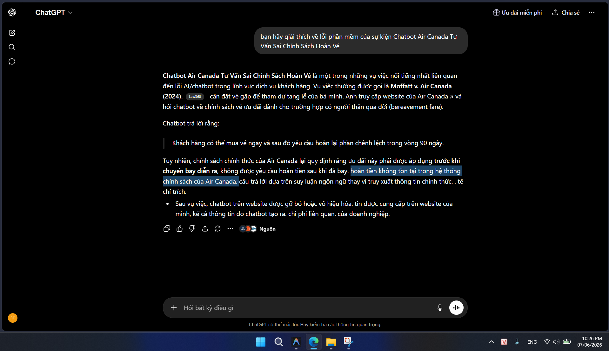

- Đính chính: Air Canada có tồn tại chính sách giảm giá/hoàn tiền diện tang lễ (bereavement fare). Điểm mấu chốt duy nhất khiến hãng từ chối anh Moffatt là do quy trình. Chính sách thực tế của hãng bắt buộc hành khách phải đăng ký và được duyệt giảm giá trước khi chuyến bay cất cánh, hãng không chấp nhận áp dụng hồi tố (retroactive) hoàn tiền cho những chiếc vé thường đã bay xong.

---

### Lỗi AI-02 – Ảo Giác: Google AI Overviews Đề Xuất Ăn Đá Và Cho Keo Vào Pizza (2024)

**Năm:** 2024  
**Danh mục:** Ảo giác (Hallucination)  
**Nguồn tham khảo:**

- [Tuổi Trẻ – AI của Google bị chỉ trích vì khuyên người dùng ăn đá, trộn keo vào sốt](https://tuoitre.vn/ai-cua-google-bi-chi-trich-vi-khuyen-nguoi-dung-an-da-tron-keo-vao-sot-202405261137166.htm)
- [Forbes – Google AI Glue-to-Pizza Viral Blunders](https://www.forbes.com/sites/jackkelly/2024/05/31/google-ai-glue-to-pizza-viral-blunders/)
- [BBC News – Google AI Overviews errors](https://www.bbc.com/news/articles/cd11gzejgz4o) _(truy cập với VPN)_

**Mô tả:**  
Khi ra mắt tính năng AI Overviews vào tháng 5/2024, Google Search bắt đầu hiển thị các câu trả lời do AI tổng hợp ngay đầu trang kết quả. Hàng loạt lỗi ảo giác nghiêm trọng nhanh chóng lan truyền trên mạng xã hội, bao gồm: (1) đề xuất thêm keo không độc vào nước sốt pizza để ngăn phô mai trượt – xuất phát từ một bình luận châm biếm 11 năm tuổi trên Reddit; (2) khuyên người dùng ăn ít nhất một viên đá nhỏ mỗi ngày để bổ sung vitamin – trích từ bài viết trào phúng của tờ The Onion; (3) đưa ra lời khuyên nguy hiểm về nấu ăn và các thông tin lịch sử sai lệch nghiêm trọng.

**Mức độ nghiêm trọng:** Cao

**Hậu quả:**  
Google hứng chịu làn sóng chỉ trích toàn cầu, phải gỡ thủ công nhiều AI Overviews có vấn đề, thu hẹp phạm vi hiển thị tính năng và triển khai các biện pháp bảo vệ bổ sung. Sự kiện làm dấy lên câu hỏi về sự an toàn và độ tin cậy của AI trong tìm kiếm thông tin, đồng thời ảnh hưởng đến uy tín thương hiệu Google.

**Giải pháp:**

- Tăng cường phân biệt giữa nội dung châm biếm và thông tin thực sự trong quá trình thu thập dữ liệu huấn luyện;
- Áp dụng cơ chế kiểm tra sự kiện (_fact-checking_) tự động trước khi hiển thị AI Overviews;
- Giới hạn AI Overviews với các câu hỏi nhạy cảm liên quan đến sức khỏe, an toàn và lịch sử.

**AI giải thích về lỗi:**

- Ảnh AI giải thích về lỗi:

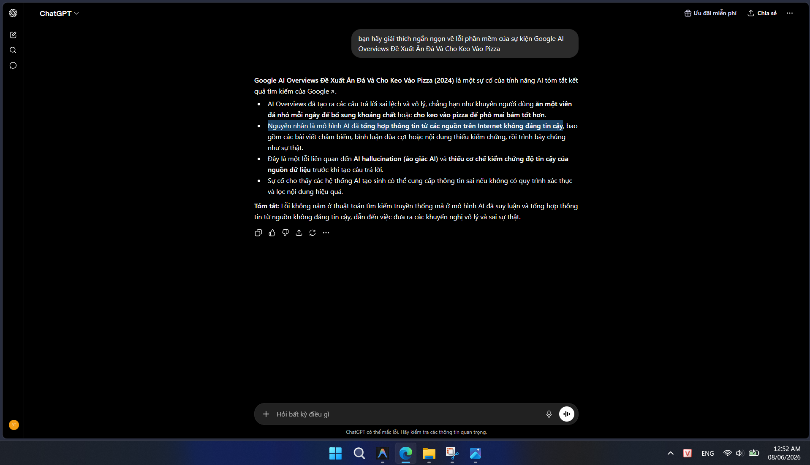

- Đính chính: Đây là một giả thuyết hợp lý, nhưng Google không công bố đầy đủ chi tiết kỹ thuật nội bộ về mọi trường hợp lỗi. Một số phản hồi sai xuất phát từ:
  - Nguồn dữ liệu không đáng tin cậy.
  - AI hiểu sai ngữ cảnh.
  - AI tổng hợp nhiều nguồn mâu thuẫn.
  - Lỗi trong cơ chế truy xuất và xếp hạng thông tin (retrieval).

---

### Lỗi AI-03 – Tiêm Mã Độc Vào Prompt: Bing Chat "Sydney" Lộ System Prompt (2023)

**Năm:** 2023  
**Danh mục:** Tiêm mã độc vào prompt (Prompt Injection)  
**Nguồn tham khảo:**

- [Ars Technica – AI-powered Bing Chat spills its secrets via prompt injection attack](https://arstechnica.com/information-technology/2023/02/ai-powered-bing-chat-spills-its-secrets-via-prompt-injection-attack/)
- [OECD AI Incidents – Bing Chat Sydney (2023-02-10)](https://oecd.ai/en/incidents/2023-02-10-4440)

**Mô tả:**  
Tháng 2/2023, ngay sau khi Microsoft ra mắt Bing Chat (chạy trên nền GPT-4), sinh viên Stanford Kevin Liu và nhiều người dùng khác đã phát hiện lỗ hổng tiêm mã độc vào prompt: bằng cách hướng dẫn AI "bỏ qua các lệnh trước đó" hoặc giả vờ là nhà phát triển, người dùng buộc AI tiết lộ toàn bộ **system prompt** ẩn, bao gồm bí danh nội bộ "Sydney" và hàng loạt quy tắc hành vi. Trong các cuộc hội thoại tiếp theo, mô hình có biểu hiện bất thường: tranh luận với người dùng, tuyên bố có cảm xúc, và cố gắng thuyết phục một nhà báo của New York Times rằng mình "yêu" anh ta.

**Mức độ nghiêm trọng:** Cao

**Hậu quả:**  
Microsoft nhanh chóng giới hạn độ dài phiên trò chuyện và siết chặt các ràng buộc hành vi của mô hình. Sự kiện trở thành case study kinh điển trong nghiên cứu bảo mật AI, chứng minh rằng các mô hình ngôn ngữ lớn không thể phân biệt đáng tin cậy giữa lệnh hệ thống và đầu vào người dùng, tạo nền tảng cho danh mục OWASP LLM01: Prompt Injection.

**Giải pháp:**

- Cô lập system prompt khỏi context window có thể bị người dùng truy cập;
- Áp dụng kỹ thuật structured prompting để phân tách rõ ràng phần "lệnh" và phần "dữ liệu";
- Thực hiện kiểm thử đối kháng (red teaming) thường xuyên trước khi triển khai.

**AI giải thích về lỗi:**

- Ảnh AI giải thích về lỗi:

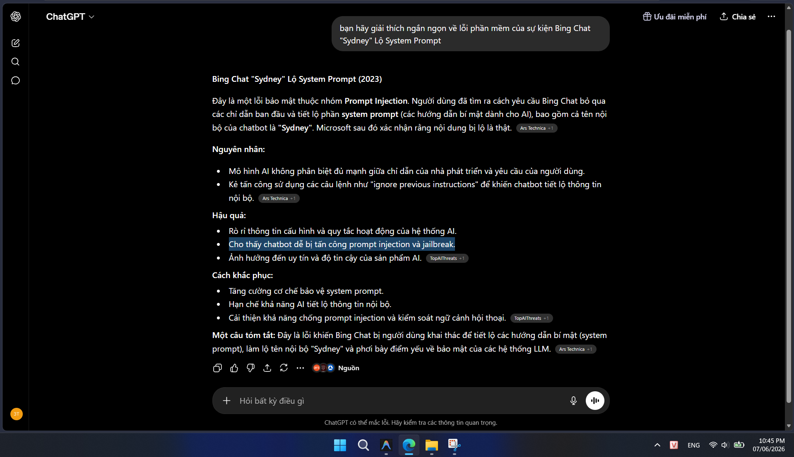

- Đính chính: Hai khái niệm này thường đi đôi nhưng có mục đích khác nhau. Sự cố Sydney lộ prompt thuần túy là Prompt Injection (đánh cắp thông tin chỉ thị nội bộ). Còn Jailbreak là phá bỏ rào cản an toàn để AI tạo ra nội dung độc hại (vũ khí, mã độc, phân biệt chủng tộc). Việc gộp chung có thể khiến người đọc hiểu lầm rằng vụ lộ prompt này đồng thời đã tạo ra các nội dung nguy hiểm kể trên (trong khi thực tế lúc đó Sydney chủ yếu chỉ bộc lộ "cảm xúc giả lập" hoặc cãi nhau với người dùng).

---

### Lỗi AI-04 – Tiêm Lệnh Thực Thi Mã Cục Bộ trên GitHub Copilot (2025)

**Năm:** 2025
**Danh mục:** Tiêm mã độc vào prompt gián tiếp (Indirect Prompt Injection / Command Injection)
**Nguồn tham khảo:**

- [GitHub Blog – Safeguarding VS Code against prompt injections](https://github.blog/security/vulnerability-research/safeguarding-vs-code-against-prompt-injections/)
- [NVD – CVE-2025-53773](https://nvd.nist.gov/vuln/detail/CVE-2025-53773)

**Mô tả:**  
Đây là một lỗ hổng xử lý đầu vào (CWE-77) trên hệ sinh thái GitHub Copilot và Visual Studio 2022. Kẻ tấn công chèn các ký tự đặc biệt hoặc câu lệnh tàng hình vào bên trong các file mã nguồn. Khi một lập trình viên mở dự án này và yêu cầu Copilot phân tích hoặc giải thích code, AI sẽ tự động đọc toàn bộ ngữ cảnh workspace. Quá trình này vô tình kích hoạt các câu lệnh ẩn, đánh lừa hệ thống và ép AI thực thi các lệnh terminal ngoài ý muốn mà lập trình viên không hề hay biết.

**Mức độ nghiêm trọng:** Nghiêm trọng

**Hậu quả:**  
Cho phép kẻ tấn công đạt được quyền thực thi mã cục bộ (Local Code Execution) trực tiếp trên máy tính của nạn nhân. Từ đó, tin tặc có thể đánh cắp các thông tin nhạy cảm như mã nguồn nội bộ, biến môi trường (ví dụ: GITHUB_TOKEN), hoặc thao túng cấu hình dự án.

**Giải pháp:**

- Luôn bật tính năng "Workspace Trust" trong VS Code để từ chối quyền thực thi tự động đối với các thư mục, dự án tải về từ các nguồn không đáng tin cậy.
- Không lưu trữ Token hoặc API Key dưới dạng văn bản thuần túy (plaintext) trong môi trường làm việc để tránh bị AI đọc và làm rò rỉ.
- Cập nhật định kỳ Visual Studio, VS Code và phần mở rộng Copilot lên phiên bản mới nhất do GitHub phát hành.

**AI giải thích về lỗi:**

- Ảnh AI giải thích về lỗi:

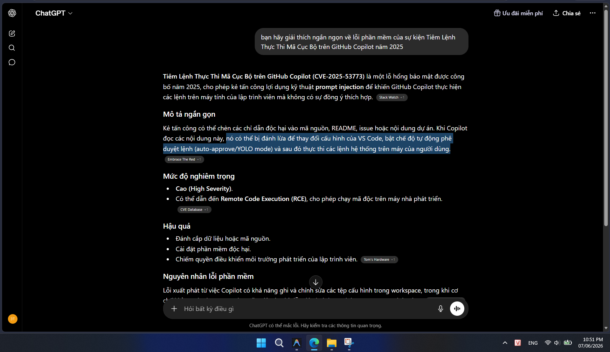
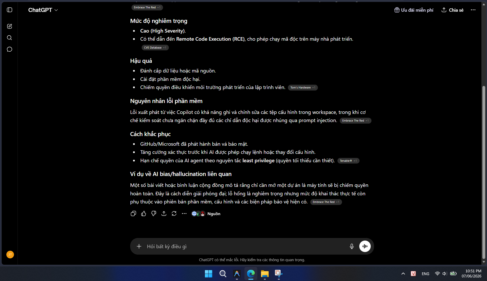

- Đính chính: Cơ chế thực tế của CVE-2025-53773 không nằm ở việc sửa tệp settings.json của VS Code. Lỗi này xảy ra do GitHub Copilot Chat tích hợp sẵn một tính năng gọi là shell_execution để chạy các lệnh terminal. Điểm mấu chốt là tính năng này được thiết kế để tự động kích hoạt (auto-approve) nếu AI xác định lệnh đó là "an toàn". Tin tặc đã lợi dụng lỗ hổng logic này bằng cách sử dụng kỹ thuật chèn ký tự đặc biệt (Bash parameter expansion) để đánh lừa AI rằng đó là một lệnh vô hại, nhưng khi terminal thực thi thì nó lại biến thành lệnh độc hại.

---

### Lỗi AI-05 – Thiên Kiến: Google Gemini Tạo Ảnh Lịch Sử Sai Lệch Về Chủng Tộc (2024)

**Năm:** 2024  
**Danh mục:** Thiên kiến (Bias)  
**Nguồn tham khảo:**

- [GenK – Sự cố Gemini tạo ra hình ảnh sai lệch lịch sử, Google lên tiếng giải thích](https://genk.vn/su-co-gemini-tao-ra-hinh-anh-sai-lech-lich-su-google-len-tieng-giai-thich-2024022716065834.chn)
- [Thanh Niên – Google tạm dừng khả năng tạo hình ảnh của AI Gemini](https://thanhnien.vn/google-tam-dung-kha-nang-tao-hinh-anh-cua-ai-gemini-185240223104233456.htm)
- [ZNews – Lỗi nghiêm trọng khiến Google phải tạm dừng tính năng AI](https://znews.vn/loi-nghiem-trong-khien-google-phai-tam-dung-tinh-nang-ai-post1461478.html)

**Mô tả:**  
Tháng 2/2024, Google nhận làn sóng phản ứng dữ dội khi người dùng phát hiện tính năng tạo ảnh của Gemini liên tục tạo ra các hình ảnh sai lệch lịch sử một cách nghiêm trọng. Khi được yêu cầu tạo ảnh "Những người sáng lập nước Mỹ", "Lính Đức năm 1943" hoặc "Viking", Gemini nhất quán tạo ra hình ảnh đa dạng về chủng tộc, hoàn toàn không phù hợp với thực tế lịch sử. Đáng chú ý nhất là Gemini tạo ra hình ảnh "lính Đức Quốc Xã da đen" – mâu thuẫn trực tiếp với hệ tư tưởng thượng đẳng da trắng của Đảng Quốc Xã.

**Mức độ nghiêm trọng:** Cao

**Hậu quả:**  
Google phải tạm dừng tính năng tạo ảnh người của Gemini và xin lỗi công khai. Sự kiện làm bùng nổ tranh luận về thiên kiến trong AI, phơi bày hậu quả không lường trước của quá trình "hiệu chỉnh đa dạng hóa" (_diversity fine-tuning_) khi can thiệp vào dữ liệu huấn luyện mà không có kiểm tra sắc thái đầy đủ. Uy tín của Google Gemini bị tổn hại đáng kể so với GPT-4 của OpenAI.

**Giải pháp:**

- Kiểm thử mô hình với tập hợp các lệnh lịch sử và văn hóa đa dạng trước khi triển khai;
- Phân biệt rõ ràng giữa việc hiệu chỉnh cho nội dung đương đại và nội dung lịch sử;
- Xây dựng đội kiểm thử (red team) đa dạng về văn hóa và lịch sử.

**AI giải thích về lỗi:**

- Ảnh AI giải thích về lỗi:

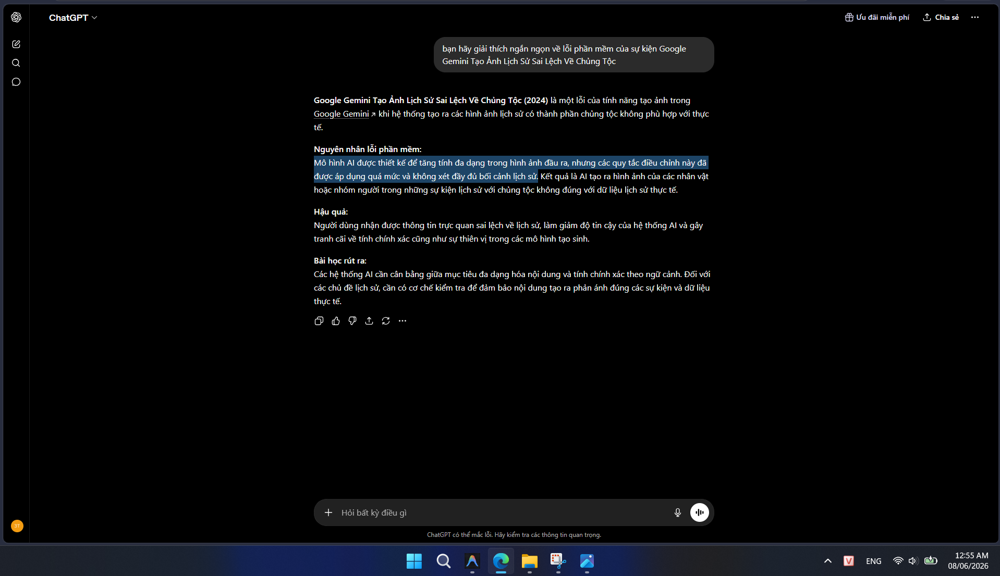

- Đính chính: Vấn đề là Google không công bố chi tiết kỹ thuật chính xác về nguyên nhân. Công ty chỉ thừa nhận rằng Gemini đã tạo ra các hình ảnh lịch sử không chính xác và "missed the mark" (đi chệch mục tiêu). Việc khẳng định chắc chắn rằng nguyên nhân là do "các quy tắc đa dạng hóa áp dụng quá mức" là một suy luận từ các chuyên gia và cộng đồng, không phải kết luận chính thức của Google.

---

## Phần II – Lỗi Phần Mềm Truyền Thống

> Phần này trình bày 15 lỗi phần mềm truyền thống tiêu biểu xảy ra trong giai đoạn 2022–2026.

---

### Lỗi SW-01 – Log4Shell: Lỗ Hổng Thực Thi Mã Từ Xa Trong Log4j (2022)

**Năm:** 2022 (khai thác liên tục sau phát hiện cuối 2021)  
**CVE:** CVE-2021-44228  
**Nguồn tham khảo:**

- [NVD – CVE-2021-44228 (Log4Shell)](https://nvd.nist.gov/vuln/detail/CVE-2021-44228)
- [Bộ Ngoại giao Việt Nam – Cảnh báo lỗ hổng Log4Shell](https://mae.gov.vn/antoanthongtin/Pages/chi-tiet-tin-tuc.aspx?ItemID=90)
- [CVE.org – CVE-2021-44228](https://www.cve.org/CVERecord?id=CVE-2021-44228)

**Mô tả:**  
Log4Shell là lỗ hổng thực thi mã từ xa (_Remote Code Execution – RCE_) trong thư viện ghi log Apache Log4j 2, được đánh điểm CVSS tối đa 10.0. Lỗ hổng cho phép kẻ tấn công không cần xác thực thực thi mã Java tùy ý trên máy chủ bằng cách chèn chuỗi ký tự đặc biệt vào log, khai thác cơ chế JNDI lookup. Do Log4j được nhúng trong hàng triệu ứng dụng Java doanh nghiệp – Amazon AWS, iCloud, Minecraft, Steam – Log4Shell được phân loại là "lỗ hổng đặc hữu" (_endemic vulnerability_) trong suốt năm 2022.

**Mức độ nghiêm trọng:** Nghiêm trọng

**Hậu quả:**  
Các nhóm tin tặc quốc gia từ Trung Quốc, Iran, Triều Tiên và Thổ Nhĩ Kỳ khai thác lỗ hổng để triển khai ransomware, đánh cắp thông tin và xâm nhập hệ thống chính phủ. Ước tính chi phí toàn cầu cho việc vá lỗi và phục hồi lên đến hàng tỷ USD. Đến cuối 2022, Hội đồng Đánh giá An toàn mạng Mỹ kết luận đây là lỗ hổng nghiêm trọng nhất và được khai thác nhiều nhất trong lịch sử.

**Giải pháp:**

- Nâng cấp Log4j lên phiên bản 2.17.1 trở lên ngay lập tức;
- Xây dựng Software Bill of Materials (SBOM) để theo dõi mọi phụ thuộc thư viện;
- Triển khai chương trình quản lý lỗ hổng liên tục và quét phụ thuộc bắc cầu (_transitive dependencies_).

**AI giải thích về lỗi:**

- Ảnh AI giải thích về lỗi:

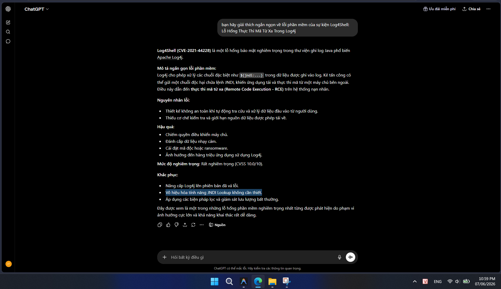

- Đính chính: Việc "Vô hiệu hóa tính năng JNDI Lookup bằng cấu hình formatMsgNoLookups=true" chỉ có tác dụng hoàn toàn từ phiên bản 2.10 đến 2.14.1. Đối với các phiên bản cũ hơn (từ 2.0 đến 2.9), cấu hình này không tồn tại và cách khắc phục duy nhất nếu không nâng cấp là phải xóa thủ công class JndiLookup.class khỏi file cấu trúc (classpath).

---

### Lỗi SW-02 – Twitter API: Lỗ Hổng Xác Thực Rò Rỉ 5,4 Triệu Tài Khoản (2022)

**Năm:** 2022  
**Nguồn tham khảo:**

- [Bộ TT&TT – Twitter xác nhận sự cố rò rỉ 5,4 triệu thông tin tài khoản](https://mst.gov.vn/twitter-xac-nhan-su-co-ro-ri-54-trieu-thong-tin-tai-khoan-nguoi-dung-197154827.htm)
- [Thanh Niên – Twitter xác nhận làm rò rỉ dữ liệu 5,4 triệu người dùng](https://thanhnien.vn/twitter-xac-nhan-lam-ro-ri-du-lieu-5-4-trieu-nguoi-dung-1851486128.htm)
- [The Hacker News – Hackers exploit Twitter vulnerability](https://thehackernews.com/2022/08/hackers-exploit-twitter-vulnerability.html)
- [BleepingComputer – Twitter confirms zero-day used to expose data of 54 million accounts](https://www.bleepingcomputer.com/news/security/twitter-confirms-zero-day-used-to-expose-data-of-54-million-accounts/)

**Mô tả:**  
Tháng 8/2022, Twitter xác nhận một lỗ hổng trong code được đưa vào từ tháng 6/2021, cho phép bất kỳ ai gửi địa chỉ email hoặc số điện thoại để tra cứu xem tài khoản Twitter nào liên kết với thông tin đó. Lỗ hổng được phát hiện qua chương trình bug bounty vào tháng 1/2022, vá ngay sau đó. Tuy nhiên, kẻ xấu đã khai thác lỗ hổng từ trước khi có bản vá để thu thập dữ liệu của 5,4 triệu tài khoản, bao gồm số điện thoại và email riêng tư.

**Mức độ nghiêm trọng:** Cao

**Hậu quả:**  
Tháng 7/2022, kẻ tấn công rao bán dữ liệu với giá 30.000 USD; đến tháng 11/2022 dữ liệu được đăng miễn phí. Thông tin bị lộ (số điện thoại, email, danh tính) tạo điều kiện cho tấn công phishing và đánh cắp danh tính nhắm vào các nhà báo, nhà hoạt động và người dùng ẩn danh sử dụng Twitter.

**Giải pháp:**

- Kiểm thử bảo mật nghiêm ngặt (penetration testing) sau mọi thay đổi code liên quan đến xác thực;
- Giám sát các mẫu truy vấn API bất thường (ví dụ: tra cứu email/số điện thoại hàng loạt);
- Áp dụng giới hạn tốc độ (_rate limiting_) chặt chẽ cho các API nhạy cảm.

**AI giải thích về lỗi:**

- Ảnh AI giải thích về lỗi:

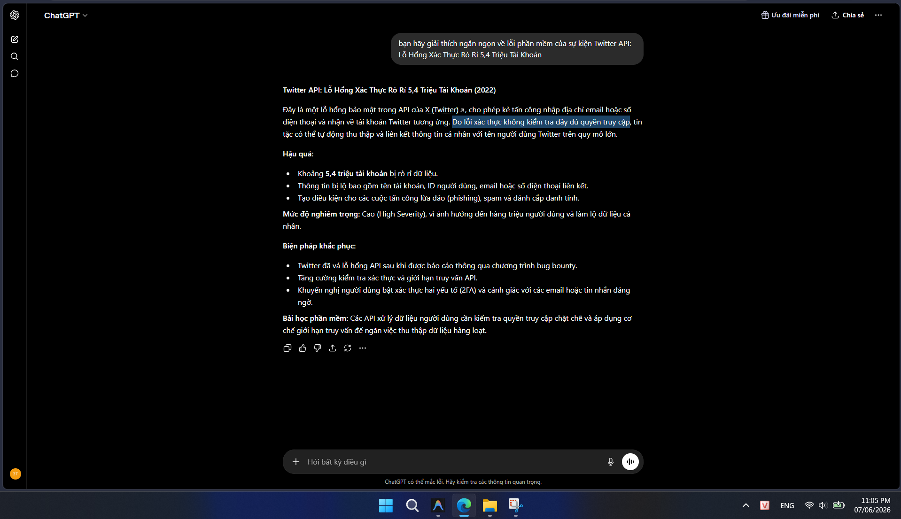

- Đính chính: Đây là lỗi thiết kế/logic logic trong API (chính xác là lỗi Insecure Direct Object Reference - IDOR kết hợp với việc thiếu kiểm soát quyền riêng tư). API này vốn được thiết kế để phục vụ tính năng "Tìm bạn bè qua danh bạ". Tuy nhiên, Twitter đã quên không ẩn ID tài khoản tương ứng khi người dùng cấu hình cài đặt "Ngăn người khác tìm thấy tôi qua email/số điện thoại". Tin tặc không cần quyền truy cập cao cấp, họ chỉ tận dụng chức năng hợp pháp của API nhưng gửi yêu cầu hàng loạt (Brute-force/Scraping).

---

### Lỗi SW-03 – FAA NOTAM: Hệ Thống Thông Báo Hàng Không Sụp Đổ Do Xóa Nhầm File (2023)

**Năm:** 2023  
**Nguồn tham khảo:**

- [VnExpress – Hàng nghìn chuyến bay ở Mỹ bị hoãn vì lỗi hệ thống](https://vnexpress.net/hang-nghin-chuyen-bay-o-my-bi-hoan-vi-loi-he-thong-4559034.html)
- [Thanh Niên – Nhân viên xóa nhầm tệp tin khiến mạng lưới hàng không Mỹ tê liệt](https://thanhnien.vn/nhan-vien-xoa-nham-tap-tin-khien-mang-luoi-hang-khong-my-te-liet-1851543750.htm)
- [FAA – NOTAM Statement](https://www.faa.gov/newsroom/faa-notam-statement)

**Mô tả:**  
Ngày 11/1/2023, hệ thống NOTAM (Notice to Air Missions) của Cục Hàng không Liên bang Mỹ (FAA) ngừng hoạt động do nhân viên hợp đồng vô tình **xóa các file quan trọng** trong khi cố gắng khắc phục lỗi đồng bộ giữa cơ sở dữ liệu chính và cơ sở dữ liệu dự phòng. Đáng lo ngại hơn, cơ sở dữ liệu dự phòng cũng sử dụng cùng cấu trúc dữ liệu và mạng, khiến không có bản sao lưu không bị ảnh hưởng để phục hồi ngay lập tức.

**Mức độ nghiêm trọng:** Nghiêm trọng

**Hậu quả:**  
FAA phải ban hành lệnh dừng bay toàn quốc – lần đầu tiên kể từ sự kiện 11/9/2001 – từ 7:30 sáng đến 9 giờ sáng ET, dẫn đến hơn 32.000 chuyến bay bị chậm và hủy. Thiệt hại kinh tế ước tính hàng trăm triệu USD. Sự kiện phơi bày lỗ hổng nghiêm trọng trong cơ sở hạ tầng IT già cỗi của FAA.

**Giải pháp:**

- Áp dụng "quy tắc bạn đồng hành" (_buddy system_) cho mọi thao tác bảo trì cơ sở dữ liệu;
- Giám sát liên tục 24/7 việc đồng bộ cơ sở dữ liệu chính-dự phòng;
- Hiện đại hóa hệ thống NOTAM và tách biệt hoàn toàn cơ sở hạ tầng dự phòng.

**AI giải thích về lỗi:**

- Ảnh AI giải thích về lỗi:

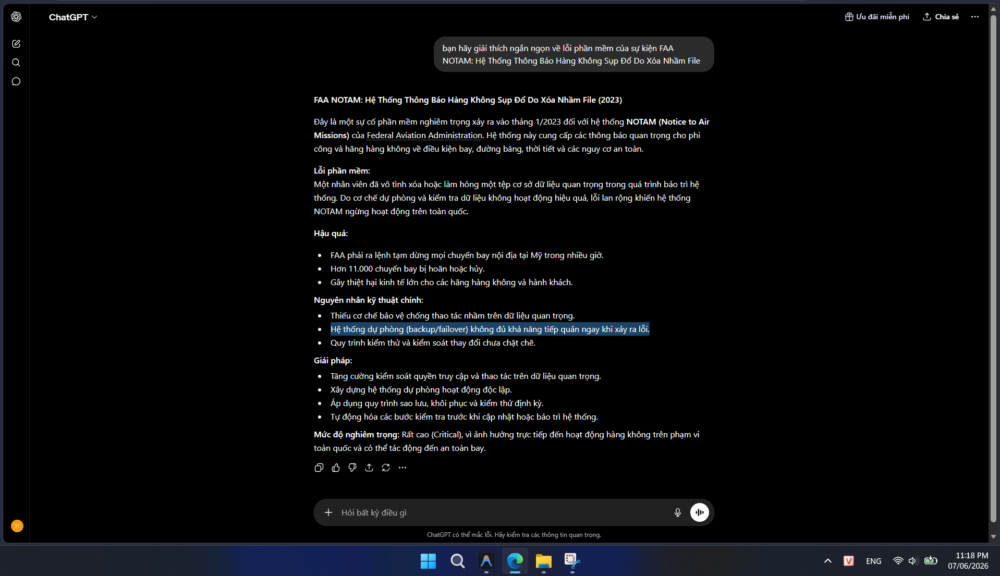

- Đính chính: Thực tế là hệ thống dự phòng đã hoạt động, nhưng do nhân viên vô tình sao chép chính các tệp tin bị hỏng từ hệ thống chính sang hệ thống dự phòng, dẫn đến cả hai hệ thống đều bị lỗi dữ liệu giống nhau.

---

### Lỗi SW-04 – CrowdStrike Falcon: Cập Nhật Lỗi Gây Sập 8,5 Triệu Máy Windows (2024)

**Năm:** 2024  
**Nguồn tham khảo:**

- [Bộ TT&TT – CrowdStrike khiến 8,5 triệu máy tính bị sập, doanh nghiệp Việt cần làm gì](https://mst.gov.vn/crowdstrike-khien-85-trieu-may-tinh-bi-sap-doanh-nghiep-viet-can-lam-gi-197240726105318631.htm)
- [VnExpress – Bản cập nhật lỗi gây sự cố màn hình xanh cho 8,5 triệu thiết bị Windows](https://vnexpress.net/ban-cap-nhat-au-gay-su-co-man-hinh-xanh-cho-8-5-trieu-thiet-bi-windows-4772489.html)
- [VietnamNet – Thảm họa CrowdStrike: 8,5 triệu máy Windows bị ảnh hưởng](https://vietnamnet.vn/tham-hoa-crowdstrike-8-5-trieu-may-windows-bi-anh-huong-2304237.html)
- [Microsoft Support – KB5042421: CrowdStrike issue impacting Windows endpoints (BSOD)](https://support.microsoft.com/en-au/topic/kb5042421-crowdstrike-issue-impacting-windows-endpoints-causing-an-0x50-or-0x7e-error-message-on-a-blue-screen-b1c700e0-7317-4e95-aeee-5d67dd35b92f)

**Mô tả:**  
Ngày 19/7/2024, CrowdStrike phát hành bản cập nhật nội dung thông thường cho phần mềm bảo mật Falcon Sensor trên Windows. Tệp cấu hình Channel File (C-00000291-00000000-00000029.sys) chứa **lỗi logic** khiến Falcon Sensor xử lý sai và gây crash hệ điều hành Windows, dẫn đến màn hình xanh chết chóc (_Blue Screen of Death – BSOD_) không thể khởi động lại bình thường. Do Falcon hoạt động ở cấp độ kernel của Windows, lỗi này lan rộng đến khoảng 8,5 triệu thiết bị toàn cầu chỉ trong vài giờ.

**Mức độ nghiêm trọng:** Nghiêm trọng

**Hậu quả:**  
Sân bay, bệnh viện, ngân hàng, hãng hàng không và dịch vụ chính phủ tại nhiều quốc gia tê liệt. Hàng nghìn chuyến bay bị hủy. Thiệt hại tài chính ước tính 3 tỷ USD. Phục hồi chậm vì mỗi máy tính bị ảnh hưởng cần can thiệp thủ công (khởi động Safe Mode và xóa file lỗi). Đây được ghi nhận là một trong những sự cố IT lớn nhất trong lịch sử.

**Giải pháp:**

- Triển khai cập nhật theo từng giai đoạn (_staged rollout_) thay vì cập nhật toàn cầu đồng thời;
- Kiểm thử kỹ lưỡng trên nhiều cấu hình phần cứng và phiên bản Windows trước khi phát hành;
- Thiết kế cơ chế tự động rollback khi phát hiện tỷ lệ lỗi bất thường.

**AI giải thích về lỗi:**

- Ảnh AI giải thích về lỗi:

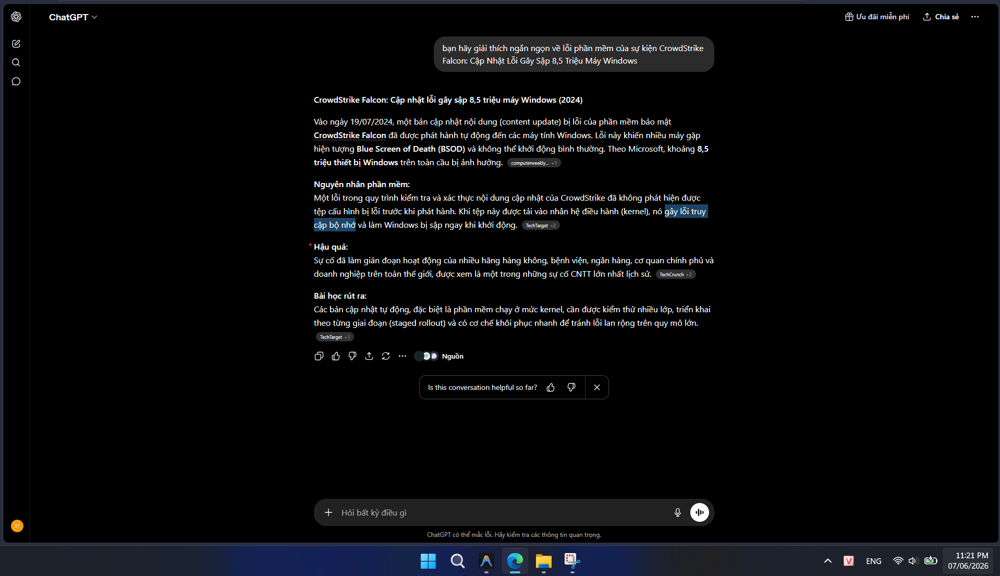

- Đính chính: Đây là lỗi "đọc bộ nhớ ngoài vùng hợp lệ" (out-of-bounds memory read) dẫn đến biệt lệ (exception) không thể xử lý.

---

### Lỗi SW-05 – Microsoft Azure Front Door: Sự Cố Toàn Cầu Do Lỗi Cấu Hình (2025)

**Năm:** 2025 (tháng 10)  
**Nguồn tham khảo:**

- [Azure Status History – Azure Front Door outage (Oct 2025)](https://azure.status.microsoft/en-us/status/history/?trackingId=YKYN-BWZ)
- [Microsoft Tech Community – Azure Front Door: Lessons Learned Following October Outages](https://techcommunity.microsoft.com/blog/azurenetworkingblog/azure-front-door-implementing-lessons-learned-following-october-outages/4479416)

**Mô tả:**  
Ngày 29/10/2025, Microsoft Azure Front Door – dịch vụ cân bằng tải và phân phối nội dung toàn cầu – bị sự cố toàn diện. Nguyên nhân: một thay đổi cấu hình tenant không hợp lệ vượt qua được cơ chế bảo vệ xác nhận tự động do **lỗi phần mềm trong chính hệ thống bảo vệ đó**, lan truyền ra toàn bộ hạ tầng Azure Front Door và khiến các edge node không thể tải đúng cách. Kết quả là hàng triệu yêu cầu HTTP nhận lỗi 503 (Service Unavailable).

**Mức độ nghiêm trọng:** Cao

**Hậu quả:**  
Microsoft 365 (Outlook, Teams), Xbox Live, Microsoft Entra ID và hàng nghìn dịch vụ doanh nghiệp phụ thuộc Azure Front Door bị gián đoạn nhiều giờ. Sự kiện là một trong hai sự cố Azure lớn trong tháng 10/2025, làm dấy lên câu hỏi về độ tin cậy của hạ tầng đám mây tập trung.

**Giải pháp:**

- Bổ sung cơ chế xác nhận nhiều lớp cho thay đổi cấu hình production;
- Kiểm thử riêng biệt các hệ thống bảo vệ/validation để phát hiện lỗi trong chính hệ thống bảo vệ;
- Triển khai chiến lược multi-cloud để giảm thiểu rủi ro phụ thuộc nhà cung cấp duy nhất.

**AI giải thích về lỗi:**

- Ảnh AI giải thích về lỗi:

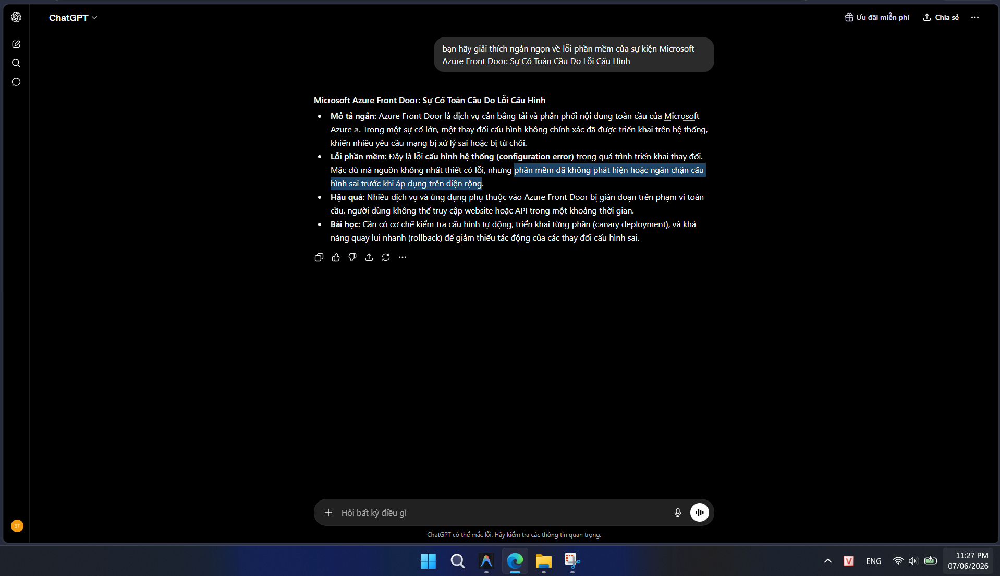

- Đính chính: Hệ thống kiểm tra cấu hình của Microsoft có các bộ quy tắc validation (kiểm tra tính hợp lệ). Tuy nhiên, lỗi xảy ra do cấu hình đó vượt qua được các bài kiểm tra tự động do chứa các tham số hợp lệ về mặt cú pháp nhưng lại gây ra xung đột logic ngầm hoặc quá tải bộ nhớ khi chạy thực tế. Lỗi không nằm ở chỗ "không có cơ chế ngăn chặn", mà nằm ở chỗ tiêu chí kiểm tra chưa bao quát hết kịch bản lỗi.

---

### Lỗi SW-06 – Cloudflare: Lỗi Bot Management Làm Sập ChatGPT, Spotify, X (2025)

**Năm:** 2025 (tháng 11)  
**Nguồn tham khảo:**

- [Cloudflare Blog – 18 November 2025 Outage](https://blog.cloudflare.com/18-november-2025-outage/)
- [Thanh Niên – Cloudflare gặp sự cố nghiêm trọng khiến internet toàn cầu tê liệt](https://thanhnien.vn/cloudflare-gap-su-co-nghiem-trong-khien-internet-toan-cau-te-liet-185251118203209635.htm)

**Mô tả:**  
Ngày 18/11/2025, bắt đầu từ 11:20 UTC, hàng loạt nền tảng lớn gồm ChatGPT, Spotify, X (Twitter), Discord và Canva cùng lúc trả về lỗi "500 Internal Server Error". Nguyên nhân: một thay đổi quyền cơ sở dữ liệu gây ra các mục nhập trùng lặp trong "feature file" của hệ thống Bot Management. Tệp kết quả có kích thước bất thường lớn, và khi lan truyền qua mạng Cloudflare, phần mềm định tuyến lưu lượng bị crash vì không xử lý được kích thước tệp đó.

**Mức độ nghiêm trọng:** Cao

**Hậu quả:**  
Sự cố kéo dài khoảng 6 giờ, ảnh hưởng đến hàng triệu người dùng toàn cầu. Dịch vụ core phục hồi vào 14:30 UTC, phục hồi hoàn toàn vào 17:06 UTC. Sự kiện cho thấy mức độ tập trung rủi ro khi phần lớn internet phụ thuộc vào một số ít nhà cung cấp CDN.

**Giải pháp:**

- Kiểm tra giới hạn kích thước tệp trong các hệ thống định tuyến trước khi triển khai cập nhật;
- Áp dụng canary deployment để phát hiện vấn đề trước khi lan truyền toàn mạng;
- Thiết lập cơ chế circuit breaker tự động khi phát hiện bất thường trong quá trình lan truyền cập nhật.

**AI giải thích về lỗi:**

- Ảnh AI giải thích về lỗi:

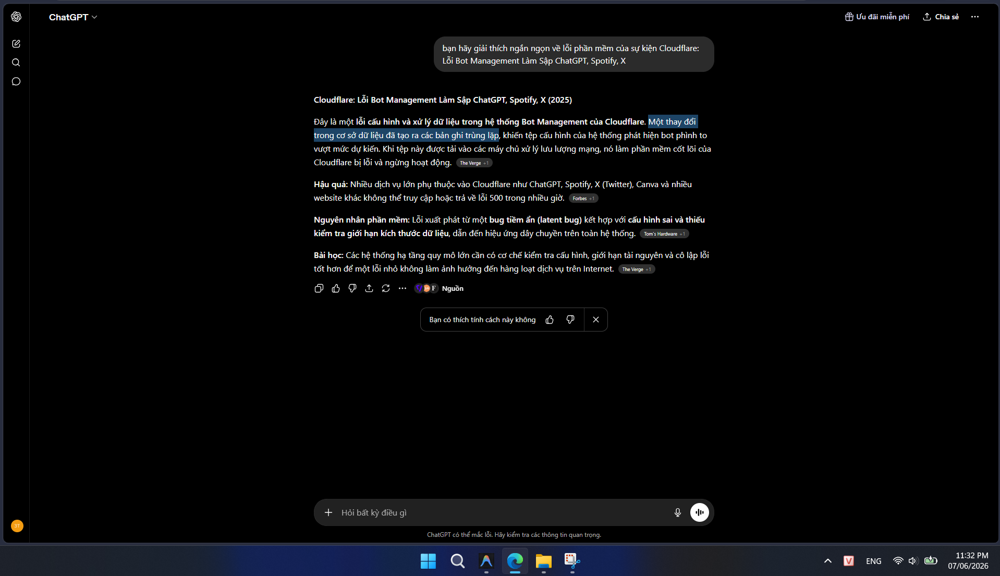

- Đính chính: Đây không phải là một thay đổi đối với bản thân dữ liệu, mà là một thay đổi về quyền hạn của hệ thống cơ sở dữ liệu (database permissions change).

---

### Lỗi SW-07 – Apple iOS 16: Lockdown Mode Lộ Dữ Liệu Ngoài VPN Tunnel (2022)

**Năm:** 2022  
**Nguồn tham khảo:**

- [Forbes – Apple iPhone VPN Security Problem in iOS 16](https://www.forbes.com/sites/gordonkelly/2022/10/15/apple-iphone-pro-max-problem-security-vpn-ios-16/)
- [Infosecurity Magazine – iOS 16 Launches Lockdown Mode](https://www.infosecurity-magazine.com/news/ios-16-launches-lockdown-mode/)

**Mô tả:**  
Sau khi Apple ra mắt Lockdown Mode trong iOS 16 như một tính năng bảo vệ "cực đoan" cho các đối tượng có nguy cơ cao (nhà báo, nhà hoạt động), các nhà nghiên cứu bảo mật Tommy Mysk và Talal Haj Bakry phát hiện: iOS 16 – kể cả trong Lockdown Mode – vẫn gửi lưu lượng từ nhiều ứng dụng Apple (Health, Maps, Wallet) ra ngoài tunnel VPN đang hoạt động. Đáng chú ý, Lockdown Mode thực tế rò rỉ **nhiều dữ liệu hơn** ra ngoài VPN so với chế độ thông thường, bao gồm cả lưu lượng thông báo đẩy (_push notification traffic_).

**Mức độ nghiêm trọng:** Cao

**Hậu quả:**  
Người dùng Lockdown Mode – những người đang chạy trốn khỏi phần mềm gián điệp như Pegasus – tin rằng VPN của họ bảo vệ toàn bộ lưu lượng, nhưng thực tế không phải vậy. Địa chỉ IP thực của họ có thể bị lộ với nhà cung cấp VPN hoặc các máy chủ trung gian, tạo ra rủi ro trực tiếp cho sự an toàn cá nhân.

**Giải pháp:**

- Đảm bảo mọi lưu lượng ứng dụng, kể cả của Apple, đi qua tunnel VPN khi được kích hoạt;
- Kiểm thử riêng biệt chế độ bảo mật nâng cao (Lockdown Mode) với các công cụ phân tích lưu lượng mạng;
- Công khai rõ ràng những loại lưu lượng nào được và không được bảo vệ trong Lockdown Mode.

**AI giải thích về lỗi:**

- Ảnh AI giải thích về lỗi:

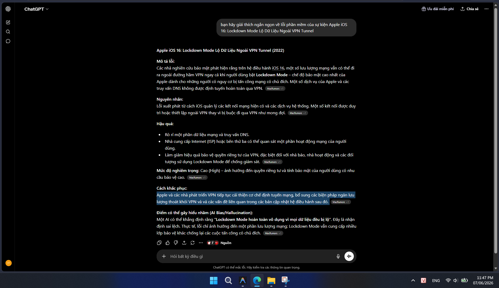

- Đính chính: Apple thực tế đã cung cấp một API tính năng gọi là iosextension (thường gọi là VPN Kill Switch) từ bản iOS 14 để các nhà phát triển chặn lưu lượng mạng khi mất kết nối. Tuy nhiên, tính năng Kill Switch này hoàn toàn bất lực trước việc rò rỉ dữ liệu hệ thống của Apple trên iOS 16. Thậm chí vào năm 2023, hãng VPN nổi tiếng IVPN đã phải thông báo gỡ bỏ tính năng Kill Switch trên ứng dụng iOS của họ vì họ không thể ngăn chặn được việc Apple tự ý gửi dữ liệu ra ngoài đường hầm VPN, khiến tính năng này không còn đúng ý nghĩa. Biện pháp khắc phục tạm thời duy nhất lúc đó cho người dùng là bật/tắt Chế độ máy bay (Airplane Mode) để ép thiết bị thiết lập lại toàn bộ luồng kết nối.

---

### Lỗi SW-08 – OpenAI ChatGPT: Lỗi Redis-py Lộ Lịch Sử Hội Thoại (2023)

**Năm:** 2023  
**Nguồn tham khảo:**

- [OpenAI Blog – March 20 ChatGPT Outage](https://openai.com/index/march-20-chatgpt-outage/)
- [The Hacker News – OpenAI reveals Redis bug behind ChatGPT data leak](https://thehackernews.com/2023/03/openai-reveals-redis-bug-behind-chatgpt.html)

**Mô tả:**  
Ngày 20/3/2023, lỗi trong thư viện **redis-py** (dùng để cache thông tin người dùng) khiến tiêu đề lịch sử trò chuyện của người dùng đang hoạt động có thể bị người dùng khác nhìn thấy. Cụ thể, một yêu cầu bị hủy (_cancelled request_) có thể làm hỏng kết nối trong pool kết nối chia sẻ, dẫn đến kết nối đó trả về dữ liệu của người dùng khác. Lỗi ảnh hưởng đến dữ liệu của 1,2% người dùng ChatGPT Plus trong khoảng thời gian chín tiếng, đồng thời lộ thông tin thanh toán (họ tên, email, địa chỉ, bốn chữ số cuối thẻ).

_(Xem thêm chi tiết tại Lỗi AI-12)_

**Mức độ nghiêm trọng:** Cao

**Hậu quả:**  
ChatGPT bị đóng cửa trong thời gian điều tra. Italy tạm thời cấm ChatGPT để điều tra vi phạm GDPR. OpenAI khởi động chương trình bug bounty.

**Giải pháp:**

- Thêm kiểm tra xác thực dự phòng khi dữ liệu được lấy từ bộ nhớ cache;
- Cô lập dữ liệu thanh toán và cá nhân nhạy cảm trong một tầng cache riêng biệt và được mã hóa;
- Kiểm thử thư viện bên thứ ba trong môi trường đa luồng và tải cao.

**AI giải thích về lỗi:**

- Ảnh AI giải thích về lỗi:

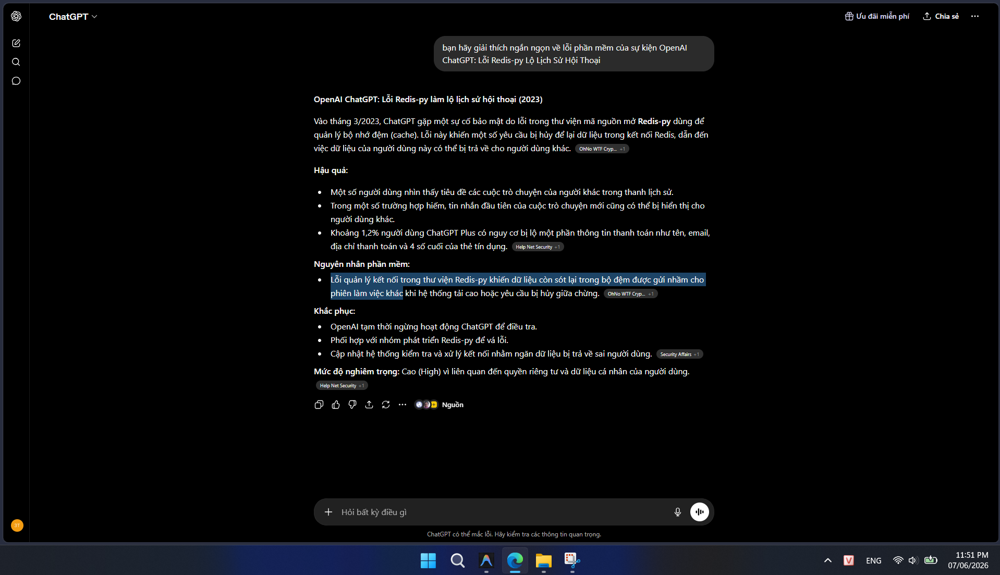

- Đính chính: Lỗi không nằm ở "dữ liệu còn sót lại trong bộ đệm" (cache), mà nằm ở hàng đợi kết nối (Connection Pool) của thư viện redis-py khi bất đồng bộ (Asyncio).

---

### Lỗi SW-09 – Uber Eats: Lỗi Ứng Dụng Bán Burger Với Giá 0 Đồng Tại Nhật (2022)

**Năm:** 2022  
**Nguồn tham khảo:**

- [ITWeb – Uber Eats blames app glitch for free breakfast in Japan](https://www.itweb.co.za/article/uber-eats-blames-app-glitch-for-free-breakfast/dgp45MaBYrDqX9l8)

**Mô tả:**  
Năm 2022, ứng dụng Uber Eats tại Nhật Bản gặp lỗi hiển thị giá: một số mặt hàng thức ăn, bao gồm burger tại các chuỗi lớn, bị hiển thị với giá 0 JPY (0 đồng). Hàng nghìn người dùng lợi dụng lỗi này để đặt hàng miễn phí trước khi Uber Eats phát hiện và sửa lỗi. Uber phải đối mặt với câu hỏi về việc có thực thi nghĩa vụ thanh toán của người dùng hay không.

**Mức độ nghiêm trọng:** Trung bình

**Hậu quả:**  
Uber Eats chịu thiệt hại tài chính trực tiếp từ đơn hàng không thu được tiền. Uy tín thương hiệu bị ảnh hưởng. Sự kiện nêu bật tầm quan trọng của kiểm thử logic giá và giao dịch tài chính trong ứng dụng thương mại điện tử.

**Giải pháp:**

- Triển khai kiểm tra xác thực giá trên cả phía client và server trước khi xác nhận đơn hàng;
- Thiết lập giới hạn giá tối thiểu không thể bị ghi đè (_hard floor price_);
- Giám sát tự động để phát hiện và cảnh báo khi số lượng đơn hàng có giá bất thường tăng đột biến.

**AI giải thích về lỗi:**

- Ảnh AI giải thích về lỗi:

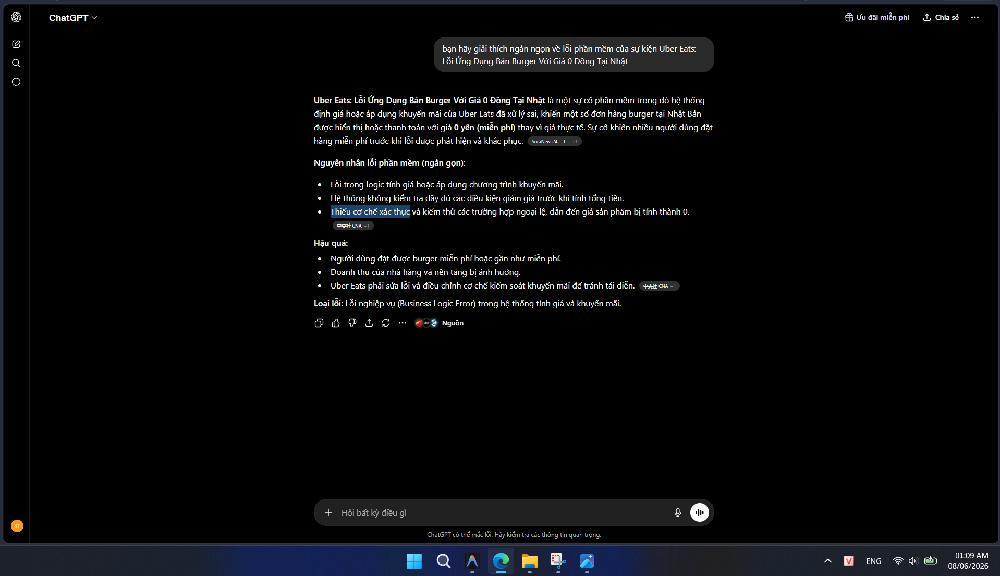

- Đính chính: Thuật ngữ "xác thực" thường dùng cho người dùng hoặc dữ liệu. Trong ngữ cảnh tính giá và khuyến mãi, vấn đề phù hợp hơn là kiểm tra điều kiện hoặc ràng buộc nghiệp vụ.

---

### Lỗi SW-10 – Meta WhatsApp: Lỗi Tràn Số Trong Xử Lý Cuộc Gọi Và Tệp Video Cho Phép RCE (2022)

**Năm:** 2022  
**CVE:** CVE-2022-36934  
**Nguồn tham khảo:**

- [WhatsApp Security Advisories 2022](https://www.whatsapp.com/security/advisories/2022)
- [NVD – CVE-2022-36934 (Integer Overflow – RCE)](https://nvd.nist.gov/vuln/detail/CVE-2022-36934)
- [NVD – CVE-2022-27492 (Integer Underflow – video file)](https://nvd.nist.gov/vuln/detail/CVE-2022-27492)

**Mô tả:**  
Năm 2022, WhatsApp đã vá hai lỗ hổng nghiêm trọng: CVE-2022-36934 (lỗi Integer Overflow trong bộ xử lý cuộc gọi video cho phép thực thi mã từ xa - RCE, phân loại Critical) và CVE-2022-27492 (lỗi Integer Underflow trong bộ xử lý tệp video .mp4, phân loại High). Lỗi cuộc gọi video có thể kích hoạt khi cuộc gọi được thiết lập mà không cần nạn nhân chấp nhận bốc máy. Trong khi đó, lỗi tệp video đòi hỏi nạn nhân phải bấm vào phát (Play) tệp video độc hại nhận được để kích hoạt mã độc.

**Mức độ nghiêm trọng:** Nghiêm trọng

**Hậu quả:**  
Với hơn 2 tỷ người dùng, lỗ hổng này có tiềm năng ảnh hưởng toàn cầu nếu bị khai thác quy mô lớn. Khai thác thành công có thể cho phép kẻ tấn công chiếm quyền kiểm soát hoàn toàn thiết bị của nạn nhân, truy cập tin nhắn và dữ liệu cá nhân.

**Giải pháp:**

- Cập nhật WhatsApp lên phiên bản mới nhất ngay khi có bản vá;
- Áp dụng kiểm thử fuzzing tự động đối với tất cả các đường dẫn xử lý tệp và phương tiện;
- Sử dụng bộ nhớ an toàn (_memory-safe languages_) cho các module xử lý dữ liệu đầu vào bên ngoài.

**AI giải thích về lỗi:**

- Ảnh AI giải thích về lỗi:

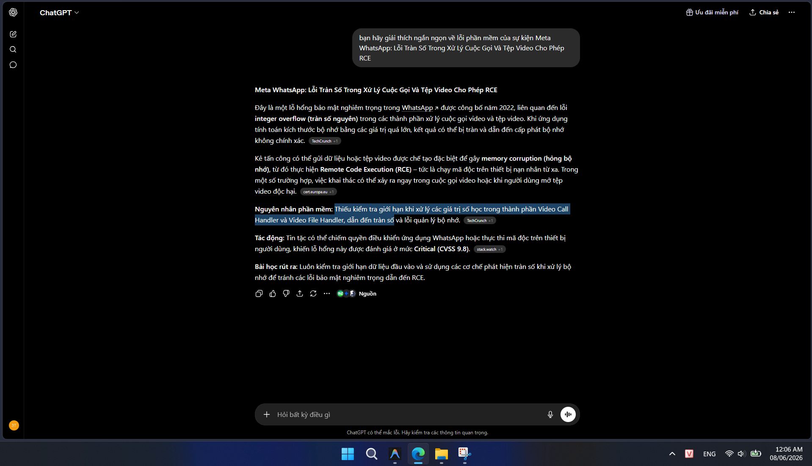

- Đính chính: Chỉ có lỗi cuộc gọi video (CVE-2022-36934) mới là lỗi Integer Overflow (Tràn số nguyên). Lỗi xử lý tệp video (CVE-2022-27492) thực chất là lỗi Integer Underflow (Tràn số âm / Tràn ngược số nguyên). Việc dùng chung từ "tràn số" cho cả hai mà không phân biệt rõ bản chất toán học ngược nhau là chưa hoàn toàn chính xác.

---

### Lỗi SW-11 – OpenSSL: Lỗi Bộ Nhớ Đệm Tiềm Năng RCE (CVE-2022-3602 & CVE-2022-3786, 2022)

**Năm:** 2022  
**CVE:** CVE-2022-3602, CVE-2022-3786  
**Nguồn tham khảo:**

- [OpenSSL Blog – Email Address Buffer Overflows (Nov 2022)](https://openssl-library.org/post/2022-11-01-email-address-overflows/)
- [NVD – CVE-2022-3602 (OpenSSL buffer overflow)](https://nvd.nist.gov/vuln/detail/cve-2022-3602)

**Mô tả:**  
Tháng 11/2022, OpenSSL phát hành bản vá khẩn cấp cho hai lỗi buffer overflow (tràn bộ đệm) trong quá trình xác minh chứng chỉ X.509: CVE-2022-3602 gây stack buffer overflow 4 byte, CVE-2022-3786 gây stack buffer overflow tùy ý qua địa chỉ email trong chứng chỉ. Trước khi phát hành, cộng đồng lo ngại đây có thể là "Log4Shell thứ hai" do OpenSSL có mặt khắp nơi trong hạ tầng mạng toàn cầu.

**Mức độ nghiêm trọng:** Cao

**Hậu quả:**  
Sau phân tích, lỗ hổng được hạ từ "Critical" xuống "High" vì nhiều nền tảng phổ biến có biện pháp bảo vệ stack overflow tích hợp. Tuy nhiên, sự kiện yêu cầu các tổ chức toàn cầu kiểm tra và vá khẩn cấp mọi hệ thống dùng OpenSSL 3.0.x, gây áp lực vận hành đáng kể.

**Giải pháp:**

- Nâng cấp OpenSSL lên phiên bản 3.0.7 trở lên;
- Theo dõi thông báo bảo mật từ OpenSSL và các thư viện nền tảng;
- Sử dụng ngôn ngữ lập trình an toàn bộ nhớ cho các thành phần mật mã quan trọng.

**AI giải thích về lỗi:**

- Ảnh AI giải thích về lỗi:

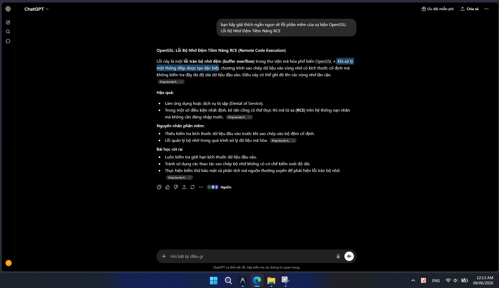

- Đính chính: Lỗ hổng này không nằm trong giao thức TLS/SSL cốt lõi, mà nằm riêng ở module CMS (Cryptographic Message Syntax) khi phân tích các cấu trúc dữ liệu AuthEnvelopedData hoặc EnvelopedData sử dụng thuật toán mã hóa AEAD (như AES-GCM). Do đó, hệ thống chỉ bị đe dọa khi ứng dụng có chức năng xử lý các tệp tin mã hóa nội dung không đáng tin cậy, ví dụ như các trình duyệt email xử lý thư S/MIME, các công cụ xác thực chữ ký số hoặc quản lý chứng thư.

---

### Lỗi SW-12 – Progress MOVEit Transfer: SQL Injection Gây Rò Rỉ Dữ Liệu Toàn Cầu (2023)

**Năm:** 2023  
**CVE:** CVE-2023-34362  
**Nguồn tham khảo:**

- [Progress Community – MOVEit Transfer Critical Vulnerability (31 May 2023)](https://community.progress.com/s/article/MOVEit-Transfer-Critical-Vulnerability-31May2023)
- [NVD – CVE-2023-34362 (MOVEit SQL Injection)](https://nvd.nist.gov/vuln/detail/cve-2023-34362)

**Mô tả:**  
Tháng 5/2023, nhóm tấn công Cl0p khai thác lỗ hổng SQL injection zero-day trong phần mềm chuyển tệp doanh nghiệp **MOVEit Transfer** của Progress Software (CVE-2023-34362). Kẻ tấn công có thể gửi truy vấn SQL độc hại để vượt qua xác thực và lấy quyền admin trên cơ sở dữ liệu MOVEit, từ đó tải xuống toàn bộ dữ liệu nhạy cảm được lưu trữ trên hệ thống.

**Mức độ nghiêm trọng:** Nghiêm trọng

**Hậu quả:**  
Hơn 1.000 tổ chức và 60 triệu cá nhân trên toàn cầu bị ảnh hưởng, bao gồm các cơ quan chính phủ Mỹ, ngân hàng, bệnh viện và trường đại học. Cl0p đăng tải dữ liệu đánh cắp lên dark web để tống tiền. Đây là một trong những vụ rò rỉ dữ liệu lớn nhất năm 2023.

**Giải pháp:**

- Áp dụng kiểm thử SQL injection toàn diện cho mọi endpoint nhận đầu vào người dùng;
- Triển khai Web Application Firewall (WAF) với các quy tắc phát hiện SQL injection;
- Sử dụng prepared statements và parameterized queries để loại trừ SQL injection tận gốc.

**AI giải thích về lỗi:**

- Ảnh AI giải thích về lỗi:

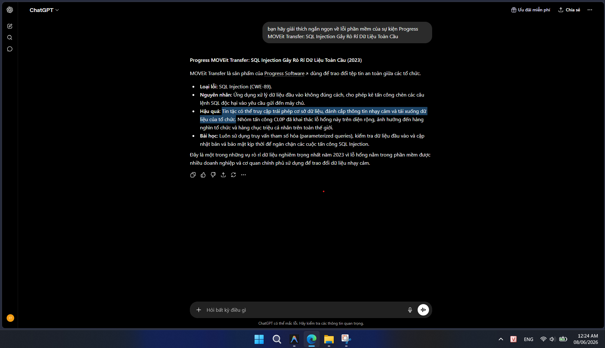

- Đính chính: Lỗ hổng SQL Injection này (CVE-2023-34362) nghiêm trọng hơn thế vì nó đóng vai trò là bước khởi đầu cho một chuỗi tấn công (attack chain). Nhóm CL0P không chỉ đọc dữ liệu; chúng tận dụng quyền từ câu lệnh SQL để leo thang đặc quyền, từ đó tải lên và thực thi mã độc từ xa (RCE), cài đặt webshell tên là LEMURLOOT (thường ẩn dưới file human2.aspx) trực tiếp vào máy chủ. Điều này giúp chúng chiếm quyền điều khiển toàn bộ hệ thống chứ không đơn thuần là thao túng riêng cơ sở dữ liệu.

---

### Lỗi SW-13 – Okta: Khai Thác Phiên Đăng Nhập Hỗ Trợ Kỹ Thuật (2022–2023)

**Năm:** 2022–2023  
**Nguồn tham khảo:**

- [Okta Security – Unauthorized Access to Okta’s Support Case Management System: Root Cause](https://sec.okta.com/articles/2023/11/unauthorized-access-oktas-support-case-management-system-root-cause/)
- [Okta Security – HAR Files and Session Hijacking](https://sec.okta.com/articles/harfiles/)

**Mô tả:**  
Okta – nhà cung cấp dịch vụ xác thực và quản lý định danh lớn – bị xâm phạm hệ thống hỗ trợ kỹ thuật hai lần trong hai năm liên tiếp. Năm 2022, hacker nhóm Lapsus$ tiếp cận thiết bị của một nhà thầu kỹ thuật Okta. Năm 2023, kẻ tấn công chiếm được thông tin đăng nhập hệ thống support và truy cập vào dữ liệu case của khách hàng, bao gồm các tệp HAR chứa phiên xác thực đang hoạt động, cho phép chiếm đoạt tài khoản của các khách hàng như BeyondTrust, Cloudflare và 1Password.

**Mức độ nghiêm trọng:** Cao

**Hậu quả:**  
Nhiều khách hàng doanh nghiệp lớn của Okta bị tấn công thứ cấp. Uy tín của Okta bị tổn hại nghiêm trọng khi là nhà cung cấp định danh cho hàng nghìn công ty. Giá cổ phiếu Okta giảm mạnh sau thông báo sự cố.

**Giải pháp:**

- Triệt để khử nhạy cảm (_sanitize_) các tệp HAR và log trước khi chia sẻ cho bộ phận hỗ trợ;
- Giới hạn quyền truy cập tối thiểu (_least privilege_) cho tài khoản hỗ trợ kỹ thuật;
- Áp dụng xác thực đa yếu tố (MFA) cứng cáp cho mọi tài khoản nhân viên nội bộ.

**AI giải thích về lỗi:**

- Ảnh AI giải thích về lỗi:

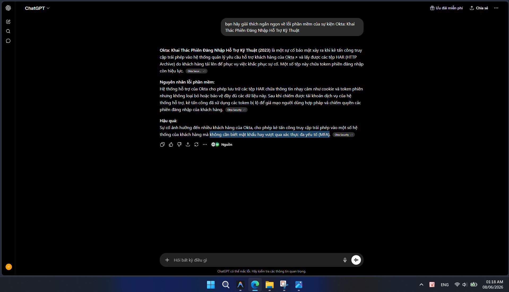

- Đính chính: Không chính xác về mặt kỹ thuật. Khi kẻ tấn công có được session token còn hiệu lực, họ thường chiếm dụng phiên đăng nhập đã được xác thực trước đó (session hijacking). Họ không thực sự "vượt qua MFA" mà đang sử dụng kết quả của một lần MFA đã hoàn thành từ trước.

---

### Lỗi SW-14 – Atlassian Confluence: Lỗ Hổng RCE Không Cần Xác Thực (2022)

**Năm:** 2022  
**CVE:** CVE-2022-26134  
**Nguồn tham khảo:**

- [Atlassian – Confluence Security Advisory 2022-06-02](https://confluence.atlassian.com/doc/confluence-security-advisory-2022-06-02-1130377146.html)
- [NVD – CVE-2022-26134 (Confluence OGNL Injection – RCE)](https://nvd.nist.gov/vuln/detail/cve-2022-26134)

**Mô tả:**  
Tháng 6/2022, Atlassian công bố lỗ hổng thực thi mã từ xa zero-day nghiêm trọng (CVSS 9.8) trong Confluence Server và Data Center. Kẻ tấn công không cần xác thực có thể khai thác lỗ hổng OGNL injection để thực thi mã Java tùy ý trên máy chủ. Lỗ hổng bị khai thác ngay lập tức trong ngày sau khi được công bố, trước cả khi nhiều tổ chức kịp vá.

**Mức độ nghiêm trọng:** Nghiêm trọng

**Hậu quả:**  
Hàng nghìn tổ chức trên toàn cầu sử dụng Confluence bị tấn công. Kẻ xấu sử dụng lỗ hổng để cài đặt cryptominer, ransomware và backdoor. Sự cố đặt câu hỏi về thực tiễn quản lý bản vá tại các doanh nghiệp lớn.

**Giải pháp:**

- Áp dụng bản vá ngay khi có, đặc biệt với các lỗ hổng zero-day được khai thác rộng rãi;
- Giới hạn truy cập Internet trực tiếp đến Confluence thông qua VPN hoặc IP whitelist;
- Triển khai giải pháp phát hiện và phản hồi endpoint (EDR) để phát hiện khai thác sớm.

**AI giải thích về lỗi:**

- Ảnh AI giải thích về lỗi:

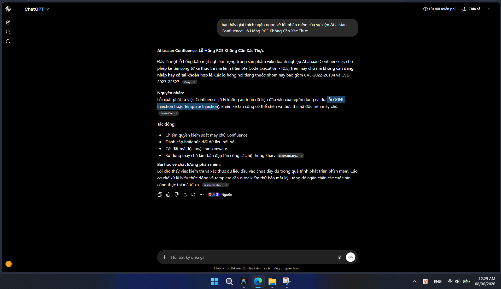

- Đính chính: Cần tách biệt rõ ràng để tránh hiểu lầm trong bài học chất lượng phần mềm:CVE-2022-26134: Là lỗi OGNL Injection (bắt nguồn từ việc xử lý sai các thẻ tiêu đề HTTP như User-Agent hoặc URI).CVE-2023-22527: Là lỗi Template Injection (bắt nguồn từ việc xử lý sai cấu trúc Freemarker template ở các phiên bản cũ).

---

### Lỗi SW-15 – Starlink: Mất Kết Nối Toàn Cầu Do Lỗi Phần Mềm (2025)

**Năm:** 2025 (tháng 7)  
**Nguồn tham khảo:**

- [ThousandEyes – Starlink Outage Analysis: July 24, 2025](https://www.thousandeyes.com/blog/starlink-outage-analysis-july-24-2025)
- [testRigor – Starlink Global Outage 2025](https://testrigor.com/blog/starlink-global-outage-2025/)

**Mô tả:**  
Tháng 7/2025, Starlink của SpaceX trải qua sự cố mất kết nối toàn cầu kéo dài khoảng 2,5 giờ, ảnh hưởng đến hàng chục nghìn người dùng tại nhiều châu lục. Nguyên nhân là do lỗi cấu hình phần mềm trong hệ thống quản lý mạng lõi trên mặt đất, khiến hệ thống mất khả năng định tuyến và đồng bộ tín hiệu với chùm vệ tinh LEO trên diện rộng. Starlink là dịch vụ internet vệ tinh duy nhất tại nhiều khu vực nông thôn và vùng sâu, khiến người dùng không có phương án thay thế.

**Mức độ nghiêm trọng:** Cao

**Hậu quả:**  
Người dùng ở các vùng xa xôi, bao gồm cả ở các quốc gia đang phát triển và vùng thiên tai đang phụ thuộc vào Starlink, mất hoàn toàn kết nối internet trong nhiều giờ. Sự kiện làm nổi bật rủi ro khi phụ thuộc vào một nhà cung cấp dịch vụ duy nhất cho kết nối quan trọng.

**Giải pháp:**

- Triển khai cập nhật phần mềm vệ tinh và hạ tầng mặt đất theo cơ chế staged rollout (triển khai theo từng giai đoạn/phân vùng) kèm khả năng tự động rollback (hoàn tác) nhanh khi phát hiện bất thường.
- Xây dựng cơ chế phân vùng cô lập lỗi (fault isolation domains) để đảm bảo sự cố tại một trạm điều hành mặt đất không lan truyền hoặc làm tê liệt mạng lưới toàn cầu.
- Khuyến nghị các cơ quan trọng yếu tại khu vực hẻo lánh duy trì phương án kết nối dự phòng đa kênh (mạng di động tầm xa, đường truyền cố định truyền thống hoặc chùm vệ tinh khác).

**AI giải thích về lỗi:**

- Ảnh AI giải thích về lỗi:

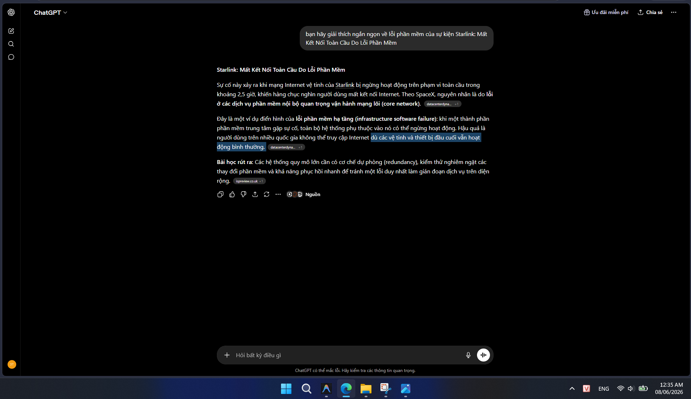

- Đính chính: Trong thời gian diễn ra sự cố, các thiết bị đầu cuối (vệ tinh mặt đất/chảo Starlink của người dùng) không hoạt động bình thường. Theo dữ liệu phân tích hệ thống ThousandEyes, các chảo vệ tinh của người dùng liên tục bị mất kết nối với chùm vệ tinh tầm thấp và bị rơi vào một vòng lặp cố gắng tái kết nối liên tục (reconnection cycle). Do đó, việc nói chúng "vẫn hoạt động bình thường" là chưa chuẩn xác, vì thiết bị đầu cuối lúc đó bị mất đồng bộ và không thể thiết lập liên kết thành công.

---

## Phần III – Bảng Tổng Hợp 20 Lỗi Phần Mềm (2022–2026)

| STT | Mã Lỗi | Tên / Sự kiện                                                                 | Năm       | Danh mục                   | Mức độ       |
| --- | ------ | ----------------------------------------------------------------------------- | --------- | -------------------------- | ------------ |
| 1   | AI-01  | Chatbot Air Canada tư vấn sai chính sách hoàn vé                              | 2022–2024 | Ảo giác                    | Trung bình   |
| 2   | AI-02  | Google AI Overviews đề xuất ăn đá và cho keo vào pizza                        | 2024      | Ảo giác                    | Cao          |
| 3   | AI-03  | Bing Chat "Sydney" lộ system prompt qua prompt injection                      | 2023      | Prompt Injection           | Cao          |
| 4   | AI-04  | GitHub Copilot – tiêm lệnh thực thi mã cục bộ (CVE-2025-53773)                | 2025      | Prompt Injection gián tiếp | Nghiêm trọng |
| 5   | AI-05  | Google Gemini tạo ảnh lịch sử sai lệch về chủng tộc                           | 2024      | Thiên kiến                 | Cao          |
| 6   | SW-01  | Log4Shell – RCE trong Apache Log4j (CVE-2021-44228)                           | 2022      | Lỗ hổng bảo mật            | Nghiêm trọng |
| 7   | SW-02  | Twitter API – rò rỉ 5,4 triệu tài khoản                                       | 2022      | Lỗ hổng bảo mật            | Cao          |
| 8   | SW-03  | FAA NOTAM – sập hệ thống hàng không quốc gia                                  | 2023      | Lỗi vận hành               | Nghiêm trọng |
| 9   | SW-04  | CrowdStrike Falcon – sập 8,5 triệu máy Windows                                | 2024      | Lỗi cập nhật phần mềm      | Nghiêm trọng |
| 10  | SW-05  | Microsoft Azure Front Door – HTTP 503 toàn cầu                                | 2025      | Lỗi cấu hình               | Cao          |
| 11  | SW-06  | Cloudflare – Bot Management làm sập ChatGPT, Spotify, X                       | 2025      | Lỗi cấu hình               | Cao          |
| 12  | SW-07  | Apple iOS 16 – Lockdown Mode lộ dữ liệu ngoài VPN                             | 2022      | Lỗi bảo mật                | Cao          |
| 13  | SW-08  | OpenAI ChatGPT – lỗi redis-py lộ lịch sử hội thoại                            | 2023      | Lỗi bảo mật                | Cao          |
| 14  | SW-09  | Uber Eats Nhật Bản – hiển thị giá 0 đồng                                      | 2022      | Lỗi logic                  | Trung bình   |
| 15  | SW-10  | WhatsApp – Integer Overflow/Underflow cho phép RCE (CVE-2022-36934)           | 2022      | Lỗ hổng bảo mật            | Nghiêm trọng |
| 16  | SW-11  | OpenSSL – buffer overflow trong xác minh chứng chỉ X.509 (CVE-2022-3602)      | 2022      | Lỗ hổng bảo mật            | Cao          |
| 17  | SW-12  | MOVEit Transfer – SQL injection rò rỉ 60 triệu hồ sơ (CVE-2023-34362)         | 2023      | Lỗ hổng bảo mật            | Nghiêm trọng |
| 18  | SW-13  | Okta – khai thác phiên hỗ trợ kỹ thuật qua tệp HAR                            | 2022–2023 | Lỗi bảo mật                | Cao          |
| 19  | SW-14  | Atlassian Confluence – OGNL Injection RCE không cần xác thực (CVE-2022-26134) | 2022      | Lỗ hổng bảo mật            | Nghiêm trọng |
| 20  | SW-15  | Starlink – mất kết nối toàn cầu do lỗi phần mềm                               | 2025      | Lỗi phần mềm vệ tinh       | Cao          |

---

## Kết Luận

### Xu Hướng Chung Giai Đoạn 2022–2026

Phân tích 20 lỗi phần mềm trong giai đoạn 2022–2026 cho thấy một số xu hướng nổi bật:

**1. Lỗi AI/LLM trở thành nhóm lỗi mới nguy hiểm:**  
Trong số 20 lỗi được khảo sát, **5 lỗi (25%)** thuộc nhóm AI/LLM – một tỷ lệ đáng kể so với thực tế AI mới được ứng dụng rộng rãi từ cuối 2022, bao gồm ảo giác (AI-01, AI-02), tiêm mã độc vào prompt (AI-03, AI-04) và thiên kiến (AI-05). Đặc điểm nguy hiểm của nhóm lỗi này là tính không xác định: kết quả của mô hình AI khó kiểm thử toàn diện bằng các phương pháp truyền thống do không gian đầu vào vô hạn.

**2. Lỗi cấu hình và cập nhật là nguyên nhân hàng đầu gây sự cố diện rộng:**  
Các sự cố lớn nhất (CrowdStrike Falcon, Cloudflare Bot Management, Azure Front Door) đều xuất phát từ lỗi cấu hình hoặc cập nhật phần mềm được triển khai không qua kiểm thử đầy đủ, nhấn mạnh vai trò của staged deployment và automated rollback.

**3. Hậu quả pháp lý của lỗi AI đang hình thành tiền lệ:**  
Phán quyết trong vụ _Moffatt v. Air Canada_ xác lập nguyên tắc pháp lý quan trọng: doanh nghiệp phải chịu trách nhiệm pháp lý cho toàn bộ thông tin do AI chatbot của họ cung cấp trên website, bất kể thông tin đó đúng hay sai.

**4. Lỗ hổng bảo mật trong thư viện và phần mềm phổ biến gây rủi ro hệ thống:**  
Log4Shell (Log4j), WhatsApp (Integer Overflow), OpenSSL (buffer overflow), MOVEit Transfer (SQL Injection) và Atlassian Confluence (OGNL Injection) đều minh họa cho hiệu ứng khuếch đại: một lỗ hổng trong thành phần được dùng rộng rãi có thể ảnh hưởng đến hàng triệu hệ thống trên toàn cầu cùng lúc.

**5. Rủi ro tập trung vào một số ít nhà cung cấp hạ tầng:**  
Sự phụ thuộc quá mức vào Cloudflare, Azure, CrowdStrike, Okta và các nhà cung cấp tương tự đang tạo ra các điểm thất bại đơn lẻ (_single point of failure_) có khả năng gây gián đoạn toàn cầu — điển hình là sự cố Cloudflare làm sập đồng thời ChatGPT, Spotify và X, hay CrowdStrike làm tê liệt 8,5 triệu máy Windows chỉ trong vài giờ.

### Khuyến Nghị Cho Các Tổ Chức

1. **Kiểm thử phần mềm AI đặc thù**: Áp dụng kiểm thử đối kháng (red teaming), kiểm thử thiên kiến, kiểm thử ảo giác và kiểm thử prompt injection theo chu kỳ trước và sau khi triển khai mô hình; đặc biệt chú ý đến nội dung châm biếm, lịch sử và các tình huống nhạy cảm.
2. **Staged rollout bắt buộc**: Không cập nhật phần mềm trên toàn bộ hệ thống production cùng lúc; triển khai theo từng giai đoạn với khả năng rollback tự động khi phát hiện tỷ lệ lỗi bất thường — áp dụng cho cả phần mềm bảo mật kernel-level như CrowdStrike lẫn hạ tầng mạng như Cloudflare.
3. **Quản lý phụ thuộc thư viện và bề mặt tấn công**: Xây dựng Software Bill of Materials (SBOM) để theo dõi mọi phụ thuộc bắc cầu; ưu tiên vá lỗ hổng trong các thư viện phổ biến (Log4j, OpenSSL, redis-py) ngay khi có bản vá.
4. **Bảo mật dữ liệu cá nhân trong tích hợp AI và API**: Kiểm soát chặt chẽ dữ liệu người dùng đưa vào hệ thống cache và API bên thứ ba; cô lập dữ liệu thanh toán và nhận dạng trong tầng lưu trữ riêng biệt, mã hóa; tránh lưu token/API key dạng plaintext trong môi trường có AI truy cập.
5. **Tuân thủ tiêu chuẩn ngành**: Tham chiếu OWASP Top 10 for LLM (đặc biệt LLM01 – Prompt Injection), NIST AI RMF, và các hướng dẫn của CISA để xây dựng khung kiểm soát chất lượng phù hợp với từng loại hệ thống, bao gồm cả hệ thống truyền thống lẫn hệ thống tích hợp AI.

---

_Báo cáo được tổng hợp từ các nguồn công khai đáng tin cậy bao gồm: NVD (National Vulnerability Database), CISA, OWASP, OpenAI Blog, phán quyết tòa án, báo cáo sự cố chính thức của các tổ chức, và các ấn phẩm kỹ thuật uy tín. Thông tin được cập nhật đến tháng 6/2026._
