# Yêu Cầu 3 – Ca Kiểm Thử Thiết Bị Vật Lý

**Thiết bị:** Quạt điện
**Hãng / Nhãn hiệu:** Senko  
**Model:** BX1282
**Năm sản xuất:** 06/2019
**Số serial (che 4 ký tự giữa):** Không có

> **Ảnh thiết bị + thẻ sinh viên:**
> 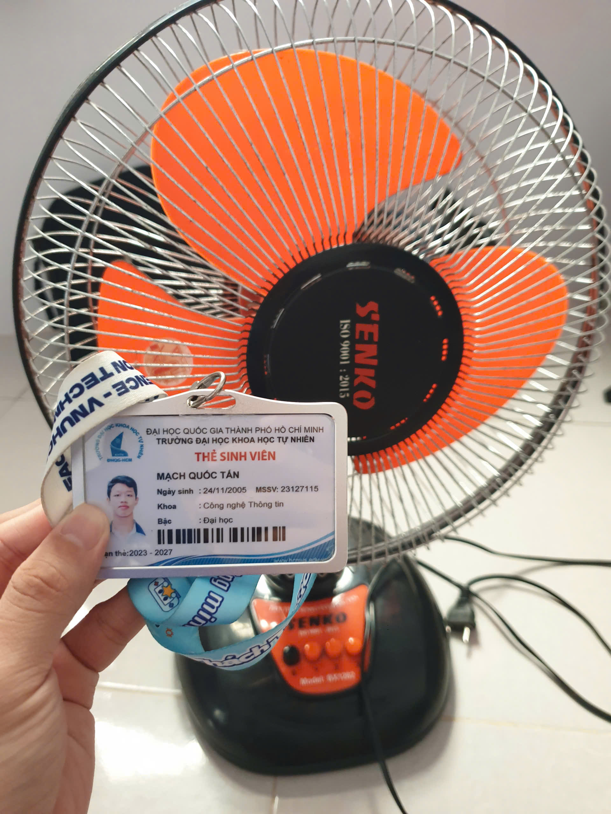
> 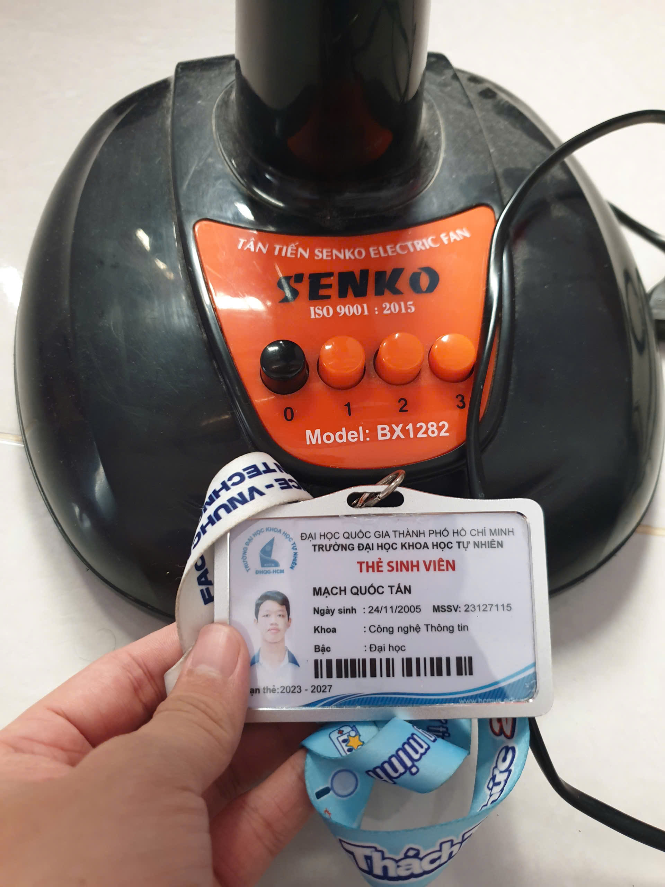
> 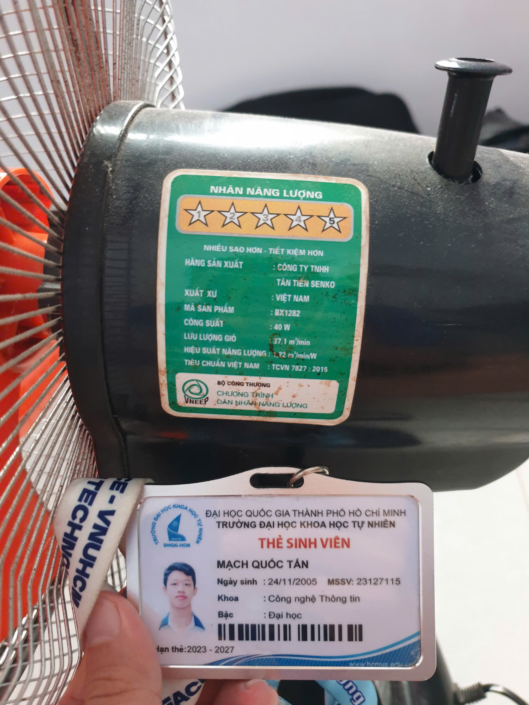
> 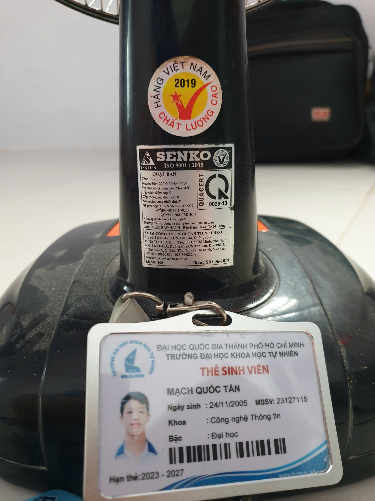

---

## Phần A – Test cases

- Checklist thực hiện tại tab Checklist: [File]([Req03]Test_Cases_Physical_Product.xlsx)
- Danh sách các ca kiểm thử tại tab TestCase: [File]([Req03]Test_Cases_Physical_Product.xlsx)

### Video thực hiện

- Link Google Drive: [Link](https://drive.google.com/drive/folders/1P59JvV6xo_iJQ9FJ6Tjti74ouy-BVY0E?usp=drive_link)

### Các edge case mà AI KHÔNG tìm ra

- Dưới đây là hình ảnh chụp màn hình cuộc trò chuyện với AI chứng minh các edge case mà AI không tìm ra:
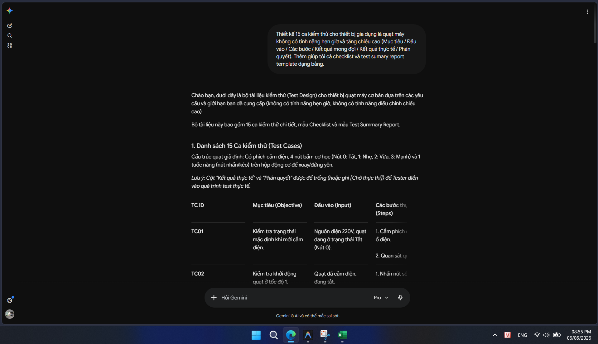
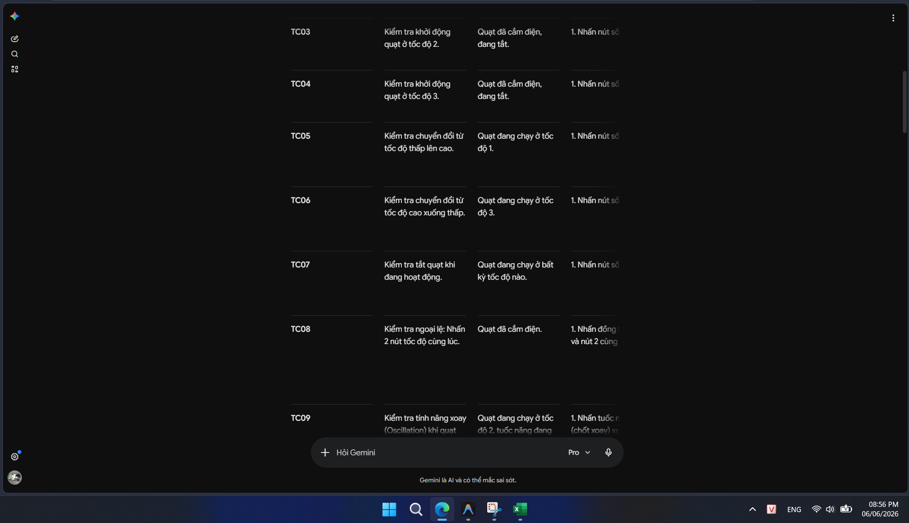
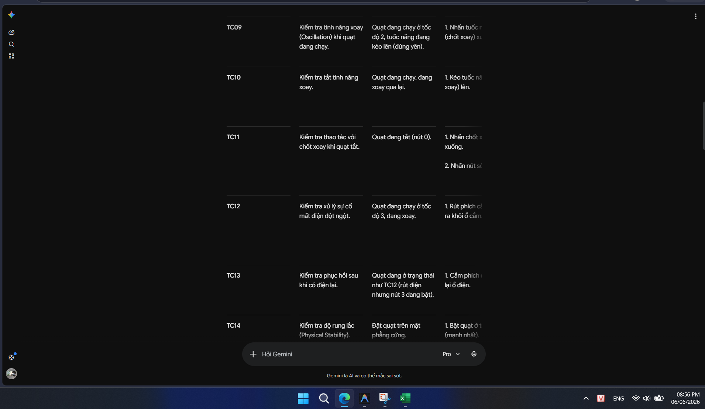
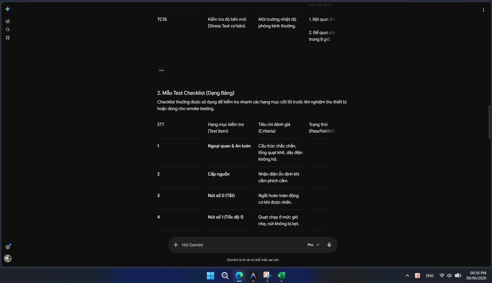
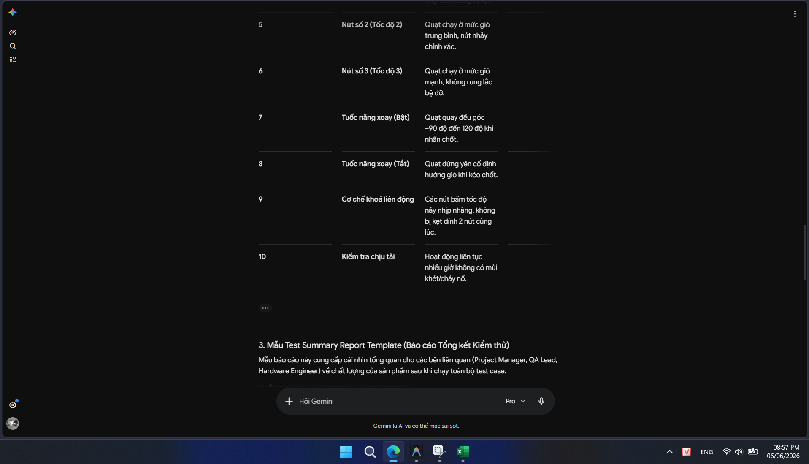
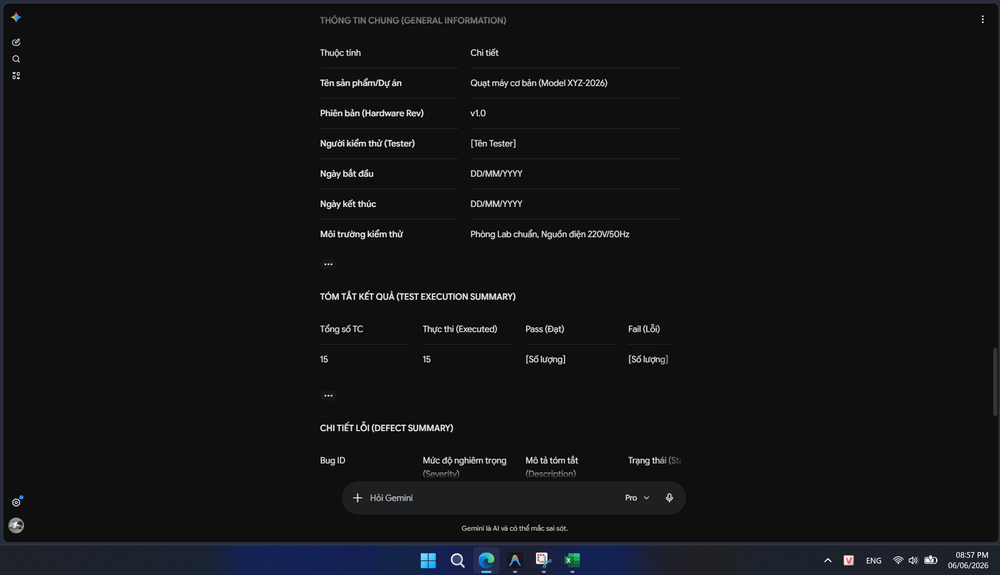
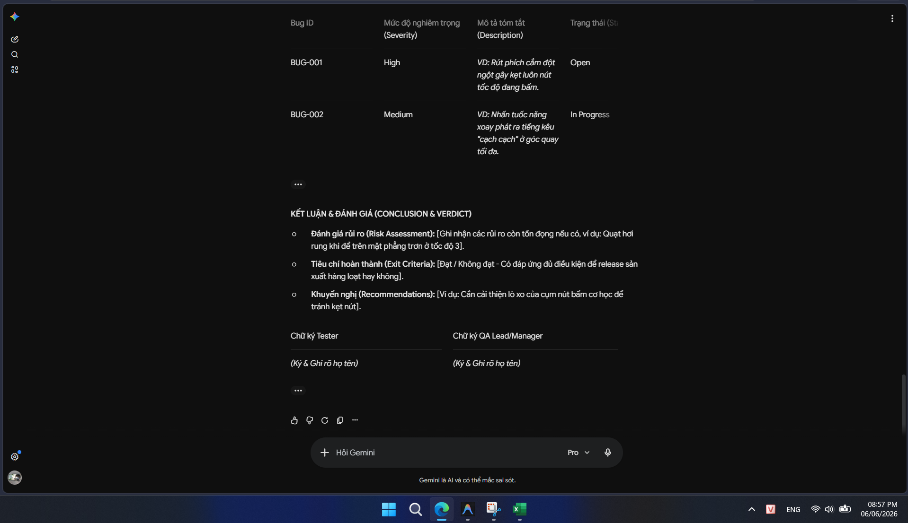

- Các edge test cases mà em đã thêm vào file Excel là: TC16, TC17, TC18, TC19. Các test cases mà em thêm chủ yếu khai thác về thành phần lồng quạt, do prompt cho AI gen test cases giới hạn với 15 test cases nên đa số AI tập trung vào các chức năng chính như tốc độ quạt, xoay quạt, ... Ngoài ra lồng quạt với các chức năng tương tác cùng lồng quạt thường ít được quan tâm (đôi khi người sử dụng tháo cả lồng quạt ra để sử dụng), các test cases mà em thêm vào đều dựa trên những tình huống thực tế khi sử dụng và những hạn chế của sản phẩm quạt điện.

---

## Phần B – Kết quả kiểm thử

Trong file Excel tại tab TestSummaryReport: [File]([Req03]Test_Cases_Physical_Product.xlsx)

---

## Phần C – Danh Sách Lỗi Phát Hiện

> **Link GitHub Issues:** [https://github.com/mqt4n/hcmus-swtesting--hw/issues](https://github.com/mqt4n/hcmus-swtesting--hw/issues)
> **Ảnh chụp trang chứa các Github Issues (kèm username GitHub):**
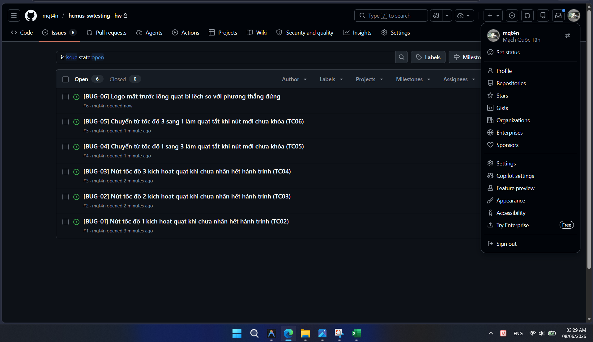
