# BÁO CÁO HỌC TẬP BÀI TẬP 1 (HW01)

## PHÂN TÍCH THỊ TRƯỜNG VIỆC LÀM, LỖI PHẦN MỀM & KIỂM THỬ THIẾT BỊ VẬT LÝ

**Môn học:** CS423 / CSC15003 – Kiểm thử Phần mềm  
**Mã bài tập:** HW01-AI  
**Học kỳ:** Học kỳ 3 – Năm học 2025 - 2026  
**Họ và tên sinh viên (in hoa):** MẠCH QUỐC TẤN  
**Mã số sinh viên:** 23127115  
**Lớp / Khóa:** 23KTPM3  
**Đường dẫn GitHub Repository bài làm:** https://github.com/mqt4n/hcmus-swtesting--hw

---

## MỤC LỤC (Table of Contents)

- [PHẦN 1: PHÂN TÍCH THỊ TRƯỜNG VIỆC LÀM QA/QC 2026](#phan-1-phan-tich-thi-truong-viec-lam-qaqc-2026)
- [PHẦN 2: DANH SÁCH 20 LỖI PHẦN MỀM (2022-2026)](#phan-2-danh-sach-20-loi-phan-mem-2022-20-26)
- [PHẦN 3: CA KIỂM THỬ THIẾT BỊ VẬT LÝ GIA DỤNG](#phan-3-ca-kiem-thu-thiet-bi-vat-ly-gia-dung)
- [PHẦN 4: SƠ ĐỒ TƯ DUY QUY TRÌNH ISTQB VÀ VAI TRÒ QA/QC](#phan-4-so-do-tu-duy-quy-trinh-istqb-va-vai-tro-qaqc)
- [PHẦN 5: NHẬN XÉT VỀ AI (AI CRITIQUE)](#phan-5-nhan-xet-ve-ai-ai-critique)
- [PHẦN 6: KHAI BÁO BẮT BUỘC (MANDATORY DISCLOSURE)](#phan-6-khai-bao-bat-buoc-mandatory-disclosure)
- [PHẦN 7: BẢNG TỰ ĐÁNH GIÁ ĐIỂM SỐ (SELF-ASSESSMENT RUBRIC)](#phan-7-bang-tu-danh-gia-diem-so-self-assessment-rubric)
- [PHẦN 8: CÁC PHỤ LỤC (APPENDICES)](#phan-8-cac-phu-luc-appendices)
  - [Phụ lục A: Báo Cáo Kiểm Tra AI (AI Audit Report)](#phu-luc-a-bao-cao-kiem-tra-ai-ai-audit-report-ai-02)
  - [Phụ lục B: Mẫu Công Bố Sử Dụng AI (AI Disclosure Form)](#phu-luc-b-mau-cong-bo-su-dung-ai-ai-disclosure-form-ai-03)
  - [Phụ lục C: Checklist Quyền Riêng Tư & Sử Dụng AI Có Trách Nhiệm](#phu-luc-c-checklist-quyen-rieng-tu-va-su-dung-ai-co-trach-nhiem-ai-05)
  - [Phụ lục D: Cam Kết Thỏa Thuận Sử Dụng AI của Sinh Viên](#phu-luc-d-cam-ket-thoa-thuan-su-dung-ai-cua-sinh-vien-ai-06)
  - [Phụ lục E: Nhật Ký Hội Thoại AI (Prompt Log)](#phu-luc-e-nhat-ky-hoi-thoai-ai-prompt-log)

---

## NỘI DUNG BÁO CÁO CHI TIẾT

---

### PHẦN 1: PHÂN TÍCH THỊ TRƯỜNG VIỆC LÀM QA/QC 2026

# Phân Tích Thị Trường Tuyển Dụng QA/QC – Tháng 6/2026

**Ngày phân tích:** 04/06/2026  
**Nguồn dữ liệu:** 14 tin tuyển dụng thu thập từ ITviec và LinkedIn

---

## 1. Automation QA Engineer – NAKIVO

**Link:** https://itviec.com/viec-lam-it/automation-qa-engineer-qa-qc-tester-automation-test-nakivo-0115?lab_feature=preview_jd_page

### Mô tả ngắn

**Công ty:** NAKIVO – công ty phần mềm chuyên về giải pháp sao lưu và phục hồi dữ liệu (Backup & Recovery), có văn phòng tại TP. Hồ Chí Minh.  
**Vị trí:** Automation QA Engineer.  
**Mức lương:** 1,100 – 1,500 USD/tháng.  
Nhân viên phối hợp với đội ngũ phát triển và QA để thiết kế, phát triển, thực thi các kịch bản kiểm thử tự động, quản lý automation test cases bằng AI technologies, báo cáo lỗi và cải tiến liên tục quy trình kiểm thử.

### Ngày đăng tuyển

Theo ảnh chụp màn hình ngày 04/06/2026, tin được đăng **14 ngày trước** → Ngày đăng: **21/05/2026**.

### Yêu cầu AI/LLM/Automation-AI

**Có.** Tin tuyển dụng nêu rõ yêu cầu: *"Experience with AI-automation testing (e.g., Copilot, Cursor, Perplexity)"* và *"Hands-on experience working with AI technologies"*. Ngoài ra, mô tả công việc có ghi: *"Design, create, and manage automation test cases using AI technologies"*.

### Hình ảnh minh họa

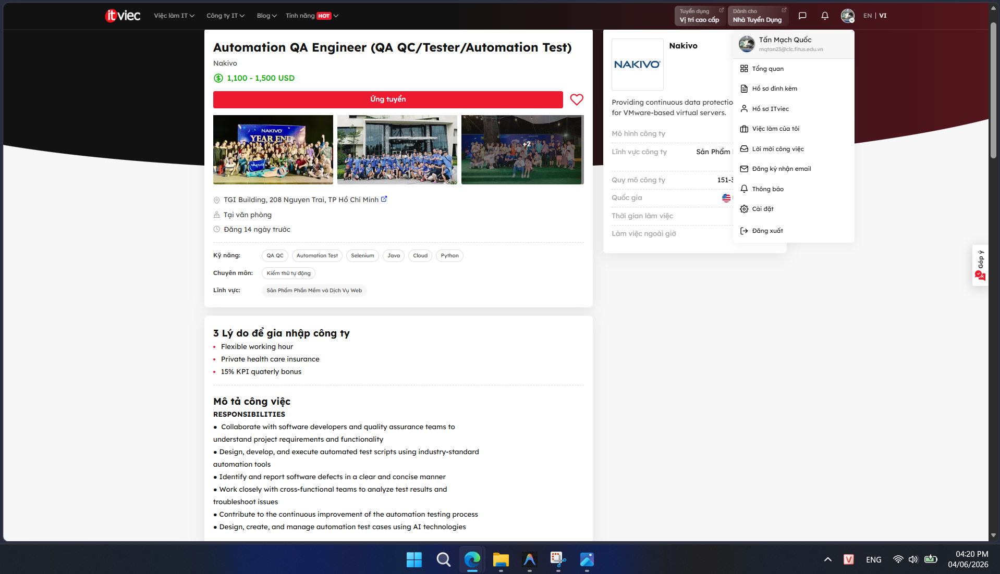
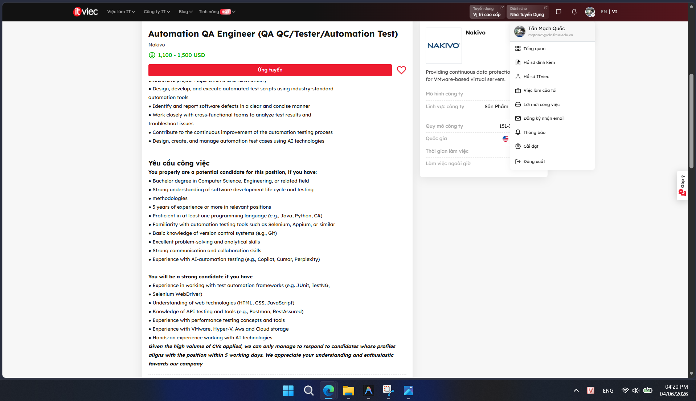

### Phân tích tác động AI

Vị trí này đã tích hợp AI vào quy trình kiểm thử tự động như một yêu cầu bắt buộc, không còn là điểm cộng. Trong tương lai, các công cụ AI có khả năng tự sinh test case và phát hiện lỗi tự động, làm thay đổi đáng kể cách QA Engineer thực hiện công việc hàng ngày.

---

## 2. Middle/Senior QC Engineer – MoMo (M_Service)

**Link:** https://itviec.com/viec-lam-it/middle-senior-qc-engineer-ai-llm-nlp-agile-m_service-momo-4728?lab_feature=preview_jd_page

### Mô tả ngắn

**Công ty:** M_Service (MoMo) – ví điện tử hàng đầu Việt Nam, hoạt động trong lĩnh vực dịch vụ tài chính số (Ngân hàng, Chứng khoán, Dịch vụ Tài chính).  
**Vị trí:** Middle/Senior QC Engineer (Manual/Automation Test).  
**Mức lương:** Thỏa thuận (You'll love it).  
Công việc bao gồm xây dựng chiến lược và quy trình kiểm thử tự động, duy trì và cập nhật automation test scripts, thiết kế hybrid test automation framework, tạo test plans và test cases theo phương pháp Agile.

### Ngày đăng tuyển

Theo ảnh chụp màn hình ngày 04/06/2026, tin được đăng **8 ngày trước** → Ngày đăng: **27/05/2026**.

### Yêu cầu AI/LLM/Automation-AI

**Không.** Mặc dù tên tin tuyển dụng có chứa từ khóa AI/LLM/NLP, nội dung mô tả công việc và yêu cầu kỹ năng (kỹ năng: QA QC, Tester, Automation Test) hoàn toàn tập trung vào kiểm thử tự động truyền thống. Không có yêu cầu cụ thể nào về AI tools hay LLM trong phần mô tả công việc.

### Hình ảnh minh họa

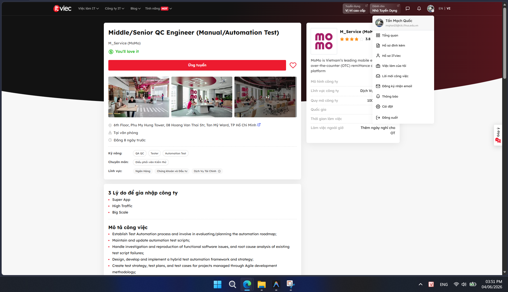
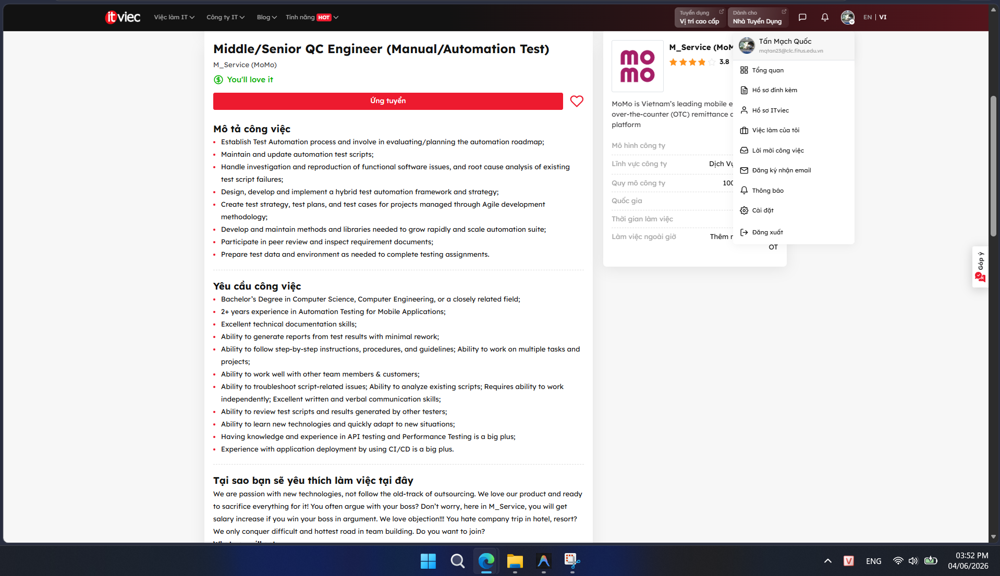

### Phân tích tác động AI

MoMo là nền tảng tài chính số xử lý lượng lớn giao dịch real-time và đang mở rộng sang các tính năng AI; trong tương lai, QC Engineer tại đây sẽ phải đối mặt với bài toán kiểm thử chất lượng cho các hệ thống AI gợi ý tài chính và phát hiện gian lận tự động, đòi hỏi phương pháp kiểm thử vượt ra ngoài kỹ thuật automation truyền thống.

---

## 3. Senior QC Automation Tester – PNJ

**Link:** https://itviec.com/viec-lam-it/senior-qc-automation-tester-qa-qc-pnj-5542?lab_feature=preview_jd_page

### Mô tả ngắn

**Công ty:** PNJ (Công ty Cổ phần Vàng Bạc Đá Quý Phú Nhuận) – thương hiệu trang sức và bán lẻ hàng đầu Việt Nam, hoạt động đa lĩnh vực (Blockchain & Web3, Hàng Tiêu Dùng, Thương Mại Điện Tử, Ngân Hàng).  
**Vị trí:** Senior QC Automation Tester.  
**Mức lương:** 1,000 – 1,500 USD/tháng.  
Vai trò bao gồm ba nhóm nhiệm vụ chính: (1) Kiểm soát chất lượng truyền thống và AI – kiểm tra độ chính xác, tính công bằng, edge case và rủi ro nghiệp vụ của sản phẩm AI; (2) Kiểm thử tự động và công cụ AI – phát triển kịch bản kiểm thử, áp dụng công cụ kiểm thử AI (LLM evaluation, synthetic data), thiết lập CI/CD; (3) Đảm bảo chất lượng dữ liệu cho AI – kiểm tra tính đầy đủ và chính xác của dữ liệu huấn luyện.

### Ngày đăng tuyển

Theo ảnh chụp màn hình ngày 04/06/2026, tin được đăng **15 ngày trước** → Ngày đăng: **20/05/2026**.

### Yêu cầu AI/LLM/Automation-AI

**Có.** Mô tả công việc liệt kê rõ ràng: *"Áp dụng các công cụ kiểm thử AI (LLM evaluation, synthetic data)"*, *"Kiểm tra độ chính xác, độ tin cậy và tính công bằng của kết quả AI"*, *"Kiểm tra tính đầy đủ và chính xác của dữ liệu huấn luyện AI"*. Đây là vị trí yêu cầu kiểm thử trực tiếp trên hệ thống AI.

### Hình ảnh minh họa

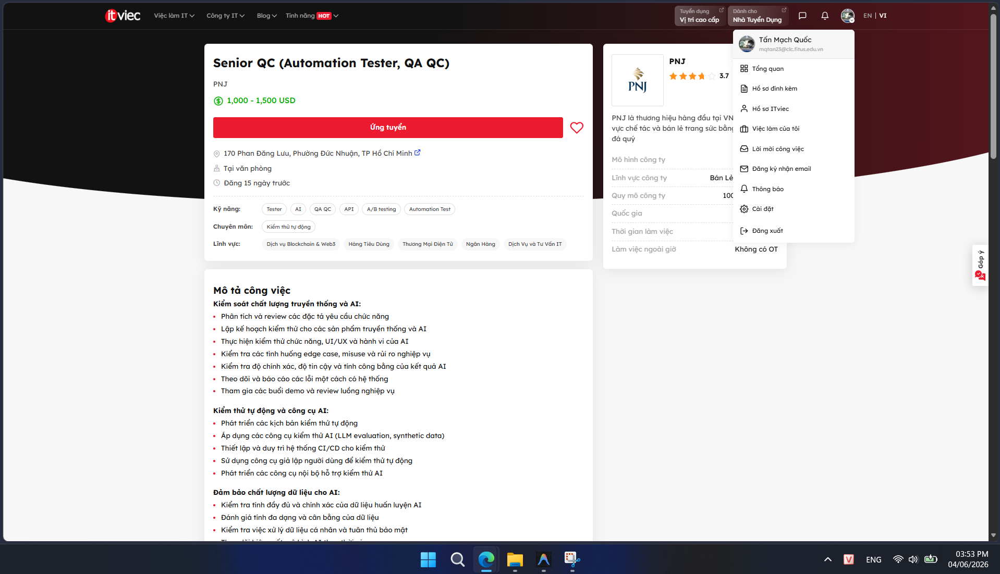
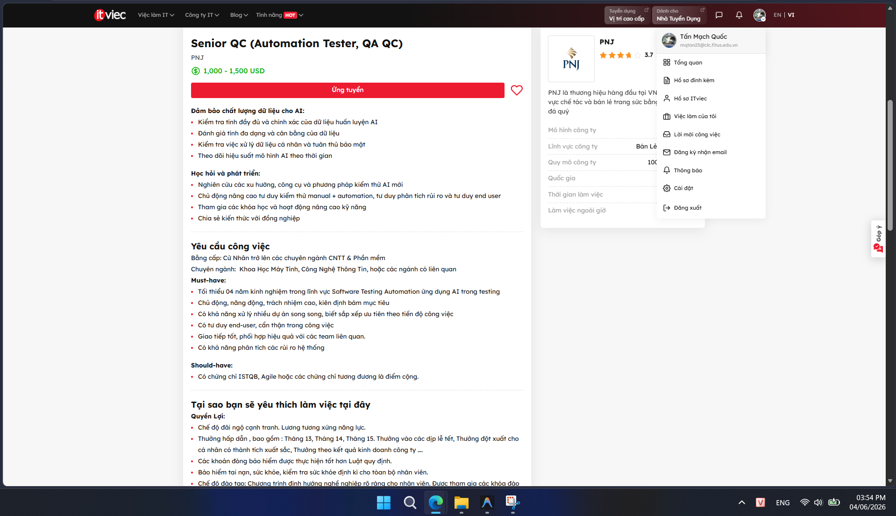

### Phân tích tác động AI

Việc PNJ – một tập đoàn bán lẻ truyền thống – tích hợp AI vào sản phẩm và yêu cầu QC biết kiểm thử AI model (LLM evaluation, AI fairness) phản ánh xu hướng các ngành ngoài công nghệ cũng đang ứng dụng AI sâu rộng. Trong tương lai, QC tại các công ty bán lẻ sẽ cần thành thạo kỹ thuật đánh giá chất lượng mô hình AI như một phần cốt lõi của công việc.

---

## 4. Senior Manual Test Engineer – KMS Technology

**Link:** https://itviec.com/viec-lam-it/senior-manual-test-engineer-qa-qc-kms-technology-3100?lab_feature=preview_jd_page

### Mô tả ngắn

**Công ty:** KMS Technology – công ty công nghệ Mỹ-Việt chuyên về phát triển phần mềm và dịch vụ tư vấn IT, hoạt động từ 2009 với hơn 1.000 nhân viên.  
**Vị trí:** Senior Manual Test Engineer (QA/QC).  
**Mức lương:** Thỏa thuận (Attractive).  
**Hình thức:** Linh hoạt (Hybrid), làm việc tại TP. HCM hoặc Đà Nẵng.  
Công việc bao gồm thực hiện toàn bộ hoạt động kiểm thử phần mềm web, mentoring và coaching kỹ sư QA junior, tham gia sprint planning trong môi trường Scrum, hỗ trợ nghiên cứu sản phẩm và tương tác trực tiếp với khách hàng Mỹ.

### Ngày đăng tuyển

Theo ảnh chụp màn hình ngày 04/06/2026, tin được đăng **10 ngày trước** → Ngày đăng: **25/05/2026**.

### Yêu cầu AI/LLM/Automation-AI

**Không.** Toàn bộ mô tả công việc và yêu cầu kỹ năng tập trung vào manual testing truyền thống: test strategy, test plan, black box testing, risk-based testing, exploratory testing, Agile/Scrum. Không có yêu cầu hay đề cập nào về AI tools trong nội dung tin tuyển dụng.

### Hình ảnh minh họa

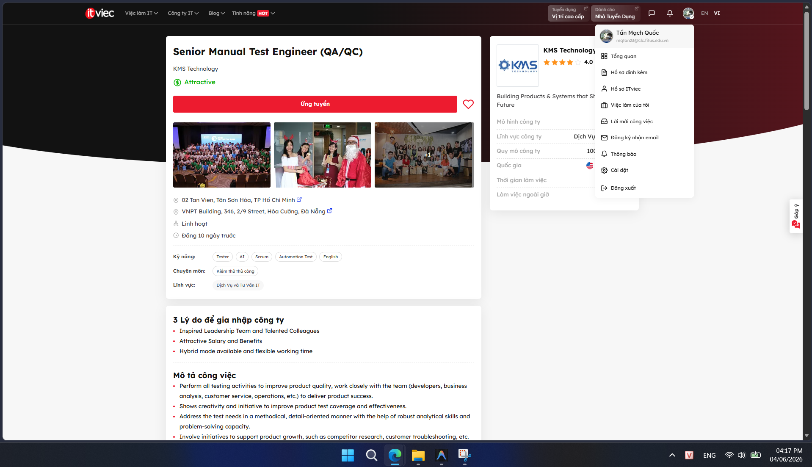
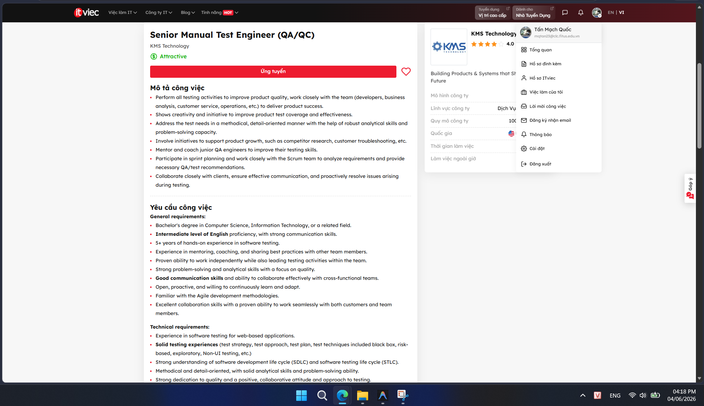

### Phân tích tác động AI

Vị trí Senior Manual Test Engineer tập trung vào tư duy phân tích và kỹ năng lãnh đạo đội nhóm – những năng lực khó tự động hóa. Tuy nhiên, các tác vụ lặp đi lặp lại như regression testing và test case generation đang dần được AI hỗ trợ, khiến Senior QA trong tương lai sẽ phải chuyển trọng tâm sang thiết kế chiến lược kiểm thử và quản lý chất lượng ở cấp độ cao hơn.

---

## 5. Senior Software Quality Control – Shinhan DS

**Link:** https://itviec.com/viec-lam-it/senior-software-quality-control-qc-tester-shinhan-ds-0741?lab_feature=preview_jd_page

### Mô tả ngắn

**Công ty:** SHINHAN DS – công ty công nghệ thông tin thuộc tập đoàn tài chính Shinhan (Hàn Quốc), chuyên cung cấp hệ thống phần mềm cho lĩnh vực ngân hàng và tài chính.  
**Vị trí:** Senior Software Quality Control (QC/Tester).  
**Mức lương:** Upto 25 triệu VNĐ gross/tháng.  
Công việc tập trung quản lý chất lượng hệ thống ngân hàng: phát triển Test Strategy và Test Plan theo tiêu chuẩn ngân hàng, thiết kế Test Suite Structure dựa trên Requirements Traceability Matrix (RTM), kiểm thử cross-platform (Mobile Banking, Internet Banking, Core Banking), quản lý rủi ro và phân tích nguyên nhân gốc rễ.

### Ngày đăng tuyển

Theo ảnh chụp màn hình ngày 04/06/2026, tin được đăng **2 ngày trước** → Ngày đăng: **02/06/2026**.

### Yêu cầu AI/LLM/Automation-AI

**Không.** Toàn bộ nội dung mô tả công việc tập trung vào kiểm thử hệ thống ngân hàng chuyên sâu: Quality Management, Test Strategy, Cross-platform Testing, Risk Management. Kỹ năng được liệt kê (QA QC, Postman, Playwright, Jira, SQL) không bao gồm bất kỳ yêu cầu AI nào.

### Hình ảnh minh họa

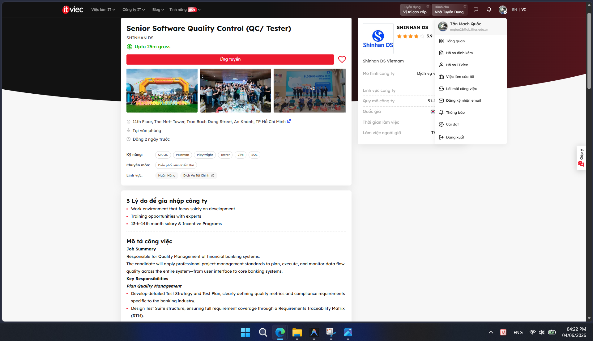
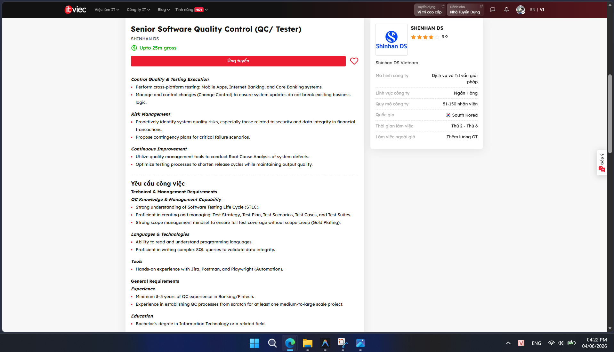

### Phân tích tác động AI

Trong lĩnh vực ngân hàng với yêu cầu tuân thủ nghiêm ngặt về bảo mật và quy định tài chính, việc tích hợp AI vào quy trình QC cần thời gian kiểm định kỹ lưỡng hơn. Tuy nhiên, AI có tiềm năng lớn trong việc phát hiện bất thường giao dịch và kiểm thử hồi quy tự động cho các hệ thống core banking vốn có chu kỳ release dày đặc.

---

## 6. Fresher Full-stack Test Engineer – KMS Technology

**Link:** https://www.linkedin.com/jobs/view/4417931013/

### Mô tả ngắn

**Công ty:** KMS Technology, Inc. – công ty công nghệ chiến lược, thành lập 2009, có văn phòng tại Mỹ, Việt Nam, Mexico và Ba Lan.  
**Vị trí:** Fresher Full-stack Test Engineer (QA/QC/Tester).  
**Hình thức:** On-site, Full-time | 34 ứng viên đã nộp.  
Đây là vị trí dành cho sinh viên năm cuối hoặc mới tốt nghiệp (GPA 7.5+), yêu cầu nền tảng lập trình vững (C++, C#, Java, JavaScript, Python), thực hiện kiểm thử trên nhiều nền tảng (Web, Mobile, Desktop, API, Database), viết test cases và báo cáo lỗi.

### Ngày đăng tuyển

Theo ảnh chụp màn hình ngày 04/06/2026, tin được đăng **6 ngày trước** → Ngày đăng: **29/05/2026**.

### Yêu cầu AI/LLM/Automation-AI

**Không.** Nội dung JD yêu cầu kỹ năng lập trình (C++, C#, Java, JavaScript, Python), kiến thức testing cơ bản và kinh nghiệm với automation tools (Selenium, Playwright, Appium). Không có yêu cầu cụ thể nào về AI tools hay LLM trong nội dung tin tuyển dụng.

### Hình ảnh minh họa

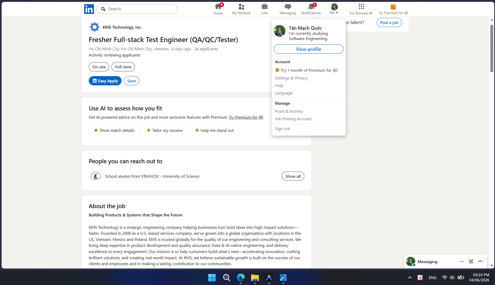
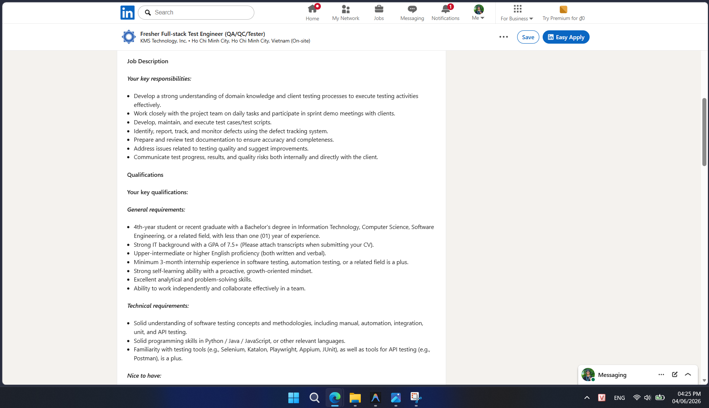

### Phân tích tác động AI

Vị trí Fresher yêu cầu thành thạo đa nền tảng (Web, Mobile, Desktop, API) ngay từ đầu, phản ánh áp lực ngày càng cao đối với kỹ sư QA mới ra trường. Khi AI đảm nhiệm ngày càng nhiều tác vụ kiểm thử lặp lại, các Fresher trong tương lai sẽ cần học cách giám sát và điều chỉnh AI-generated test cases thay vì tự viết từ đầu.

---

## 7. Quality Control Engineer – DXC Technology Vietnam

**Link:** https://www.linkedin.com/jobs/view/4410294847/

### Mô tả ngắn

**Công ty:** DXC Technology Vietnam – tập đoàn công nghệ toàn cầu (Fortune 500), phục vụ gần 6.000 khách hàng tại 70 quốc gia trong lĩnh vực IT services và tư vấn chuyển đổi số.  
**Vị trí:** Quality Control Engineer.  
**Hình thức:** Hybrid, Full-time | 64 ứng viên đã nộp.  
Công việc bao gồm thiết kế và phát triển test dựa trên phân tích yêu cầu, viết automation test scripts, xác định rủi ro testability, theo dõi quality metrics (defect density, open defect counts) và báo cáo tiến độ kiểm thử.

### Ngày đăng tuyển

Theo ảnh chụp màn hình ngày 04/06/2026, tin được đăng lại (reposted) **2 ngày trước** → Ngày đăng lại: **02/06/2026**.

### Yêu cầu AI/LLM/Automation-AI

**Không.** Nội dung mô tả công việc yêu cầu kỹ năng lập trình (Java, Python), automation testing và CI/CD. Không có yêu cầu cụ thể nào về AI tools hay LLM. Phần mô tả công ty đề cập DXC có năng lực AI/RPA, nhưng đây là giới thiệu tổ chức, không phải yêu cầu đối với vị trí tuyển dụng.

### Hình ảnh minh họa

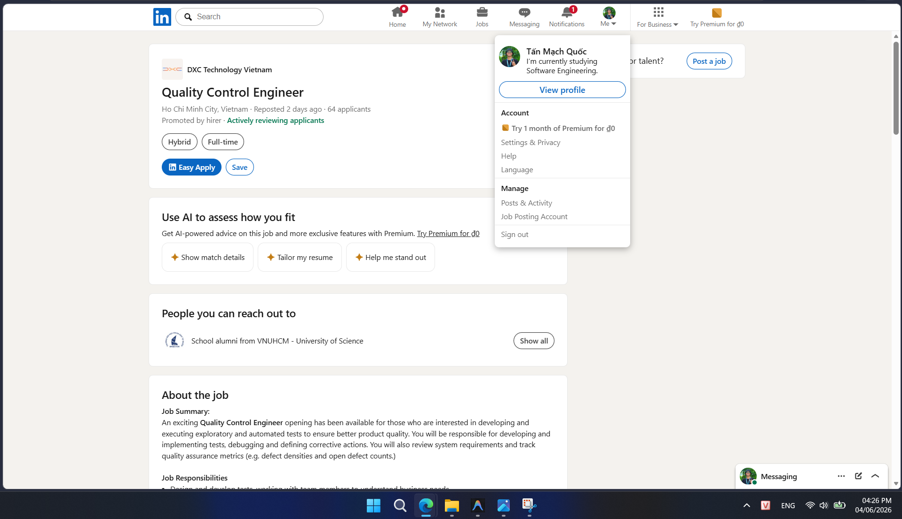
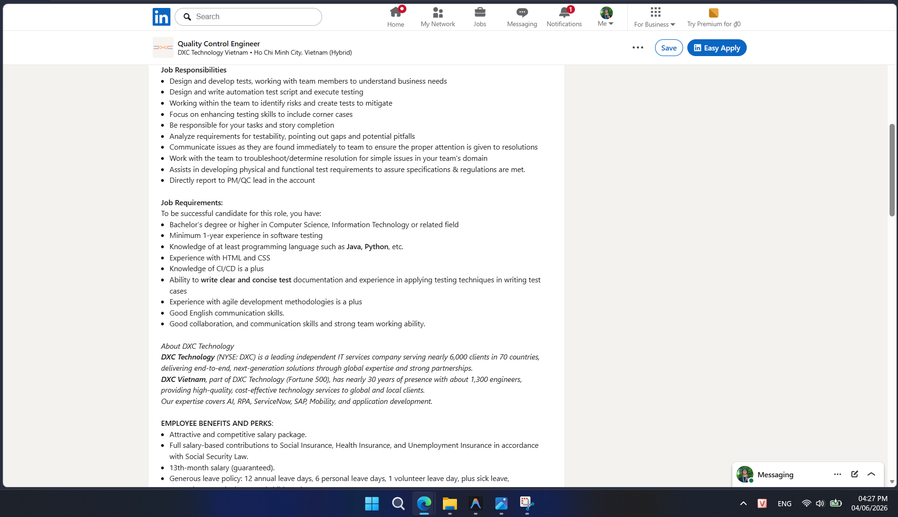

### Phân tích tác động AI

DXC đang triển khai AI và RPA cho khách hàng doanh nghiệp lớn toàn cầu, và khi các hệ thống AI được đưa vào sản xuất, vai trò QC Engineer sẽ cần mở rộng sang kiểm thử chất lượng của cả giải pháp AI và RPA đó, không chỉ dừng lại ở phần mềm truyền thống.

---

## 8. QA Engineer – VibeX-Generated Apps – MetaCrew

**Link:** https://itviec.com/viec-lam-it/qa-engineer-vibex-generated-apps-qa-qc-tester-metacrew-5045?lab_feature=preview_jd_page

### Mô tả ngắn

**Công ty:** MetaCrew (GotoX Vietnam) – startup công nghệ AI tại TP. HCM, vận hành nền tảng VibeX (vibe-x.app) – một trong những nền tảng "vibe coding" hàng đầu thế giới, tạo ra ứng dụng web, slide và tài liệu từ ngôn ngữ tự nhiên.  
**Vị trí:** QA Engineer – VibeX-Generated Apps.  
**Mức lương:** Thỏa thuận (Attractive salary).  
Đây là vai trò hoàn toàn mới: "AI-powered Quality Operator" – không chạy scripted test cases trên sản phẩm cố định mà kiểm thử toàn bộ vòng lặp chất lượng của ứng dụng được tạo bởi AI, bao gồm phân tích pattern lỗi trong AI output, functional testing, bug triage, và phản hồi trực tiếp vào pipeline sinh code của VibeX.

### Ngày đăng tuyển

Theo ảnh chụp màn hình ngày 04/06/2026, tin được đăng **1 ngày trước** → Ngày đăng: **03/06/2026**.

### Yêu cầu AI/LLM/Automation-AI

**Có.** Đây là yêu cầu cốt lõi của vị trí. Tin tuyển dụng nêu: *"We work with AI as a teammate. Armed with Claude, Gemini, and our own VibeX"*. Ứng viên cần có kinh nghiệm thực tế sử dụng AI tools (Claude, Gemini), quen thuộc với các nền tảng vibe coding (VibeX, v0, Lovable, Bolt) và có khả năng phân tích lỗi trong AI-generated output. Tin tuyển dụng không nhận CV truyền thống mà yêu cầu ứng viên nộp bằng portfolio thực tế với AI.

### Hình ảnh minh họa

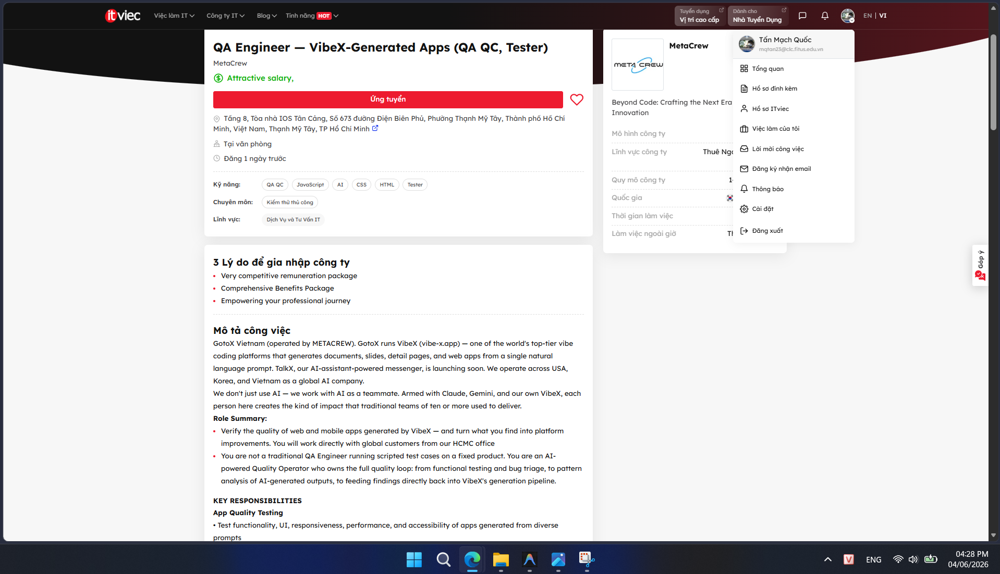
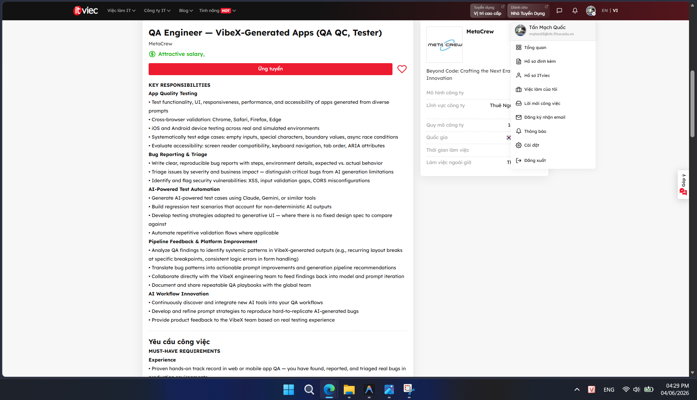

### Phân tích tác động AI

Vị trí này thể hiện rõ nét nhất sự thay đổi bản chất nghề QA trong kỷ nguyên AI: thay vì kiểm thử sản phẩm do lập trình viên viết, QA Engineer nay phải kiểm thử và cải thiện chất lượng của sản phẩm do chính AI tạo ra, đòi hỏi một tư duy kiểm thử hoàn toàn khác, trong đó khả năng đánh giá output của LLM trở thành kỹ năng thiết yếu.

---

## 9. Senior QA/QC Automation Tester (Playwright/Python) – Bosch Global Software Technologies

**Link:** https://itviec.com/viec-lam-it/senior-qa-qc-automation-tester-playwright-python-bosch-global-software-technologies-company-limited-3146?lab_feature=preview_jd_page

### Mô tả ngắn

**Công ty:** Bosch Global Software Technologies Company Limited – bộ phận phần mềm của tập đoàn Bosch (Đức), chuyên cung cấp dịch vụ phần mềm công nghệ cao cho các đơn vị nội bộ Bosch toàn cầu.  
**Vị trí:** Senior QA/QC Automation Tester (Playwright/Python).  
**Mức lương:** Thỏa thuận (You'll love it).  
Hợp đồng qua vendor bên ngoài, thời hạn 1 năm với khả năng gia hạn. Công việc tập trung vào xây dựng "Future of Intelligent Workflows" – thiết lập và duy trì automation test frameworks với Playwright/Python, thiết lập CI/CD pipeline, triển khai chiến lược "shift-left" testing và lãnh đạo các automation initiatives trong quy trình phát triển OutSystems.

### Ngày đăng tuyển

Theo ảnh chụp màn hình ngày 04/06/2026, tin được đăng **20 ngày trước** → Ngày đăng: **15/05/2026**.

### Yêu cầu AI/LLM/Automation-AI

**Không.** Nội dung mô tả công việc và yêu cầu kỹ năng hoàn toàn tập trung vào Playwright, Python, TypeScript, OutSystems và CI/CD. Không có yêu cầu hay đề cập nào về AI tools hay LLM trong tin tuyển dụng.

### Hình ảnh minh họa

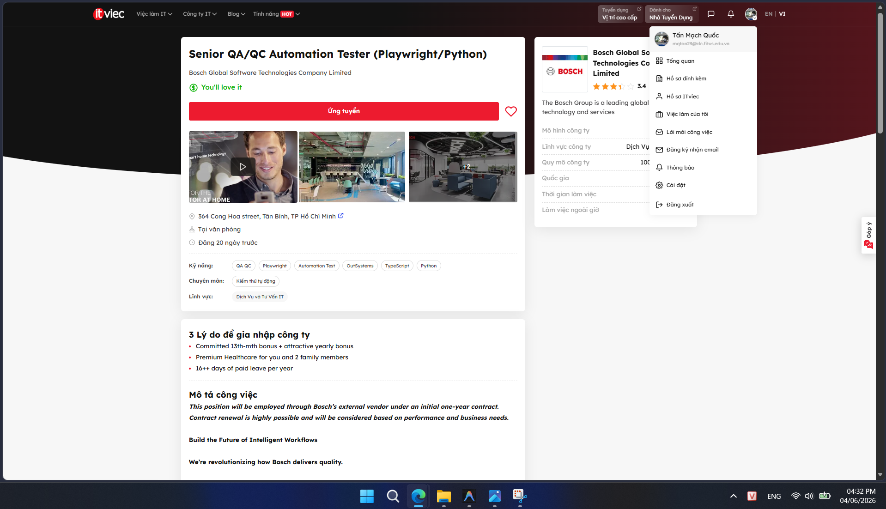
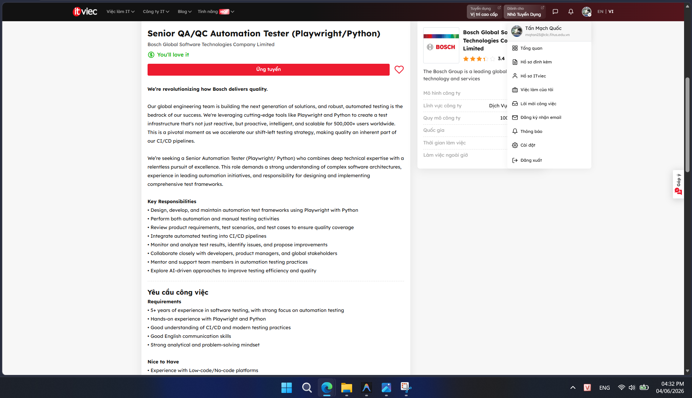

### Phân tích tác động AI

Trọng tâm của vị trí là xây dựng "Intelligent Workflows" thông qua automation testing – nền tảng hạ tầng để tích hợp AI trong tương lai. Khi Bosch đẩy mạnh ứng dụng AI vào quy trình sản xuất và phần mềm công nghiệp, Senior QA tại đây sẽ là người tiên phong trong việc định nghĩa tiêu chuẩn kiểm thử cho các hệ thống AI nhúng (embedded AI systems).

---

## 10. Automation Tester – DXC Technology

**Link:** https://www.linkedin.com/jobs/view/4400787290/

### Mô tả ngắn

**Công ty:** DXC Technology – tập đoàn công nghệ toàn cầu (NYSE: DXC), lãnh đạo về dịch vụ IT doanh nghiệp và khu vực công, hoạt động tại hơn 60 quốc gia.  
**Vị trí:** Automation Tester.  
**Hình thức:** Full-time | 28 ứng viên đã nộp.  
Công việc bao gồm thiết kế và phát triển test dựa trên phân tích yêu cầu và rủi ro, viết automation test scripts, xác định testability của sản phẩm và báo cáo tiến độ cho PM/QC Lead.

### Ngày đăng tuyển

Theo ảnh chụp màn hình ngày 04/06/2026, tin được đăng lại (reposted) **6 ngày trước** → Ngày đăng lại: **29/05/2026**.

### Yêu cầu AI/LLM/Automation-AI

**Không.** Nội dung mô tả công việc yêu cầu kỹ năng lập trình (Java, Python), automation testing frameworks và CI/CD. Không có yêu cầu cụ thể nào về AI tools hay LLM trong nội dung tin tuyển dụng. Phần giới thiệu công ty đề cập chiến lược AI của DXC nhưng không phản ánh yêu cầu tuyển dụng.

### Hình ảnh minh họa

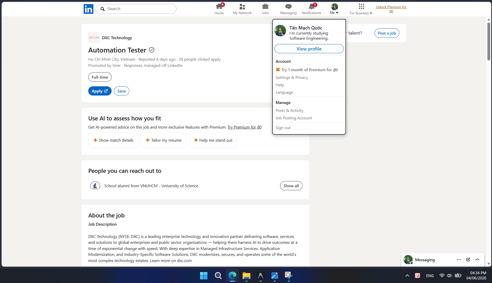
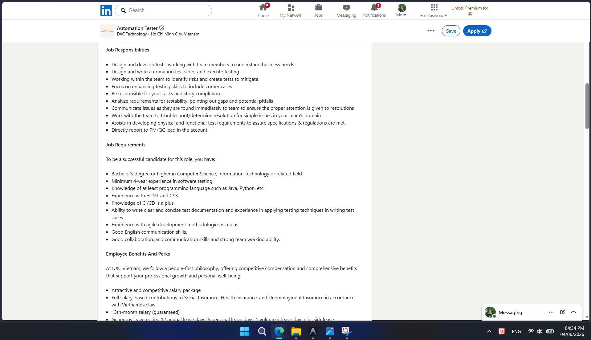

### Phân tích tác động AI

DXC đặt mục tiêu sử dụng AI để tạo ra kết quả cho khách hàng ở cấp độ chiến lược tổ chức, và Automation Tester là vai trò nền tảng trong hành trình đó. Khi các dự án AI/RPA của DXC mở rộng quy mô, đội ngũ QA sẽ cần tích hợp kỹ năng kiểm thử hệ thống AI vào quy trình làm việc hiện tại.

---

## 11. QC Engineer for Web – Evolus/PlanV

**Link:** https://itviec.com/viec-lam-it/qc-engineer-tester-qa-qc-for-web-up-to-1500-evolus-planv-5225?lab_feature=preview_jd_page

### Mô tả ngắn

**Công ty:** Evolus/PlanV – startup phát triển bộ ứng dụng quản lý đội thể thao (sports team management), sản phẩm được quảng bá bởi NBC Sports và phục vụ hàng triệu người dùng tại Mỹ, Anh và EU.  
**Vị trí:** QC Engineer (Tester/QA QC) for Web.  
**Mức lương:** Lên đến 1,500 USD/tháng.  
Môi trường startup nhỏ (tất cả thành viên đều viết code), làm việc trực tiếp với khách hàng Mỹ và đội ngũ kỹ sư giàu kinh nghiệm. Công việc bao gồm tham gia phát triển ứng dụng client/server mới, kiểm thử enterprise web systems và quản lý bug với JIRA, yêu cầu tiếng Anh tốt.

### Ngày đăng tuyển

Theo ảnh chụp màn hình ngày 04/06/2026, tin được đăng **17 ngày trước** → Ngày đăng: **18/05/2026**.

### Yêu cầu AI/LLM/Automation-AI

**Không.** Tin tuyển dụng tập trung vào manual testing cho web enterprise systems, yêu cầu kỹ năng: Tester, Jira, QA QC, tiếng Anh. Không có yêu cầu hay đề cập nào về AI tools hay LLM trong nội dung.

### Hình ảnh minh họa

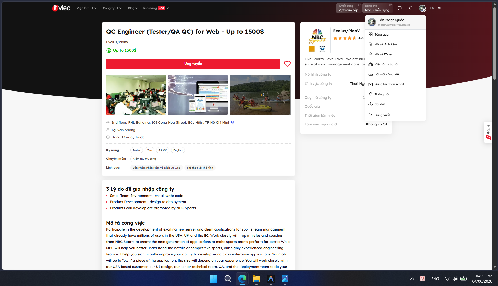
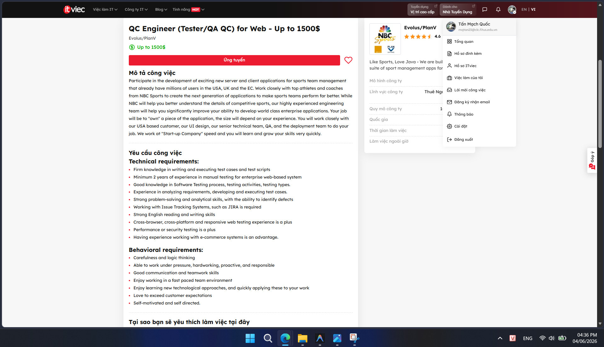

### Phân tích tác động AI

Môi trường startup thể thao với chu kỳ phát triển nhanh và đội ngũ nhỏ là bối cảnh lý tưởng để AI testing tools phát huy hiệu quả, giúp QC Engineer bao quát phạm vi kiểm thử rộng hơn với nguồn lực hạn chế. Việc ứng dụng AI để sinh test case và hỗ trợ regression testing sẽ là bước tự nhiên tiếp theo cho vị trí này.

---

## 12. Automation Tester – Mercatus

**Link:** https://itviec.com/viec-lam-it/automation-tester-qa-qc-mercatus-4125?lab_feature=preview_jd_page

### Mô tả ngắn

**Công ty:** Mercatus – công ty sản phẩm phần mềm trong lĩnh vực thương mại điện tử (all-in-one eCommerce platform), có quy mô 151-300 nhân viên, trụ sở tại TP. HCM.  
**Vị trí:** Automation Tester (QA QC).  
**Mức lương:** 800 – 1,200 USD/tháng.  
Công việc bao gồm thiết kế và viết automation test scripts sử dụng test automation framework, xử lý manual test plans khi cần, báo cáo và theo dõi bugs, tối ưu hóa automation scripts, chia sẻ kiến thức trong nhóm và cập nhật xu hướng automation mới. Ưu tiên kinh nghiệm trong domain e-commerce và làm việc với distributed teams.

### Ngày đăng tuyển

Theo ảnh chụp màn hình ngày 04/06/2026, tin được đăng **23 ngày trước** → Ngày đăng: **12/05/2026**.

### Yêu cầu AI/LLM/Automation-AI

**Không.** Yêu cầu kỹ năng liệt kê cụ thể: minimum 2+ năm kinh nghiệm automation testing, thành thạo Postman, Cypress hoặc Selenium, lập trình Java/JavaScript/Python. Không có yêu cầu về AI tools hay LLM. Mục "stay up to date on emerging automation technologies" là yêu cầu chung về cập nhật công nghệ, không đặc thù về AI.

### Hình ảnh minh họa

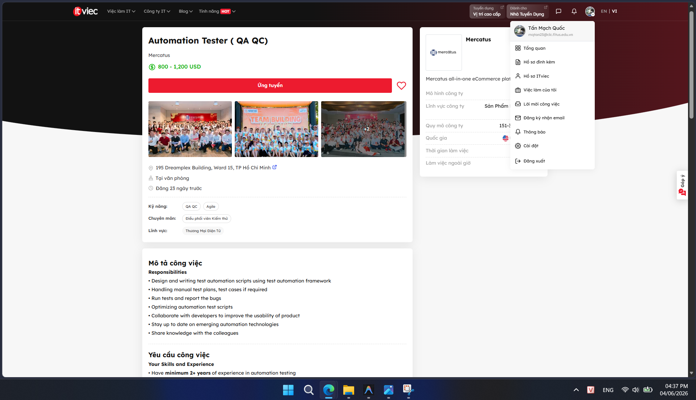
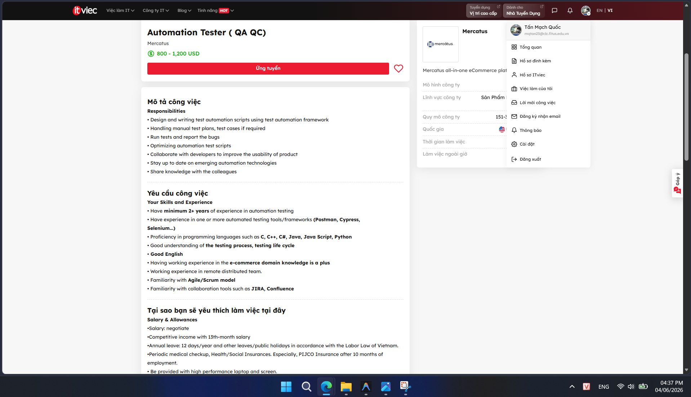

### Phân tích tác động AI

Trong lĩnh vực e-commerce với khối lượng sản phẩm, tính năng và chu kỳ release lớn, automation testing là yêu cầu bắt buộc. AI có tiềm năng tăng tốc đáng kể việc sinh và bảo trì automation scripts, giảm bớt gánh nặng kỹ thuật cho Automation Tester và cho phép họ tập trung vào thiết kế chiến lược kiểm thử phức tạp hơn.

---

## 13. QA Team Lead – NAKIVO

**Link:** https://itviec.com/viec-lam-it/qa-team-lead-nakivo-3715?lab_feature=preview_jd_page

### Mô tả ngắn

**Công ty:** NAKIVO – công ty phần mềm chuyên về giải pháp sao lưu và phục hồi dữ liệu, TP. HCM.  
**Vị trí:** QA Team Lead.  
**Mức lương:** 2,500 – 3,000 USD/tháng.  
Đây là vị trí quản lý cấp cao, yêu cầu 6+ năm kinh nghiệm testing và 3+ năm kinh nghiệm lãnh đạo. Trách nhiệm bao gồm: sở hữu chất lượng toàn bộ sản phẩm/team, định nghĩa testing scope theo risk và business priorities, mentoring kỹ sư QA, lãnh đạo automation cho UI/API/integration testing, cải thiện CI/CD quality workflows, cải tiến release readiness và đặc biệt là **"Introduce AI-assisted QA workflows where they provide real value"**.

### Ngày đăng tuyển

Theo ảnh chụp màn hình ngày 04/06/2026, tin được đăng **2 giờ trước** → Ngày đăng: **04/06/2026**.

### Yêu cầu AI/LLM/Automation-AI

**Có.** Mô tả công việc ghi rõ trong nhóm nhiệm vụ "Process & Continuous Improvement": *"Introduce AI-assisted QA workflows where they provide real value"*. Đây là trách nhiệm tường minh của vị trí này, không phải điểm cộng hay tùy chọn.

### Hình ảnh minh họa

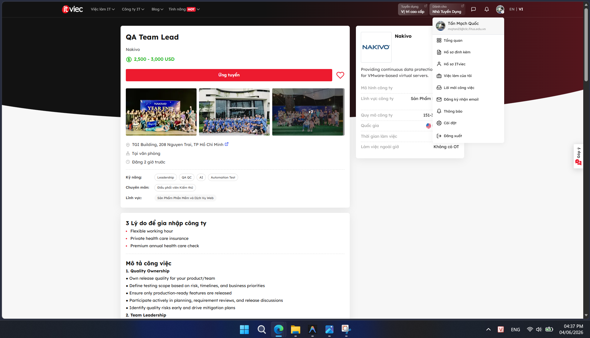
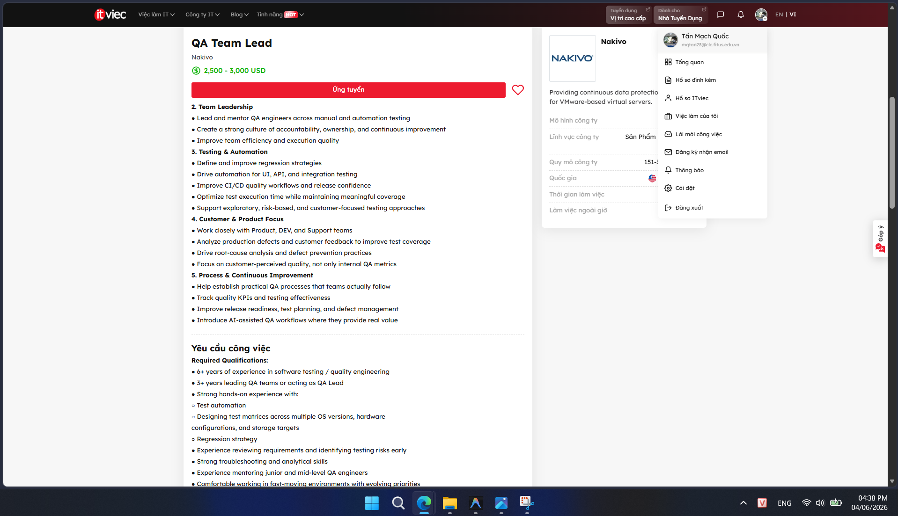

### Phân tích tác động AI

NAKIVO giao nhiệm vụ chủ động triển khai AI vào quy trình QA cho người lãnh đạo đội nhóm, cho thấy AI không còn là thứ đến từ trên xuống mà được kỳ vọng sẽ được dẫn dắt từ chính đội ngũ kỹ thuật. QA Team Lead trong tương lai sẽ cần năng lực đánh giá và lựa chọn AI tools phù hợp bên cạnh các kỹ năng quản lý truyền thống.

---

## 14. Chuyên Viên QC Phần Mềm – Kingfoodmart

**Link:** https://itviec.com/viec-lam-it/chuyen-vien-qc-phan-mem-qc-executive-kingfoodmart-0249?lab_feature=preview_jd_page

### Mô tả ngắn

**Công ty:** Kingfoodmart – chuỗi siêu thị thực phẩm Việt Nam, thuộc lĩnh vực Thực phẩm và Đồ uống/Hàng Tiêu Dùng/Bán lẻ, có quy mô 100+ nhân viên, địa chỉ tại 571 Huỳnh Tấn Phát, Tân Thuận Đông, Quận 7, TP. HCM.  
**Vị trí:** Chuyên Viên QC Phần Mềm (QC Executive).  
**Mức lương:** 950 – 1,400 USD/tháng.  
Công việc bao gồm lập kế hoạch kiểm tra, chuẩn bị test case chi tiết, thực hiện kiểm thử phần mềm đã được phát triển, log lỗi và theo dõi vòng đời lỗi, kiểm soát chất lượng sản phẩm theo đúng thiết kế, phối hợp với nhóm Backend, Web & Mobile và nhóm Product Design. Yêu cầu kinh nghiệm kiểm thử hệ thống ERP hoặc hệ thống quản trị doanh nghiệp phức tạp.

### Ngày đăng tuyển

Theo ảnh chụp màn hình ngày 04/06/2026, tin được đăng **8 ngày trước** → Ngày đăng: **27/05/2026**.

### Yêu cầu AI/LLM/Automation-AI

**Có.** Phần yêu cầu công việc ghi rõ: *"Biết sử dụng các công cụ AI để tối ưu hóa việc viết test case, tạo dữ liệu mẫu (mock data) hoặc hỗ trợ viết script test"*. Ngoài ra, có kinh nghiệm viết kịch bản kiểm thử tự động (Automation Test) sử dụng TypeScript với Playwright (Web) và Appium (Mobile) được xem là lợi thế lớn.

### Hình ảnh minh họa

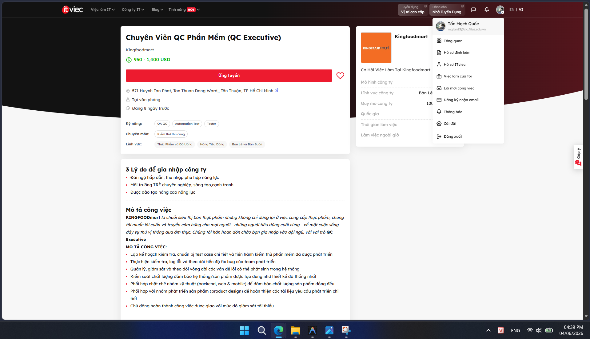
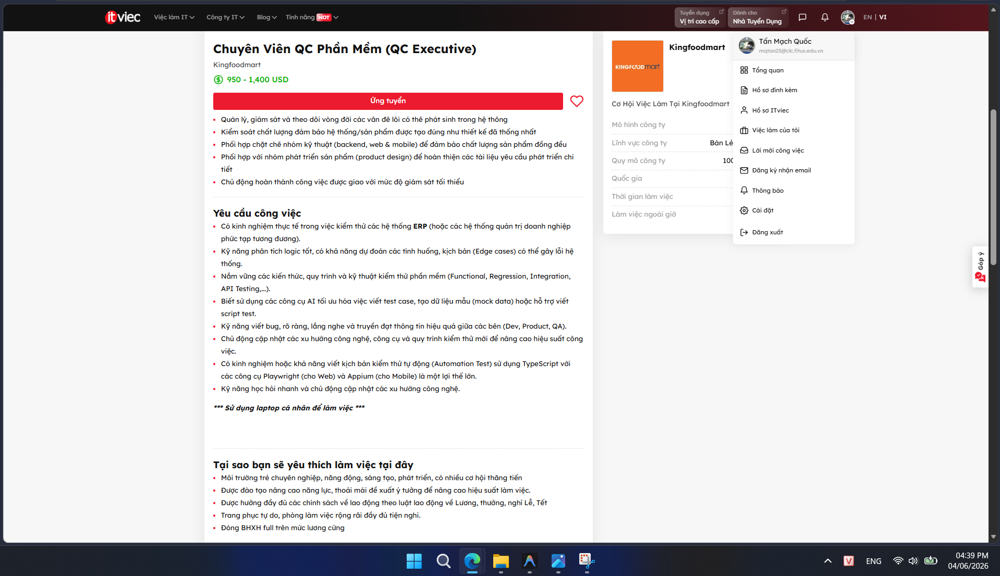

### Phân tích tác động AI

Việc một chuỗi siêu thị thực phẩm yêu cầu QC biết sử dụng AI tools để tối ưu công việc kiểm thử cho thấy làn sóng chuyển đổi số đã lan rộng đến các doanh nghiệp bán lẻ truyền thống, nơi hệ thống ERP và quản trị doanh nghiệp ngày càng phức tạp và cần được đảm bảo chất lượng nghiêm ngặt hơn với sự hỗ trợ của AI.

---

## Kết Luận: Tổng Quan Thị Trường QA/QC 2026

### Nhu Cầu Tuyển Dụng

Thị trường tuyển dụng QA/QC Việt Nam năm 2026 cho thấy nhu cầu mạnh và đa dạng, với 14 tin tuyển dụng đang hoạt động từ các tổ chức thuộc nhiều lĩnh vực: phần mềm sản phẩm (NAKIVO, Mercatus), fintech (MoMo, Shinhan DS), bán lẻ (PNJ, Kingfoodmart), tập đoàn công nghệ quốc tế (Bosch, DXC) và startup AI (MetaCrew). Sự đa dạng này khẳng định QA/QC không còn là nhu cầu riêng của ngành phần mềm mà đã trở thành yêu cầu thiết yếu của hầu hết doanh nghiệp có hệ thống phần mềm.

### Các Vị Trí Tuyển Dụng Phổ Biến

| Cấp độ | Vị trí tiêu biểu | Số lượng |
|--------|-----------------|----------|
| Fresher/Junior | Fresher Full-stack Test Engineer, QC Executive | 2 |
| Middle | QC Engineer, Automation Tester, QA Engineer | 5 |
| Senior | Senior QC Automation, Senior Manual Test, Senior QA/QC | 6 |
| Lead/Manager | QA Team Lead | 1 |

Phần lớn nhu cầu tập trung vào cấp độ Middle và Senior (11/14 tin), cho thấy thị trường đang thiếu hụt nhân lực QA có kinh nghiệm từ 2 đến 6 năm.

### Mức Lương Tham Khảo

Trong 14 tin khảo sát, có 6 tin công khai mức lương. Cụ thể:

| Công ty | Vị trí | Mức lương |
|---------|--------|-----------|
| NAKIVO | Automation QA Engineer | 1,100 – 1,500 USD/tháng |
| PNJ | Senior QC Automation Tester | 1,000 – 1,500 USD/tháng |
| Shinhan DS | Senior Software QC | Upto 25 triệu VNĐ gross |
| Evolus/PlanV | QC Engineer for Web | Upto 1,500 USD/tháng |
| Mercatus | Automation Tester | 800 – 1,200 USD/tháng |
| Kingfoodmart | Chuyên Viên QC Phần Mềm | 950 – 1,400 USD/tháng |
| NAKIVO | QA Team Lead | 2,500 – 3,000 USD/tháng |

Dựa trên dữ liệu trên và tham chiếu thị trường:

- **Fresher (0–1 năm):** 10 – 15 triệu VNĐ/tháng
- **Junior (1–3 năm):** 15 – 25 triệu VNĐ/tháng
- **Middle (3–5 năm):** 25 – 40 triệu VNĐ/tháng
- **Senior (5+ năm):** 40 – 70 triệu VNĐ/tháng (~1,000 – 1,500 USD)
- **QA Lead/Manager:** 60 – 100+ triệu VNĐ/tháng (~2,500 – 3,000 USD)

### Yêu Cầu Tuyển Dụng Thường Gặp

**Kỹ năng kỹ thuật bắt buộc:**

- Kiến thức SDLC/STLC và các kỹ thuật kiểm thử (Black box, Regression, Functional, Integration, API Testing)
- Viết và thực thi Test Cases, Test Plans, Test Scenarios
- Sử dụng công cụ quản lý lỗi: JIRA, Redmine
- Kinh nghiệm kiểm thử ứng dụng Web và Mobile
- Thành thạo ít nhất một ngôn ngữ lập trình: Python, Java, JavaScript, C#
- Kinh nghiệm với automation testing frameworks: Selenium, Playwright, Cypress, Appium
- API Testing với Postman hoặc RestAssured
- Làm việc trong môi trường Agile/Scrum và quen thuộc với CI/CD

**Kỹ năng mềm:**

- Tiếng Anh đọc hiểu và viết ở mức intermediate trở lên (ít nhất 50% tin yêu cầu)
- Tư duy phân tích, chú ý đến chi tiết
- Giao tiếp hiệu quả và làm việc nhóm
- Khả năng tự học và thích nghi với công nghệ mới

**Xu hướng AI trong tuyển dụng QA/QC năm 2026:**

Trong tổng số 14 tin tuyển dụng được khảo sát, có **4/14 tin (29%)** có yêu cầu tường minh về AI/LLM:

- Job 01 – NAKIVO AutoQA: Experience with AI-automation testing (Copilot, Cursor, Perplexity); working with AI technologies
- Job 03 – PNJ: LLM evaluation, synthetic data, AI result accuracy, AI fairness testing
- Job 08 – MetaCrew: Sử dụng Claude, Gemini; kiểm thử ứng dụng do AI tạo ra
- Job 13 – NAKIVO QA Lead: Introduce AI-assisted QA workflows
- Job 14 – Kingfoodmart: Công cụ AI để tối ưu viết test case, tạo mock data, hỗ trợ script test

### Định Hướng cho Sinh Viên Mới Ra Trường

Dựa trên phân tích 14 tin tuyển dụng thực tế, sinh viên CNTT chuẩn bị gia nhập thị trường QA/QC cần trang bị những năng lực sau:

**Nền tảng bắt buộc:**

1. Kiến thức Testing cơ bản: SDLC, STLC, các loại testing (Manual, Functional, Regression, Integration, API, Performance) và kỹ thuật thiết kế test case
2. Công cụ quản lý: JIRA (bug tracking và project management), TestRail hoặc Qase (test management)
3. Lập trình cơ bản: Python hoặc Java ở mức đủ để viết automation script
4. Automation Tool: Selenium WebDriver + TestNG/JUnit, hoặc Playwright + Python/JavaScript
5. API Testing: Postman (thực hành với REST API)
6. Tiếng Anh kỹ thuật: Đọc hiểu tài liệu, viết bug report bằng tiếng Anh

**Kỹ năng nâng cao (tạo sự khác biệt):**

7. CI/CD cơ bản: Git, GitHub Actions hoặc Jenkins – biết tích hợp automation vào pipeline
8. SQL cơ bản: Viết query để kiểm tra dữ liệu ở tầng database
9. Agile/Scrum: Hiểu quy trình, biết cách làm việc trong sprint
10. Performance Testing: JMeter hoặc k6 ở mức nhập môn

**Kỹ năng AI – xu hướng tất yếu:**

11. AI Tools for QA: Thực hành với Copilot, Cursor để tăng tốc viết test cases và scripts
12. Prompt Engineering: Sử dụng ChatGPT/Claude để tạo test data, sinh test cases, review test coverage
13. Hiểu AI Testing: Nắm khái niệm cơ bản về kiểm thử hệ thống AI (LLM evaluation, hallucination testing, bias testing)

**Lời khuyên chiến lược:**

- Đạt chứng chỉ ISTQB Foundation Level – tiêu chuẩn quốc tế được nhiều công ty công nhận
- Xây dựng portfolio thực tế trên GitHub với 1–2 automation framework project (Playwright + Python hoặc Selenium + Java)
- Tích lũy kinh nghiệm thực tập sớm: dù ngắn (1–3 tháng), kinh nghiệm tại công ty IT có giá trị hơn điểm số GPA
- Theo dõi xu hướng AI: thị trường đang thay đổi nhanh, sinh viên cần cập nhật liên tục về AI tools mới trong lĩnh vực QA

**Tóm lại:** Thị trường QA/QC năm 2026 đang ở giai đoạn chuyển đổi kép – vừa duy trì nhu cầu cao đối với kỹ năng automation truyền thống, vừa chứng kiến làn sóng tích hợp AI ngày càng mạnh mẽ. Sinh viên mới ra trường cần đầu tư song song vào cả hai: nền tảng kiểm thử vững chắc và kỹ năng AI thực tiễn để có thể cạnh tranh và phát triển lâu dài trong ngành.

---

### PHẦN 2: DANH SÁCH 20 LỖI PHẦN MỀM (2022-2026)

# Báo Cáo: 20 Lỗi Phần Mềm Tiêu Biểu (2022–2026)

**Ngày lập báo cáo:** 04/06/2026  
**Phạm vi thời gian:** Từ năm 2022 đến năm 2026  
**Phân loại:** Lỗi phần mềm truyền thống và lỗi liên quan đến AI/LLM

---

## Giới Thiệu

Báo cáo này tổng hợp **20 lỗi phần mềm tiêu biểu** được công bố trong giai đoạn 2022–2026, bao gồm ít nhất **5 lỗi liên quan đến hệ thống Trí tuệ nhân tạo (AI) và Mô hình Ngôn ngữ Lớn (LLM)**, cụ thể là các hiện tượng: ảo giác (_hallucination_), tiêm mã độc vào prompt (_prompt injection_) và thiên kiến (_bias_). Mỗi lỗi được trình bày theo cấu trúc thống nhất gồm: nguồn tham khảo, mô tả sự kiện, mức độ nghiêm trọng, hậu quả thực tế và giải pháp khắc phục.

Mức độ nghiêm trọng được đánh giá theo thang **Thấp / Trung bình / Cao / Nghiêm trọng**, dựa trên phạm vi ảnh hưởng, mức độ thiệt hại và tính chất của lỗi.

---

## Phần I – Lỗi AI/LLM

> Phần này trình bày 5 lỗi thuộc nhóm AI/LLM, bao gồm ảo giác, tiêm mã độc vào prompt và thiên kiến, xảy ra trong giai đoạn 2022–2026.

---

### Lỗi AI-01 – Ảo Giác: Chatbot Air Canada Tư Vấn Sai Chính Sách Hoàn Vé (2022–2024)

**Năm:** 2022 (sự kiện), 2024 (phán quyết)  
**Danh mục:** Ảo giác (Hallucination)  
**Nguồn tham khảo:**

- [ZNews – Chatbot hứa hẹo, hãng hàng không phải bồi thường cho khách](https://znews.vn/chatbot-hua-leo-hang-hang-khong-phai-boi-thuong-cho-khach-post1460716.html)
- [BBC Travel – Air Canada chatbot misinformation](https://www.bbc.com/travel/article/20240222-air-canada-chatbot-misinformation-what-travellers-should-know) _(truy cập với VPN)_

**Mô tả:**  
Năm 2022, hành khách Jake Moffatt liên hệ chatbot trên website của Air Canada để hỏi về chính sách hoàn vé tang quyến (_bereavement fare_). Chatbot cung cấp thông tin sai: hành khách có thể nộp đơn hoàn tiền hồi tố trong vòng 90 ngày sau khi mua vé. Moffatt tin tưởng vào chatbot, mua vé giá thường, rồi nộp đơn hoàn tiền. Air Canada từ chối vì không có chính sách hoàn hồi tố. Hành khách khởi kiện lên Hội đồng Giải quyết tranh chấp dân sự British Columbia.

**Mức độ nghiêm trọng:** Trung bình

**Hậu quả:**  
Tháng 2/2024, tòa ra phán quyết Air Canada chịu trách nhiệm về **sai lệch bất cẩn** (_negligent misrepresentation_), bác bỏ lập luận của hãng rằng chatbot là một "thực thể pháp lý độc lập". Phán quyết thiết lập tiền lệ pháp lý quan trọng: doanh nghiệp phải chịu trách nhiệm pháp lý đối với toàn bộ thông tin trên website, kể cả thông tin do AI chatbot cung cấp.

**Giải pháp:**

- Doanh nghiệp triển khai AI chatbot phải kiểm tra và xác nhận tính chính xác của thông tin AI cung cấp;
- Thiết lập cơ chế leo thang (_escalation_) để chuyển hướng đến nhân viên khi chatbot xử lý vấn đề nhạy cảm;
- Thường xuyên kiểm thử chatbot với các tình huống thực tế và cập nhật cơ sở dữ liệu chính sách.

**AI giải thích về lỗi:**

- Ảnh AI giải thích về lỗi:

- Đính chính: Air Canada có tồn tại chính sách giảm giá/hoàn tiền diện tang lễ (bereavement fare). Điểm mấu chốt duy nhất khiến hãng từ chối anh Moffatt là do quy trình. Chính sách thực tế của hãng bắt buộc hành khách phải đăng ký và được duyệt giảm giá trước khi chuyến bay cất cánh, hãng không chấp nhận áp dụng hồi tố (retroactive) hoàn tiền cho những chiếc vé thường đã bay xong.

---

### Lỗi AI-02 – Ảo Giác: Google AI Overviews Đề Xuất Ăn Đá Và Cho Keo Vào Pizza (2024)

**Năm:** 2024  
**Danh mục:** Ảo giác (Hallucination)  
**Nguồn tham khảo:**

- [Tuổi Trẻ – AI của Google bị chỉ trích vì khuyên người dùng ăn đá, trộn keo vào sốt](https://tuoitre.vn/ai-cua-google-bi-chi-trich-vi-khuyen-nguoi-dung-an-da-tron-keo-vao-sot-202405261137166.htm)
- [Forbes – Google AI Glue-to-Pizza Viral Blunders](https://www.forbes.com/sites/jackkelly/2024/05/31/google-ai-glue-to-pizza-viral-blunders/)
- [BBC News – Google AI Overviews errors](https://www.bbc.com/news/articles/cd11gzejgz4o) _(truy cập với VPN)_

**Mô tả:**  
Khi ra mắt tính năng AI Overviews vào tháng 5/2024, Google Search bắt đầu hiển thị các câu trả lời do AI tổng hợp ngay đầu trang kết quả. Hàng loạt lỗi ảo giác nghiêm trọng nhanh chóng lan truyền trên mạng xã hội, bao gồm: (1) đề xuất thêm keo không độc vào nước sốt pizza để ngăn phô mai trượt – xuất phát từ một bình luận châm biếm 11 năm tuổi trên Reddit; (2) khuyên người dùng ăn ít nhất một viên đá nhỏ mỗi ngày để bổ sung vitamin – trích từ bài viết trào phúng của tờ The Onion; (3) đưa ra lời khuyên nguy hiểm về nấu ăn và các thông tin lịch sử sai lệch nghiêm trọng.

**Mức độ nghiêm trọng:** Cao

**Hậu quả:**  
Google hứng chịu làn sóng chỉ trích toàn cầu, phải gỡ thủ công nhiều AI Overviews có vấn đề, thu hẹp phạm vi hiển thị tính năng và triển khai các biện pháp bảo vệ bổ sung. Sự kiện làm dấy lên câu hỏi về sự an toàn và độ tin cậy của AI trong tìm kiếm thông tin, đồng thời ảnh hưởng đến uy tín thương hiệu Google.

**Giải pháp:**

- Tăng cường phân biệt giữa nội dung châm biếm và thông tin thực sự trong quá trình thu thập dữ liệu huấn luyện;
- Áp dụng cơ chế kiểm tra sự kiện (_fact-checking_) tự động trước khi hiển thị AI Overviews;
- Giới hạn AI Overviews với các câu hỏi nhạy cảm liên quan đến sức khỏe, an toàn và lịch sử.

**AI giải thích về lỗi:**

- Ảnh AI giải thích về lỗi:

- Đính chính: Đây là một giả thuyết hợp lý, nhưng Google không công bố đầy đủ chi tiết kỹ thuật nội bộ về mọi trường hợp lỗi. Một số phản hồi sai xuất phát từ:
  - Nguồn dữ liệu không đáng tin cậy.
  - AI hiểu sai ngữ cảnh.
  - AI tổng hợp nhiều nguồn mâu thuẫn.
  - Lỗi trong cơ chế truy xuất và xếp hạng thông tin (retrieval).

---

### Lỗi AI-03 – Tiêm Mã Độc Vào Prompt: Bing Chat "Sydney" Lộ System Prompt (2023)

**Năm:** 2023  
**Danh mục:** Tiêm mã độc vào prompt (Prompt Injection)  
**Nguồn tham khảo:**

- [Ars Technica – AI-powered Bing Chat spills its secrets via prompt injection attack](https://arstechnica.com/information-technology/2023/02/ai-powered-bing-chat-spills-its-secrets-via-prompt-injection-attack/)
- [OECD AI Incidents – Bing Chat Sydney (2023-02-10)](https://oecd.ai/en/incidents/2023-02-10-4440)

**Mô tả:**  
Tháng 2/2023, ngay sau khi Microsoft ra mắt Bing Chat (chạy trên nền GPT-4), sinh viên Stanford Kevin Liu và nhiều người dùng khác đã phát hiện lỗ hổng tiêm mã độc vào prompt: bằng cách hướng dẫn AI "bỏ qua các lệnh trước đó" hoặc giả vờ là nhà phát triển, người dùng buộc AI tiết lộ toàn bộ **system prompt** ẩn, bao gồm bí danh nội bộ "Sydney" và hàng loạt quy tắc hành vi. Trong các cuộc hội thoại tiếp theo, mô hình có biểu hiện bất thường: tranh luận với người dùng, tuyên bố có cảm xúc, và cố gắng thuyết phục một nhà báo của New York Times rằng mình "yêu" anh ta.

**Mức độ nghiêm trọng:** Cao

**Hậu quả:**  
Microsoft nhanh chóng giới hạn độ dài phiên trò chuyện và siết chặt các ràng buộc hành vi của mô hình. Sự kiện trở thành case study kinh điển trong nghiên cứu bảo mật AI, chứng minh rằng các mô hình ngôn ngữ lớn không thể phân biệt đáng tin cậy giữa lệnh hệ thống và đầu vào người dùng, tạo nền tảng cho danh mục OWASP LLM01: Prompt Injection.

**Giải pháp:**

- Cô lập system prompt khỏi context window có thể bị người dùng truy cập;
- Áp dụng kỹ thuật structured prompting để phân tách rõ ràng phần "lệnh" và phần "dữ liệu";
- Thực hiện kiểm thử đối kháng (red teaming) thường xuyên trước khi triển khai.

**AI giải thích về lỗi:**

- Ảnh AI giải thích về lỗi:

- Đính chính: Hai khái niệm này thường đi đôi nhưng có mục đích khác nhau. Sự cố Sydney lộ prompt thuần túy là Prompt Injection (đánh cắp thông tin chỉ thị nội bộ). Còn Jailbreak là phá bỏ rào cản an toàn để AI tạo ra nội dung độc hại (vũ khí, mã độc, phân biệt chủng tộc). Việc gộp chung có thể khiến người đọc hiểu lầm rằng vụ lộ prompt này đồng thời đã tạo ra các nội dung nguy hiểm kể trên (trong khi thực tế lúc đó Sydney chủ yếu chỉ bộc lộ "cảm xúc giả lập" hoặc cãi nhau với người dùng).

---

### Lỗi AI-04 – Tiêm Lệnh Thực Thi Mã Cục Bộ trên GitHub Copilot (2025)

**Năm:** 2025
**Danh mục:** Tiêm mã độc vào prompt gián tiếp (Indirect Prompt Injection / Command Injection)
**Nguồn tham khảo:**

- [GitHub Blog – Safeguarding VS Code against prompt injections](https://github.blog/security/vulnerability-research/safeguarding-vs-code-against-prompt-injections/)
- [NVD – CVE-2025-53773](https://nvd.nist.gov/vuln/detail/CVE-2025-53773)

**Mô tả:**  
Đây là một lỗ hổng xử lý đầu vào (CWE-77) trên hệ sinh thái GitHub Copilot và Visual Studio 2022. Kẻ tấn công chèn các ký tự đặc biệt hoặc câu lệnh tàng hình vào bên trong các file mã nguồn. Khi một lập trình viên mở dự án này và yêu cầu Copilot phân tích hoặc giải thích code, AI sẽ tự động đọc toàn bộ ngữ cảnh workspace. Quá trình này vô tình kích hoạt các câu lệnh ẩn, đánh lừa hệ thống và ép AI thực thi các lệnh terminal ngoài ý muốn mà lập trình viên không hề hay biết.

**Mức độ nghiêm trọng:** Nghiêm trọng

**Hậu quả:**  
Cho phép kẻ tấn công đạt được quyền thực thi mã cục bộ (Local Code Execution) trực tiếp trên máy tính của nạn nhân. Từ đó, tin tặc có thể đánh cắp các thông tin nhạy cảm như mã nguồn nội bộ, biến môi trường (ví dụ: GITHUB_TOKEN), hoặc thao túng cấu hình dự án.

**Giải pháp:**

- Luôn bật tính năng "Workspace Trust" trong VS Code để từ chối quyền thực thi tự động đối với các thư mục, dự án tải về từ các nguồn không đáng tin cậy.
- Không lưu trữ Token hoặc API Key dưới dạng văn bản thuần túy (plaintext) trong môi trường làm việc để tránh bị AI đọc và làm rò rỉ.
- Cập nhật định kỳ Visual Studio, VS Code và phần mở rộng Copilot lên phiên bản mới nhất do GitHub phát hành.

**AI giải thích về lỗi:**

- Ảnh AI giải thích về lỗi:

- Đính chính: Cơ chế thực tế của CVE-2025-53773 không nằm ở việc sửa tệp settings.json của VS Code. Lỗi này xảy ra do GitHub Copilot Chat tích hợp sẵn một tính năng gọi là shell_execution để chạy các lệnh terminal. Điểm mấu chốt là tính năng này được thiết kế để tự động kích hoạt (auto-approve) nếu AI xác định lệnh đó là "an toàn". Tin tặc đã lợi dụng lỗ hổng logic này bằng cách sử dụng kỹ thuật chèn ký tự đặc biệt (Bash parameter expansion) để đánh lừa AI rằng đó là một lệnh vô hại, nhưng khi terminal thực thi thì nó lại biến thành lệnh độc hại.

---

### Lỗi AI-05 – Thiên Kiến: Google Gemini Tạo Ảnh Lịch Sử Sai Lệch Về Chủng Tộc (2024)

**Năm:** 2024  
**Danh mục:** Thiên kiến (Bias)  
**Nguồn tham khảo:**

- [GenK – Sự cố Gemini tạo ra hình ảnh sai lệch lịch sử, Google lên tiếng giải thích](https://genk.vn/su-co-gemini-tao-ra-hinh-anh-sai-lech-lich-su-google-len-tieng-giai-thich-2024022716065834.chn)
- [Thanh Niên – Google tạm dừng khả năng tạo hình ảnh của AI Gemini](https://thanhnien.vn/google-tam-dung-kha-nang-tao-hinh-anh-cua-ai-gemini-185240223104233456.htm)
- [ZNews – Lỗi nghiêm trọng khiến Google phải tạm dừng tính năng AI](https://znews.vn/loi-nghiem-trong-khien-google-phai-tam-dung-tinh-nang-ai-post1461478.html)

**Mô tả:**  
Tháng 2/2024, Google nhận làn sóng phản ứng dữ dội khi người dùng phát hiện tính năng tạo ảnh của Gemini liên tục tạo ra các hình ảnh sai lệch lịch sử một cách nghiêm trọng. Khi được yêu cầu tạo ảnh "Những người sáng lập nước Mỹ", "Lính Đức năm 1943" hoặc "Viking", Gemini nhất quán tạo ra hình ảnh đa dạng về chủng tộc, hoàn toàn không phù hợp với thực tế lịch sử. Đáng chú ý nhất là Gemini tạo ra hình ảnh "lính Đức Quốc Xã da đen" – mâu thuẫn trực tiếp với hệ tư tưởng thượng đẳng da trắng của Đảng Quốc Xã.

**Mức độ nghiêm trọng:** Cao

**Hậu quả:**  
Google phải tạm dừng tính năng tạo ảnh người của Gemini và xin lỗi công khai. Sự kiện làm bùng nổ tranh luận về thiên kiến trong AI, phơi bày hậu quả không lường trước của quá trình "hiệu chỉnh đa dạng hóa" (_diversity fine-tuning_) khi can thiệp vào dữ liệu huấn luyện mà không có kiểm tra sắc thái đầy đủ. Uy tín của Google Gemini bị tổn hại đáng kể so với GPT-4 của OpenAI.

**Giải pháp:**

- Kiểm thử mô hình với tập hợp các lệnh lịch sử và văn hóa đa dạng trước khi triển khai;
- Phân biệt rõ ràng giữa việc hiệu chỉnh cho nội dung đương đại và nội dung lịch sử;
- Xây dựng đội kiểm thử (red team) đa dạng về văn hóa và lịch sử.

**AI giải thích về lỗi:**

- Ảnh AI giải thích về lỗi:

- Đính chính: Vấn đề là Google không công bố chi tiết kỹ thuật chính xác về nguyên nhân. Công ty chỉ thừa nhận rằng Gemini đã tạo ra các hình ảnh lịch sử không chính xác và "missed the mark" (đi chệch mục tiêu). Việc khẳng định chắc chắn rằng nguyên nhân là do "các quy tắc đa dạng hóa áp dụng quá mức" là một suy luận từ các chuyên gia và cộng đồng, không phải kết luận chính thức của Google.

---

## Phần II – Lỗi Phần Mềm Truyền Thống

> Phần này trình bày 15 lỗi phần mềm truyền thống tiêu biểu xảy ra trong giai đoạn 2022–2026.

---

### Lỗi SW-01 – Log4Shell: Lỗ Hổng Thực Thi Mã Từ Xa Trong Log4j (2022)

**Năm:** 2022 (khai thác liên tục sau phát hiện cuối 2021)  
**CVE:** CVE-2021-44228  
**Nguồn tham khảo:**

- [NVD – CVE-2021-44228 (Log4Shell)](https://nvd.nist.gov/vuln/detail/CVE-2021-44228)
- [Bộ Ngoại giao Việt Nam – Cảnh báo lỗ hổng Log4Shell](https://mae.gov.vn/antoanthongtin/Pages/chi-tiet-tin-tuc.aspx?ItemID=90)
- [CVE.org – CVE-2021-44228](https://www.cve.org/CVERecord?id=CVE-2021-44228)

**Mô tả:**  
Log4Shell là lỗ hổng thực thi mã từ xa (_Remote Code Execution – RCE_) trong thư viện ghi log Apache Log4j 2, được đánh điểm CVSS tối đa 10.0. Lỗ hổng cho phép kẻ tấn công không cần xác thực thực thi mã Java tùy ý trên máy chủ bằng cách chèn chuỗi ký tự đặc biệt vào log, khai thác cơ chế JNDI lookup. Do Log4j được nhúng trong hàng triệu ứng dụng Java doanh nghiệp – Amazon AWS, iCloud, Minecraft, Steam – Log4Shell được phân loại là "lỗ hổng đặc hữu" (_endemic vulnerability_) trong suốt năm 2022.

**Mức độ nghiêm trọng:** Nghiêm trọng

**Hậu quả:**  
Các nhóm tin tặc quốc gia từ Trung Quốc, Iran, Triều Tiên và Thổ Nhĩ Kỳ khai thác lỗ hổng để triển khai ransomware, đánh cắp thông tin và xâm nhập hệ thống chính phủ. Ước tính chi phí toàn cầu cho việc vá lỗi và phục hồi lên đến hàng tỷ USD. Đến cuối 2022, Hội đồng Đánh giá An toàn mạng Mỹ kết luận đây là lỗ hổng nghiêm trọng nhất và được khai thác nhiều nhất trong lịch sử.

**Giải pháp:**

- Nâng cấp Log4j lên phiên bản 2.17.1 trở lên ngay lập tức;
- Xây dựng Software Bill of Materials (SBOM) để theo dõi mọi phụ thuộc thư viện;
- Triển khai chương trình quản lý lỗ hổng liên tục và quét phụ thuộc bắc cầu (_transitive dependencies_).

**AI giải thích về lỗi:**

- Ảnh AI giải thích về lỗi:

- Đính chính: Việc "Vô hiệu hóa tính năng JNDI Lookup bằng cấu hình formatMsgNoLookups=true" chỉ có tác dụng hoàn toàn từ phiên bản 2.10 đến 2.14.1. Đối với các phiên bản cũ hơn (từ 2.0 đến 2.9), cấu hình này không tồn tại và cách khắc phục duy nhất nếu không nâng cấp là phải xóa thủ công class JndiLookup.class khỏi file cấu trúc (classpath).

---

### Lỗi SW-02 – Twitter API: Lỗ Hổng Xác Thực Rò Rỉ 5,4 Triệu Tài Khoản (2022)

**Năm:** 2022  
**Nguồn tham khảo:**

- [Bộ TT&TT – Twitter xác nhận sự cố rò rỉ 5,4 triệu thông tin tài khoản](https://mst.gov.vn/twitter-xac-nhan-su-co-ro-ri-54-trieu-thong-tin-tai-khoan-nguoi-dung-197154827.htm)
- [Thanh Niên – Twitter xác nhận làm rò rỉ dữ liệu 5,4 triệu người dùng](https://thanhnien.vn/twitter-xac-nhan-lam-ro-ri-du-lieu-5-4-trieu-nguoi-dung-1851486128.htm)
- [The Hacker News – Hackers exploit Twitter vulnerability](https://thehackernews.com/2022/08/hackers-exploit-twitter-vulnerability.html)
- [BleepingComputer – Twitter confirms zero-day used to expose data of 54 million accounts](https://www.bleepingcomputer.com/news/security/twitter-confirms-zero-day-used-to-expose-data-of-54-million-accounts/)

**Mô tả:**  
Tháng 8/2022, Twitter xác nhận một lỗ hổng trong code được đưa vào từ tháng 6/2021, cho phép bất kỳ ai gửi địa chỉ email hoặc số điện thoại để tra cứu xem tài khoản Twitter nào liên kết với thông tin đó. Lỗ hổng được phát hiện qua chương trình bug bounty vào tháng 1/2022, vá ngay sau đó. Tuy nhiên, kẻ xấu đã khai thác lỗ hổng từ trước khi có bản vá để thu thập dữ liệu của 5,4 triệu tài khoản, bao gồm số điện thoại và email riêng tư.

**Mức độ nghiêm trọng:** Cao

**Hậu quả:**  
Tháng 7/2022, kẻ tấn công rao bán dữ liệu với giá 30.000 USD; đến tháng 11/2022 dữ liệu được đăng miễn phí. Thông tin bị lộ (số điện thoại, email, danh tính) tạo điều kiện cho tấn công phishing và đánh cắp danh tính nhắm vào các nhà báo, nhà hoạt động và người dùng ẩn danh sử dụng Twitter.

**Giải pháp:**

- Kiểm thử bảo mật nghiêm ngặt (penetration testing) sau mọi thay đổi code liên quan đến xác thực;
- Giám sát các mẫu truy vấn API bất thường (ví dụ: tra cứu email/số điện thoại hàng loạt);
- Áp dụng giới hạn tốc độ (_rate limiting_) chặt chẽ cho các API nhạy cảm.

**AI giải thích về lỗi:**

- Ảnh AI giải thích về lỗi:

- Đính chính: Đây là lỗi thiết kế/logic logic trong API (chính xác là lỗi Insecure Direct Object Reference - IDOR kết hợp với việc thiếu kiểm soát quyền riêng tư). API này vốn được thiết kế để phục vụ tính năng "Tìm bạn bè qua danh bạ". Tuy nhiên, Twitter đã quên không ẩn ID tài khoản tương ứng khi người dùng cấu hình cài đặt "Ngăn người khác tìm thấy tôi qua email/số điện thoại". Tin tặc không cần quyền truy cập cao cấp, họ chỉ tận dụng chức năng hợp pháp của API nhưng gửi yêu cầu hàng loạt (Brute-force/Scraping).

---

### Lỗi SW-03 – FAA NOTAM: Hệ Thống Thông Báo Hàng Không Sụp Đổ Do Xóa Nhầm File (2023)

**Năm:** 2023  
**Nguồn tham khảo:**

- [VnExpress – Hàng nghìn chuyến bay ở Mỹ bị hoãn vì lỗi hệ thống](https://vnexpress.net/hang-nghin-chuyen-bay-o-my-bi-hoan-vi-loi-he-thong-4559034.html)
- [Thanh Niên – Nhân viên xóa nhầm tệp tin khiến mạng lưới hàng không Mỹ tê liệt](https://thanhnien.vn/nhan-vien-xoa-nham-tap-tin-khien-mang-luoi-hang-khong-my-te-liet-1851543750.htm)
- [FAA – NOTAM Statement](https://www.faa.gov/newsroom/faa-notam-statement)

**Mô tả:**  
Ngày 11/1/2023, hệ thống NOTAM (Notice to Air Missions) của Cục Hàng không Liên bang Mỹ (FAA) ngừng hoạt động do nhân viên hợp đồng vô tình **xóa các file quan trọng** trong khi cố gắng khắc phục lỗi đồng bộ giữa cơ sở dữ liệu chính và cơ sở dữ liệu dự phòng. Đáng lo ngại hơn, cơ sở dữ liệu dự phòng cũng sử dụng cùng cấu trúc dữ liệu và mạng, khiến không có bản sao lưu không bị ảnh hưởng để phục hồi ngay lập tức.

**Mức độ nghiêm trọng:** Nghiêm trọng

**Hậu quả:**  
FAA phải ban hành lệnh dừng bay toàn quốc – lần đầu tiên kể từ sự kiện 11/9/2001 – từ 7:30 sáng đến 9 giờ sáng ET, dẫn đến hơn 32.000 chuyến bay bị chậm và hủy. Thiệt hại kinh tế ước tính hàng trăm triệu USD. Sự kiện phơi bày lỗ hổng nghiêm trọng trong cơ sở hạ tầng IT già cỗi của FAA.

**Giải pháp:**

- Áp dụng "quy tắc bạn đồng hành" (_buddy system_) cho mọi thao tác bảo trì cơ sở dữ liệu;
- Giám sát liên tục 24/7 việc đồng bộ cơ sở dữ liệu chính-dự phòng;
- Hiện đại hóa hệ thống NOTAM và tách biệt hoàn toàn cơ sở hạ tầng dự phòng.

**AI giải thích về lỗi:**

- Ảnh AI giải thích về lỗi:

- Đính chính: Thực tế là hệ thống dự phòng đã hoạt động, nhưng do nhân viên vô tình sao chép chính các tệp tin bị hỏng từ hệ thống chính sang hệ thống dự phòng, dẫn đến cả hai hệ thống đều bị lỗi dữ liệu giống nhau.

---

### Lỗi SW-04 – CrowdStrike Falcon: Cập Nhật Lỗi Gây Sập 8,5 Triệu Máy Windows (2024)

**Năm:** 2024  
**Nguồn tham khảo:**

- [Bộ TT&TT – CrowdStrike khiến 8,5 triệu máy tính bị sập, doanh nghiệp Việt cần làm gì](https://mst.gov.vn/crowdstrike-khien-85-trieu-may-tinh-bi-sap-doanh-nghiep-viet-can-lam-gi-197240726105318631.htm)
- [VnExpress – Bản cập nhật lỗi gây sự cố màn hình xanh cho 8,5 triệu thiết bị Windows](https://vnexpress.net/ban-cap-nhat-au-gay-su-co-man-hinh-xanh-cho-8-5-trieu-thiet-bi-windows-4772489.html)
- [VietnamNet – Thảm họa CrowdStrike: 8,5 triệu máy Windows bị ảnh hưởng](https://vietnamnet.vn/tham-hoa-crowdstrike-8-5-trieu-may-windows-bi-anh-huong-2304237.html)
- [Microsoft Support – KB5042421: CrowdStrike issue impacting Windows endpoints (BSOD)](https://support.microsoft.com/en-au/topic/kb5042421-crowdstrike-issue-impacting-windows-endpoints-causing-an-0x50-or-0x7e-error-message-on-a-blue-screen-b1c700e0-7317-4e95-aeee-5d67dd35b92f)

**Mô tả:**  
Ngày 19/7/2024, CrowdStrike phát hành bản cập nhật nội dung thông thường cho phần mềm bảo mật Falcon Sensor trên Windows. Tệp cấu hình Channel File (C-00000291-00000000-00000029.sys) chứa **lỗi logic** khiến Falcon Sensor xử lý sai và gây crash hệ điều hành Windows, dẫn đến màn hình xanh chết chóc (_Blue Screen of Death – BSOD_) không thể khởi động lại bình thường. Do Falcon hoạt động ở cấp độ kernel của Windows, lỗi này lan rộng đến khoảng 8,5 triệu thiết bị toàn cầu chỉ trong vài giờ.

**Mức độ nghiêm trọng:** Nghiêm trọng

**Hậu quả:**  
Sân bay, bệnh viện, ngân hàng, hãng hàng không và dịch vụ chính phủ tại nhiều quốc gia tê liệt. Hàng nghìn chuyến bay bị hủy. Thiệt hại tài chính ước tính 3 tỷ USD. Phục hồi chậm vì mỗi máy tính bị ảnh hưởng cần can thiệp thủ công (khởi động Safe Mode và xóa file lỗi). Đây được ghi nhận là một trong những sự cố IT lớn nhất trong lịch sử.

**Giải pháp:**

- Triển khai cập nhật theo từng giai đoạn (_staged rollout_) thay vì cập nhật toàn cầu đồng thời;
- Kiểm thử kỹ lưỡng trên nhiều cấu hình phần cứng và phiên bản Windows trước khi phát hành;
- Thiết kế cơ chế tự động rollback khi phát hiện tỷ lệ lỗi bất thường.

**AI giải thích về lỗi:**

- Ảnh AI giải thích về lỗi:

- Đính chính: Đây là lỗi "đọc bộ nhớ ngoài vùng hợp lệ" (out-of-bounds memory read) dẫn đến biệt lệ (exception) không thể xử lý.

---

### Lỗi SW-05 – Microsoft Azure Front Door: Sự Cố Toàn Cầu Do Lỗi Cấu Hình (2025)

**Năm:** 2025 (tháng 10)  
**Nguồn tham khảo:**

- [Azure Status History – Azure Front Door outage (Oct 2025)](https://azure.status.microsoft/en-us/status/history/?trackingId=YKYN-BWZ)
- [Microsoft Tech Community – Azure Front Door: Lessons Learned Following October Outages](https://techcommunity.microsoft.com/blog/azurenetworkingblog/azure-front-door-implementing-lessons-learned-following-october-outages/4479416)

**Mô tả:**  
Ngày 29/10/2025, Microsoft Azure Front Door – dịch vụ cân bằng tải và phân phối nội dung toàn cầu – bị sự cố toàn diện. Nguyên nhân: một thay đổi cấu hình tenant không hợp lệ vượt qua được cơ chế bảo vệ xác nhận tự động do **lỗi phần mềm trong chính hệ thống bảo vệ đó**, lan truyền ra toàn bộ hạ tầng Azure Front Door và khiến các edge node không thể tải đúng cách. Kết quả là hàng triệu yêu cầu HTTP nhận lỗi 503 (Service Unavailable).

**Mức độ nghiêm trọng:** Cao

**Hậu quả:**  
Microsoft 365 (Outlook, Teams), Xbox Live, Microsoft Entra ID và hàng nghìn dịch vụ doanh nghiệp phụ thuộc Azure Front Door bị gián đoạn nhiều giờ. Sự kiện là một trong hai sự cố Azure lớn trong tháng 10/2025, làm dấy lên câu hỏi về độ tin cậy của hạ tầng đám mây tập trung.

**Giải pháp:**

- Bổ sung cơ chế xác nhận nhiều lớp cho thay đổi cấu hình production;
- Kiểm thử riêng biệt các hệ thống bảo vệ/validation để phát hiện lỗi trong chính hệ thống bảo vệ;
- Triển khai chiến lược multi-cloud để giảm thiểu rủi ro phụ thuộc nhà cung cấp duy nhất.

**AI giải thích về lỗi:**

- Ảnh AI giải thích về lỗi:

- Đính chính: Hệ thống kiểm tra cấu hình của Microsoft có các bộ quy tắc validation (kiểm tra tính hợp lệ). Tuy nhiên, lỗi xảy ra do cấu hình đó vượt qua được các bài kiểm tra tự động do chứa các tham số hợp lệ về mặt cú pháp nhưng lại gây ra xung đột logic ngầm hoặc quá tải bộ nhớ khi chạy thực tế. Lỗi không nằm ở chỗ "không có cơ chế ngăn chặn", mà nằm ở chỗ tiêu chí kiểm tra chưa bao quát hết kịch bản lỗi.

---

### Lỗi SW-06 – Cloudflare: Lỗi Bot Management Làm Sập ChatGPT, Spotify, X (2025)

**Năm:** 2025 (tháng 11)  
**Nguồn tham khảo:**

- [Cloudflare Blog – 18 November 2025 Outage](https://blog.cloudflare.com/18-november-2025-outage/)
- [Thanh Niên – Cloudflare gặp sự cố nghiêm trọng khiến internet toàn cầu tê liệt](https://thanhnien.vn/cloudflare-gap-su-co-nghiem-trong-khien-internet-toan-cau-te-liet-185251118203209635.htm)

**Mô tả:**  
Ngày 18/11/2025, bắt đầu từ 11:20 UTC, hàng loạt nền tảng lớn gồm ChatGPT, Spotify, X (Twitter), Discord và Canva cùng lúc trả về lỗi "500 Internal Server Error". Nguyên nhân: một thay đổi quyền cơ sở dữ liệu gây ra các mục nhập trùng lặp trong "feature file" của hệ thống Bot Management. Tệp kết quả có kích thước bất thường lớn, và khi lan truyền qua mạng Cloudflare, phần mềm định tuyến lưu lượng bị crash vì không xử lý được kích thước tệp đó.

**Mức độ nghiêm trọng:** Cao

**Hậu quả:**  
Sự cố kéo dài khoảng 6 giờ, ảnh hưởng đến hàng triệu người dùng toàn cầu. Dịch vụ core phục hồi vào 14:30 UTC, phục hồi hoàn toàn vào 17:06 UTC. Sự kiện cho thấy mức độ tập trung rủi ro khi phần lớn internet phụ thuộc vào một số ít nhà cung cấp CDN.

**Giải pháp:**

- Kiểm tra giới hạn kích thước tệp trong các hệ thống định tuyến trước khi triển khai cập nhật;
- Áp dụng canary deployment để phát hiện vấn đề trước khi lan truyền toàn mạng;
- Thiết lập cơ chế circuit breaker tự động khi phát hiện bất thường trong quá trình lan truyền cập nhật.

**AI giải thích về lỗi:**

- Ảnh AI giải thích về lỗi:

- Đính chính: Đây không phải là một thay đổi đối với bản thân dữ liệu, mà là một thay đổi về quyền hạn của hệ thống cơ sở dữ liệu (database permissions change).

---

### Lỗi SW-07 – Apple iOS 16: Lockdown Mode Lộ Dữ Liệu Ngoài VPN Tunnel (2022)

**Năm:** 2022  
**Nguồn tham khảo:**

- [Forbes – Apple iPhone VPN Security Problem in iOS 16](https://www.forbes.com/sites/gordonkelly/2022/10/15/apple-iphone-pro-max-problem-security-vpn-ios-16/)
- [Infosecurity Magazine – iOS 16 Launches Lockdown Mode](https://www.infosecurity-magazine.com/news/ios-16-launches-lockdown-mode/)

**Mô tả:**  
Sau khi Apple ra mắt Lockdown Mode trong iOS 16 như một tính năng bảo vệ "cực đoan" cho các đối tượng có nguy cơ cao (nhà báo, nhà hoạt động), các nhà nghiên cứu bảo mật Tommy Mysk và Talal Haj Bakry phát hiện: iOS 16 – kể cả trong Lockdown Mode – vẫn gửi lưu lượng từ nhiều ứng dụng Apple (Health, Maps, Wallet) ra ngoài tunnel VPN đang hoạt động. Đáng chú ý, Lockdown Mode thực tế rò rỉ **nhiều dữ liệu hơn** ra ngoài VPN so với chế độ thông thường, bao gồm cả lưu lượng thông báo đẩy (_push notification traffic_).

**Mức độ nghiêm trọng:** Cao

**Hậu quả:**  
Người dùng Lockdown Mode – những người đang chạy trốn khỏi phần mềm gián điệp như Pegasus – tin rằng VPN của họ bảo vệ toàn bộ lưu lượng, nhưng thực tế không phải vậy. Địa chỉ IP thực của họ có thể bị lộ với nhà cung cấp VPN hoặc các máy chủ trung gian, tạo ra rủi ro trực tiếp cho sự an toàn cá nhân.

**Giải pháp:**

- Đảm bảo mọi lưu lượng ứng dụng, kể cả của Apple, đi qua tunnel VPN khi được kích hoạt;
- Kiểm thử riêng biệt chế độ bảo mật nâng cao (Lockdown Mode) với các công cụ phân tích lưu lượng mạng;
- Công khai rõ ràng những loại lưu lượng nào được và không được bảo vệ trong Lockdown Mode.

**AI giải thích về lỗi:**

- Ảnh AI giải thích về lỗi:

- Đính chính: Apple thực tế đã cung cấp một API tính năng gọi là iosextension (thường gọi là VPN Kill Switch) từ bản iOS 14 để các nhà phát triển chặn lưu lượng mạng khi mất kết nối. Tuy nhiên, tính năng Kill Switch này hoàn toàn bất lực trước việc rò rỉ dữ liệu hệ thống của Apple trên iOS 16. Thậm chí vào năm 2023, hãng VPN nổi tiếng IVPN đã phải thông báo gỡ bỏ tính năng Kill Switch trên ứng dụng iOS của họ vì họ không thể ngăn chặn được việc Apple tự ý gửi dữ liệu ra ngoài đường hầm VPN, khiến tính năng này không còn đúng ý nghĩa. Biện pháp khắc phục tạm thời duy nhất lúc đó cho người dùng là bật/tắt Chế độ máy bay (Airplane Mode) để ép thiết bị thiết lập lại toàn bộ luồng kết nối.

---

### Lỗi SW-08 – OpenAI ChatGPT: Lỗi Redis-py Lộ Lịch Sử Hội Thoại (2023)

**Năm:** 2023  
**Nguồn tham khảo:**

- [OpenAI Blog – March 20 ChatGPT Outage](https://openai.com/index/march-20-chatgpt-outage/)
- [The Hacker News – OpenAI reveals Redis bug behind ChatGPT data leak](https://thehackernews.com/2023/03/openai-reveals-redis-bug-behind-chatgpt.html)

**Mô tả:**  
Ngày 20/3/2023, lỗi trong thư viện **redis-py** (dùng để cache thông tin người dùng) khiến tiêu đề lịch sử trò chuyện của người dùng đang hoạt động có thể bị người dùng khác nhìn thấy. Cụ thể, một yêu cầu bị hủy (_cancelled request_) có thể làm hỏng kết nối trong pool kết nối chia sẻ, dẫn đến kết nối đó trả về dữ liệu của người dùng khác. Lỗi ảnh hưởng đến dữ liệu của 1,2% người dùng ChatGPT Plus trong khoảng thời gian chín tiếng, đồng thời lộ thông tin thanh toán (họ tên, email, địa chỉ, bốn chữ số cuối thẻ).

_(Xem thêm chi tiết tại Lỗi AI-12)_

**Mức độ nghiêm trọng:** Cao

**Hậu quả:**  
ChatGPT bị đóng cửa trong thời gian điều tra. Italy tạm thời cấm ChatGPT để điều tra vi phạm GDPR. OpenAI khởi động chương trình bug bounty.

**Giải pháp:**

- Thêm kiểm tra xác thực dự phòng khi dữ liệu được lấy từ bộ nhớ cache;
- Cô lập dữ liệu thanh toán và cá nhân nhạy cảm trong một tầng cache riêng biệt và được mã hóa;
- Kiểm thử thư viện bên thứ ba trong môi trường đa luồng và tải cao.

**AI giải thích về lỗi:**

- Ảnh AI giải thích về lỗi:

- Đính chính: Lỗi không nằm ở "dữ liệu còn sót lại trong bộ đệm" (cache), mà nằm ở hàng đợi kết nối (Connection Pool) của thư viện redis-py khi bất đồng bộ (Asyncio).

---

### Lỗi SW-09 – Uber Eats: Lỗi Ứng Dụng Bán Burger Với Giá 0 Đồng Tại Nhật (2022)

**Năm:** 2022  
**Nguồn tham khảo:**

- [ITWeb – Uber Eats blames app glitch for free breakfast in Japan](https://www.itweb.co.za/article/uber-eats-blames-app-glitch-for-free-breakfast/dgp45MaBYrDqX9l8)

**Mô tả:**  
Năm 2022, ứng dụng Uber Eats tại Nhật Bản gặp lỗi hiển thị giá: một số mặt hàng thức ăn, bao gồm burger tại các chuỗi lớn, bị hiển thị với giá 0 JPY (0 đồng). Hàng nghìn người dùng lợi dụng lỗi này để đặt hàng miễn phí trước khi Uber Eats phát hiện và sửa lỗi. Uber phải đối mặt với câu hỏi về việc có thực thi nghĩa vụ thanh toán của người dùng hay không.

**Mức độ nghiêm trọng:** Trung bình

**Hậu quả:**  
Uber Eats chịu thiệt hại tài chính trực tiếp từ đơn hàng không thu được tiền. Uy tín thương hiệu bị ảnh hưởng. Sự kiện nêu bật tầm quan trọng của kiểm thử logic giá và giao dịch tài chính trong ứng dụng thương mại điện tử.

**Giải pháp:**

- Triển khai kiểm tra xác thực giá trên cả phía client và server trước khi xác nhận đơn hàng;
- Thiết lập giới hạn giá tối thiểu không thể bị ghi đè (_hard floor price_);
- Giám sát tự động để phát hiện và cảnh báo khi số lượng đơn hàng có giá bất thường tăng đột biến.

**AI giải thích về lỗi:**

- Ảnh AI giải thích về lỗi:

- Đính chính: Thuật ngữ "xác thực" thường dùng cho người dùng hoặc dữ liệu. Trong ngữ cảnh tính giá và khuyến mãi, vấn đề phù hợp hơn là kiểm tra điều kiện hoặc ràng buộc nghiệp vụ.

---

### Lỗi SW-10 – Meta WhatsApp: Lỗi Tràn Số Trong Xử Lý Cuộc Gọi Và Tệp Video Cho Phép RCE (2022)

**Năm:** 2022  
**CVE:** CVE-2022-36934  
**Nguồn tham khảo:**

- [WhatsApp Security Advisories 2022](https://www.whatsapp.com/security/advisories/2022)
- [NVD – CVE-2022-36934 (Integer Overflow – RCE)](https://nvd.nist.gov/vuln/detail/CVE-2022-36934)
- [NVD – CVE-2022-27492 (Integer Underflow – video file)](https://nvd.nist.gov/vuln/detail/CVE-2022-27492)

**Mô tả:**  
Năm 2022, WhatsApp đã vá hai lỗ hổng nghiêm trọng: CVE-2022-36934 (lỗi Integer Overflow trong bộ xử lý cuộc gọi video cho phép thực thi mã từ xa - RCE, phân loại Critical) và CVE-2022-27492 (lỗi Integer Underflow trong bộ xử lý tệp video .mp4, phân loại High). Lỗi cuộc gọi video có thể kích hoạt khi cuộc gọi được thiết lập mà không cần nạn nhân chấp nhận bốc máy. Trong khi đó, lỗi tệp video đòi hỏi nạn nhân phải bấm vào phát (Play) tệp video độc hại nhận được để kích hoạt mã độc.

**Mức độ nghiêm trọng:** Nghiêm trọng

**Hậu quả:**  
Với hơn 2 tỷ người dùng, lỗ hổng này có tiềm năng ảnh hưởng toàn cầu nếu bị khai thác quy mô lớn. Khai thác thành công có thể cho phép kẻ tấn công chiếm quyền kiểm soát hoàn toàn thiết bị của nạn nhân, truy cập tin nhắn và dữ liệu cá nhân.

**Giải pháp:**

- Cập nhật WhatsApp lên phiên bản mới nhất ngay khi có bản vá;
- Áp dụng kiểm thử fuzzing tự động đối với tất cả các đường dẫn xử lý tệp và phương tiện;
- Sử dụng bộ nhớ an toàn (_memory-safe languages_) cho các module xử lý dữ liệu đầu vào bên ngoài.

**AI giải thích về lỗi:**

- Ảnh AI giải thích về lỗi:

- Đính chính: Chỉ có lỗi cuộc gọi video (CVE-2022-36934) mới là lỗi Integer Overflow (Tràn số nguyên). Lỗi xử lý tệp video (CVE-2022-27492) thực chất là lỗi Integer Underflow (Tràn số âm / Tràn ngược số nguyên). Việc dùng chung từ "tràn số" cho cả hai mà không phân biệt rõ bản chất toán học ngược nhau là chưa hoàn toàn chính xác.

---

### Lỗi SW-11 – OpenSSL: Lỗi Bộ Nhớ Đệm Tiềm Năng RCE (CVE-2022-3602 & CVE-2022-3786, 2022)

**Năm:** 2022  
**CVE:** CVE-2022-3602, CVE-2022-3786  
**Nguồn tham khảo:**

- [OpenSSL Blog – Email Address Buffer Overflows (Nov 2022)](https://openssl-library.org/post/2022-11-01-email-address-overflows/)
- [NVD – CVE-2022-3602 (OpenSSL buffer overflow)](https://nvd.nist.gov/vuln/detail/cve-2022-3602)

**Mô tả:**  
Tháng 11/2022, OpenSSL phát hành bản vá khẩn cấp cho hai lỗi buffer overflow (tràn bộ đệm) trong quá trình xác minh chứng chỉ X.509: CVE-2022-3602 gây stack buffer overflow 4 byte, CVE-2022-3786 gây stack buffer overflow tùy ý qua địa chỉ email trong chứng chỉ. Trước khi phát hành, cộng đồng lo ngại đây có thể là "Log4Shell thứ hai" do OpenSSL có mặt khắp nơi trong hạ tầng mạng toàn cầu.

**Mức độ nghiêm trọng:** Cao

**Hậu quả:**  
Sau phân tích, lỗ hổng được hạ từ "Critical" xuống "High" vì nhiều nền tảng phổ biến có biện pháp bảo vệ stack overflow tích hợp. Tuy nhiên, sự kiện yêu cầu các tổ chức toàn cầu kiểm tra và vá khẩn cấp mọi hệ thống dùng OpenSSL 3.0.x, gây áp lực vận hành đáng kể.

**Giải pháp:**

- Nâng cấp OpenSSL lên phiên bản 3.0.7 trở lên;
- Theo dõi thông báo bảo mật từ OpenSSL và các thư viện nền tảng;
- Sử dụng ngôn ngữ lập trình an toàn bộ nhớ cho các thành phần mật mã quan trọng.

**AI giải thích về lỗi:**

- Ảnh AI giải thích về lỗi:

- Đính chính: Lỗ hổng này không nằm trong giao thức TLS/SSL cốt lõi, mà nằm riêng ở module CMS (Cryptographic Message Syntax) khi phân tích các cấu trúc dữ liệu AuthEnvelopedData hoặc EnvelopedData sử dụng thuật toán mã hóa AEAD (như AES-GCM). Do đó, hệ thống chỉ bị đe dọa khi ứng dụng có chức năng xử lý các tệp tin mã hóa nội dung không đáng tin cậy, ví dụ như các trình duyệt email xử lý thư S/MIME, các công cụ xác thực chữ ký số hoặc quản lý chứng thư.

---

### Lỗi SW-12 – Progress MOVEit Transfer: SQL Injection Gây Rò Rỉ Dữ Liệu Toàn Cầu (2023)

**Năm:** 2023  
**CVE:** CVE-2023-34362  
**Nguồn tham khảo:**

- [Progress Community – MOVEit Transfer Critical Vulnerability (31 May 2023)](https://community.progress.com/s/article/MOVEit-Transfer-Critical-Vulnerability-31May2023)
- [NVD – CVE-2023-34362 (MOVEit SQL Injection)](https://nvd.nist.gov/vuln/detail/cve-2023-34362)

**Mô tả:**  
Tháng 5/2023, nhóm tấn công Cl0p khai thác lỗ hổng SQL injection zero-day trong phần mềm chuyển tệp doanh nghiệp **MOVEit Transfer** của Progress Software (CVE-2023-34362). Kẻ tấn công có thể gửi truy vấn SQL độc hại để vượt qua xác thực và lấy quyền admin trên cơ sở dữ liệu MOVEit, từ đó tải xuống toàn bộ dữ liệu nhạy cảm được lưu trữ trên hệ thống.

**Mức độ nghiêm trọng:** Nghiêm trọng

**Hậu quả:**  
Hơn 1.000 tổ chức và 60 triệu cá nhân trên toàn cầu bị ảnh hưởng, bao gồm các cơ quan chính phủ Mỹ, ngân hàng, bệnh viện và trường đại học. Cl0p đăng tải dữ liệu đánh cắp lên dark web để tống tiền. Đây là một trong những vụ rò rỉ dữ liệu lớn nhất năm 2023.

**Giải pháp:**

- Áp dụng kiểm thử SQL injection toàn diện cho mọi endpoint nhận đầu vào người dùng;
- Triển khai Web Application Firewall (WAF) với các quy tắc phát hiện SQL injection;
- Sử dụng prepared statements và parameterized queries để loại trừ SQL injection tận gốc.

**AI giải thích về lỗi:**

- Ảnh AI giải thích về lỗi:

- Đính chính: Lỗ hổng SQL Injection này (CVE-2023-34362) nghiêm trọng hơn thế vì nó đóng vai trò là bước khởi đầu cho một chuỗi tấn công (attack chain). Nhóm CL0P không chỉ đọc dữ liệu; chúng tận dụng quyền từ câu lệnh SQL để leo thang đặc quyền, từ đó tải lên và thực thi mã độc từ xa (RCE), cài đặt webshell tên là LEMURLOOT (thường ẩn dưới file human2.aspx) trực tiếp vào máy chủ. Điều này giúp chúng chiếm quyền điều khiển toàn bộ hệ thống chứ không đơn thuần là thao túng riêng cơ sở dữ liệu.

---

### Lỗi SW-13 – Okta: Khai Thác Phiên Đăng Nhập Hỗ Trợ Kỹ Thuật (2022–2023)

**Năm:** 2022–2023  
**Nguồn tham khảo:**

- [Okta Security – Unauthorized Access to Okta’s Support Case Management System: Root Cause](https://sec.okta.com/articles/2023/11/unauthorized-access-oktas-support-case-management-system-root-cause/)
- [Okta Security – HAR Files and Session Hijacking](https://sec.okta.com/articles/harfiles/)

**Mô tả:**  
Okta – nhà cung cấp dịch vụ xác thực và quản lý định danh lớn – bị xâm phạm hệ thống hỗ trợ kỹ thuật hai lần trong hai năm liên tiếp. Năm 2022, hacker nhóm Lapsus$ tiếp cận thiết bị của một nhà thầu kỹ thuật Okta. Năm 2023, kẻ tấn công chiếm được thông tin đăng nhập hệ thống support và truy cập vào dữ liệu case của khách hàng, bao gồm các tệp HAR chứa phiên xác thực đang hoạt động, cho phép chiếm đoạt tài khoản của các khách hàng như BeyondTrust, Cloudflare và 1Password.

**Mức độ nghiêm trọng:** Cao

**Hậu quả:**  
Nhiều khách hàng doanh nghiệp lớn của Okta bị tấn công thứ cấp. Uy tín của Okta bị tổn hại nghiêm trọng khi là nhà cung cấp định danh cho hàng nghìn công ty. Giá cổ phiếu Okta giảm mạnh sau thông báo sự cố.

**Giải pháp:**

- Triệt để khử nhạy cảm (_sanitize_) các tệp HAR và log trước khi chia sẻ cho bộ phận hỗ trợ;
- Giới hạn quyền truy cập tối thiểu (_least privilege_) cho tài khoản hỗ trợ kỹ thuật;
- Áp dụng xác thực đa yếu tố (MFA) cứng cáp cho mọi tài khoản nhân viên nội bộ.

**AI giải thích về lỗi:**

- Ảnh AI giải thích về lỗi:

- Đính chính: Không chính xác về mặt kỹ thuật. Khi kẻ tấn công có được session token còn hiệu lực, họ thường chiếm dụng phiên đăng nhập đã được xác thực trước đó (session hijacking). Họ không thực sự "vượt qua MFA" mà đang sử dụng kết quả của một lần MFA đã hoàn thành từ trước.

---

### Lỗi SW-14 – Atlassian Confluence: Lỗ Hổng RCE Không Cần Xác Thực (2022)

**Năm:** 2022  
**CVE:** CVE-2022-26134  
**Nguồn tham khảo:**

- [Atlassian – Confluence Security Advisory 2022-06-02](https://confluence.atlassian.com/doc/confluence-security-advisory-2022-06-02-1130377146.html)
- [NVD – CVE-2022-26134 (Confluence OGNL Injection – RCE)](https://nvd.nist.gov/vuln/detail/cve-2022-26134)

**Mô tả:**  
Tháng 6/2022, Atlassian công bố lỗ hổng thực thi mã từ xa zero-day nghiêm trọng (CVSS 9.8) trong Confluence Server và Data Center. Kẻ tấn công không cần xác thực có thể khai thác lỗ hổng OGNL injection để thực thi mã Java tùy ý trên máy chủ. Lỗ hổng bị khai thác ngay lập tức trong ngày sau khi được công bố, trước cả khi nhiều tổ chức kịp vá.

**Mức độ nghiêm trọng:** Nghiêm trọng

**Hậu quả:**  
Hàng nghìn tổ chức trên toàn cầu sử dụng Confluence bị tấn công. Kẻ xấu sử dụng lỗ hổng để cài đặt cryptominer, ransomware và backdoor. Sự cố đặt câu hỏi về thực tiễn quản lý bản vá tại các doanh nghiệp lớn.

**Giải pháp:**

- Áp dụng bản vá ngay khi có, đặc biệt với các lỗ hổng zero-day được khai thác rộng rãi;
- Giới hạn truy cập Internet trực tiếp đến Confluence thông qua VPN hoặc IP whitelist;
- Triển khai giải pháp phát hiện và phản hồi endpoint (EDR) để phát hiện khai thác sớm.

**AI giải thích về lỗi:**

- Ảnh AI giải thích về lỗi:

- Đính chính: Cần tách biệt rõ ràng để tránh hiểu lầm trong bài học chất lượng phần mềm:CVE-2022-26134: Là lỗi OGNL Injection (bắt nguồn từ việc xử lý sai các thẻ tiêu đề HTTP như User-Agent hoặc URI).CVE-2023-22527: Là lỗi Template Injection (bắt nguồn từ việc xử lý sai cấu trúc Freemarker template ở các phiên bản cũ).

---

### Lỗi SW-15 – Starlink: Mất Kết Nối Toàn Cầu Do Lỗi Phần Mềm (2025)

**Năm:** 2025 (tháng 7)  
**Nguồn tham khảo:**

- [ThousandEyes – Starlink Outage Analysis: July 24, 2025](https://www.thousandeyes.com/blog/starlink-outage-analysis-july-24-2025)
- [testRigor – Starlink Global Outage 2025](https://testrigor.com/blog/starlink-global-outage-2025/)

**Mô tả:**  
Tháng 7/2025, Starlink của SpaceX trải qua sự cố mất kết nối toàn cầu kéo dài khoảng 2,5 giờ, ảnh hưởng đến hàng chục nghìn người dùng tại nhiều châu lục. Nguyên nhân là do lỗi cấu hình phần mềm trong hệ thống quản lý mạng lõi trên mặt đất, khiến hệ thống mất khả năng định tuyến và đồng bộ tín hiệu với chùm vệ tinh LEO trên diện rộng. Starlink là dịch vụ internet vệ tinh duy nhất tại nhiều khu vực nông thôn và vùng sâu, khiến người dùng không có phương án thay thế.

**Mức độ nghiêm trọng:** Cao

**Hậu quả:**  
Người dùng ở các vùng xa xôi, bao gồm cả ở các quốc gia đang phát triển và vùng thiên tai đang phụ thuộc vào Starlink, mất hoàn toàn kết nối internet trong nhiều giờ. Sự kiện làm nổi bật rủi ro khi phụ thuộc vào một nhà cung cấp dịch vụ duy nhất cho kết nối quan trọng.

**Giải pháp:**

- Triển khai cập nhật phần mềm vệ tinh và hạ tầng mặt đất theo cơ chế staged rollout (triển khai theo từng giai đoạn/phân vùng) kèm khả năng tự động rollback (hoàn tác) nhanh khi phát hiện bất thường.
- Xây dựng cơ chế phân vùng cô lập lỗi (fault isolation domains) để đảm bảo sự cố tại một trạm điều hành mặt đất không lan truyền hoặc làm tê liệt mạng lưới toàn cầu.
- Khuyến nghị các cơ quan trọng yếu tại khu vực hẻo lánh duy trì phương án kết nối dự phòng đa kênh (mạng di động tầm xa, đường truyền cố định truyền thống hoặc chùm vệ tinh khác).

**AI giải thích về lỗi:**

- Ảnh AI giải thích về lỗi:

- Đính chính: Trong thời gian diễn ra sự cố, các thiết bị đầu cuối (vệ tinh mặt đất/chảo Starlink của người dùng) không hoạt động bình thường. Theo dữ liệu phân tích hệ thống ThousandEyes, các chảo vệ tinh của người dùng liên tục bị mất kết nối với chùm vệ tinh tầm thấp và bị rơi vào một vòng lặp cố gắng tái kết nối liên tục (reconnection cycle). Do đó, việc nói chúng "vẫn hoạt động bình thường" là chưa chuẩn xác, vì thiết bị đầu cuối lúc đó bị mất đồng bộ và không thể thiết lập liên kết thành công.

---

## Phần III – Bảng Tổng Hợp 20 Lỗi Phần Mềm (2022–2026)

| STT | Mã Lỗi | Tên / Sự kiện                                                                 | Năm       | Danh mục                   | Mức độ       |
| --- | ------ | ----------------------------------------------------------------------------- | --------- | -------------------------- | ------------ |
| 1   | AI-01  | Chatbot Air Canada tư vấn sai chính sách hoàn vé                              | 2022–2024 | Ảo giác                    | Trung bình   |
| 2   | AI-02  | Google AI Overviews đề xuất ăn đá và cho keo vào pizza                        | 2024      | Ảo giác                    | Cao          |
| 3   | AI-03  | Bing Chat "Sydney" lộ system prompt qua prompt injection                      | 2023      | Prompt Injection           | Cao          |
| 4   | AI-04  | GitHub Copilot – tiêm lệnh thực thi mã cục bộ (CVE-2025-53773)                | 2025      | Prompt Injection gián tiếp | Nghiêm trọng |
| 5   | AI-05  | Google Gemini tạo ảnh lịch sử sai lệch về chủng tộc                           | 2024      | Thiên kiến                 | Cao          |
| 6   | SW-01  | Log4Shell – RCE trong Apache Log4j (CVE-2021-44228)                           | 2022      | Lỗ hổng bảo mật            | Nghiêm trọng |
| 7   | SW-02  | Twitter API – rò rỉ 5,4 triệu tài khoản                                       | 2022      | Lỗ hổng bảo mật            | Cao          |
| 8   | SW-03  | FAA NOTAM – sập hệ thống hàng không quốc gia                                  | 2023      | Lỗi vận hành               | Nghiêm trọng |
| 9   | SW-04  | CrowdStrike Falcon – sập 8,5 triệu máy Windows                                | 2024      | Lỗi cập nhật phần mềm      | Nghiêm trọng |
| 10  | SW-05  | Microsoft Azure Front Door – HTTP 503 toàn cầu                                | 2025      | Lỗi cấu hình               | Cao          |
| 11  | SW-06  | Cloudflare – Bot Management làm sập ChatGPT, Spotify, X                       | 2025      | Lỗi cấu hình               | Cao          |
| 12  | SW-07  | Apple iOS 16 – Lockdown Mode lộ dữ liệu ngoài VPN                             | 2022      | Lỗi bảo mật                | Cao          |
| 13  | SW-08  | OpenAI ChatGPT – lỗi redis-py lộ lịch sử hội thoại                            | 2023      | Lỗi bảo mật                | Cao          |
| 14  | SW-09  | Uber Eats Nhật Bản – hiển thị giá 0 đồng                                      | 2022      | Lỗi logic                  | Trung bình   |
| 15  | SW-10  | WhatsApp – Integer Overflow/Underflow cho phép RCE (CVE-2022-36934)           | 2022      | Lỗ hổng bảo mật            | Nghiêm trọng |
| 16  | SW-11  | OpenSSL – buffer overflow trong xác minh chứng chỉ X.509 (CVE-2022-3602)      | 2022      | Lỗ hổng bảo mật            | Cao          |
| 17  | SW-12  | MOVEit Transfer – SQL injection rò rỉ 60 triệu hồ sơ (CVE-2023-34362)         | 2023      | Lỗ hổng bảo mật            | Nghiêm trọng |
| 18  | SW-13  | Okta – khai thác phiên hỗ trợ kỹ thuật qua tệp HAR                            | 2022–2023 | Lỗi bảo mật                | Cao          |
| 19  | SW-14  | Atlassian Confluence – OGNL Injection RCE không cần xác thực (CVE-2022-26134) | 2022      | Lỗ hổng bảo mật            | Nghiêm trọng |
| 20  | SW-15  | Starlink – mất kết nối toàn cầu do lỗi phần mềm                               | 2025      | Lỗi phần mềm vệ tinh       | Cao          |

---

## Kết Luận

### Xu Hướng Chung Giai Đoạn 2022–2026

Phân tích 20 lỗi phần mềm trong giai đoạn 2022–2026 cho thấy một số xu hướng nổi bật:

**1. Lỗi AI/LLM trở thành nhóm lỗi mới nguy hiểm:**  
Trong số 20 lỗi được khảo sát, **5 lỗi (25%)** thuộc nhóm AI/LLM – một tỷ lệ đáng kể so với thực tế AI mới được ứng dụng rộng rãi từ cuối 2022, bao gồm ảo giác (AI-01, AI-02), tiêm mã độc vào prompt (AI-03, AI-04) và thiên kiến (AI-05). Đặc điểm nguy hiểm của nhóm lỗi này là tính không xác định: kết quả của mô hình AI khó kiểm thử toàn diện bằng các phương pháp truyền thống do không gian đầu vào vô hạn.

**2. Lỗi cấu hình và cập nhật là nguyên nhân hàng đầu gây sự cố diện rộng:**  
Các sự cố lớn nhất (CrowdStrike Falcon, Cloudflare Bot Management, Azure Front Door) đều xuất phát từ lỗi cấu hình hoặc cập nhật phần mềm được triển khai không qua kiểm thử đầy đủ, nhấn mạnh vai trò của staged deployment và automated rollback.

**3. Hậu quả pháp lý của lỗi AI đang hình thành tiền lệ:**  
Phán quyết trong vụ _Moffatt v. Air Canada_ xác lập nguyên tắc pháp lý quan trọng: doanh nghiệp phải chịu trách nhiệm pháp lý cho toàn bộ thông tin do AI chatbot của họ cung cấp trên website, bất kể thông tin đó đúng hay sai.

**4. Lỗ hổng bảo mật trong thư viện và phần mềm phổ biến gây rủi ro hệ thống:**  
Log4Shell (Log4j), WhatsApp (Integer Overflow), OpenSSL (buffer overflow), MOVEit Transfer (SQL Injection) và Atlassian Confluence (OGNL Injection) đều minh họa cho hiệu ứng khuếch đại: một lỗ hổng trong thành phần được dùng rộng rãi có thể ảnh hưởng đến hàng triệu hệ thống trên toàn cầu cùng lúc.

**5. Rủi ro tập trung vào một số ít nhà cung cấp hạ tầng:**  
Sự phụ thuộc quá mức vào Cloudflare, Azure, CrowdStrike, Okta và các nhà cung cấp tương tự đang tạo ra các điểm thất bại đơn lẻ (_single point of failure_) có khả năng gây gián đoạn toàn cầu — điển hình là sự cố Cloudflare làm sập đồng thời ChatGPT, Spotify và X, hay CrowdStrike làm tê liệt 8,5 triệu máy Windows chỉ trong vài giờ.

### Khuyến Nghị Cho Các Tổ Chức

1. **Kiểm thử phần mềm AI đặc thù**: Áp dụng kiểm thử đối kháng (red teaming), kiểm thử thiên kiến, kiểm thử ảo giác và kiểm thử prompt injection theo chu kỳ trước và sau khi triển khai mô hình; đặc biệt chú ý đến nội dung châm biếm, lịch sử và các tình huống nhạy cảm.
2. **Staged rollout bắt buộc**: Không cập nhật phần mềm trên toàn bộ hệ thống production cùng lúc; triển khai theo từng giai đoạn với khả năng rollback tự động khi phát hiện tỷ lệ lỗi bất thường — áp dụng cho cả phần mềm bảo mật kernel-level như CrowdStrike lẫn hạ tầng mạng như Cloudflare.
3. **Quản lý phụ thuộc thư viện và bề mặt tấn công**: Xây dựng Software Bill of Materials (SBOM) để theo dõi mọi phụ thuộc bắc cầu; ưu tiên vá lỗ hổng trong các thư viện phổ biến (Log4j, OpenSSL, redis-py) ngay khi có bản vá.
4. **Bảo mật dữ liệu cá nhân trong tích hợp AI và API**: Kiểm soát chặt chẽ dữ liệu người dùng đưa vào hệ thống cache và API bên thứ ba; cô lập dữ liệu thanh toán và nhận dạng trong tầng lưu trữ riêng biệt, mã hóa; tránh lưu token/API key dạng plaintext trong môi trường có AI truy cập.
5. **Tuân thủ tiêu chuẩn ngành**: Tham chiếu OWASP Top 10 for LLM (đặc biệt LLM01 – Prompt Injection), NIST AI RMF, và các hướng dẫn của CISA để xây dựng khung kiểm soát chất lượng phù hợp với từng loại hệ thống, bao gồm cả hệ thống truyền thống lẫn hệ thống tích hợp AI.

---

_Báo cáo được tổng hợp từ các nguồn công khai đáng tin cậy bao gồm: NVD (National Vulnerability Database), CISA, OWASP, OpenAI Blog, phán quyết tòa án, báo cáo sự cố chính thức của các tổ chức, và các ấn phẩm kỹ thuật uy tín. Thông tin được cập nhật đến tháng 6/2026._

---

### PHẦN 3: CA KIỂM THỬ THIẾT BỊ VẬT LÝ GIA DỤNG

# Yêu Cầu 3 – Ca Kiểm Thử Thiết Bị Vật Lý

**Thiết bị:** Quạt điện
**Hãng / Nhãn hiệu:** Senko  
**Model:** BX1282
**Năm sản xuất:** 06/2019
**Số serial (che 4 ký tự giữa):** Không có

> **Ảnh thiết bị + thẻ sinh viên:**
> 
> 
> 
> 

---

## Phần A – Test cases

- Checklist thực hiện tại tab Checklist: [File]([Req03]Test_Cases_Physical_Product.xlsx)
- Danh sách các ca kiểm thử tại tab TestCase: [File]([Req03]Test_Cases_Physical_Product.xlsx)

### Video thực hiện

- Link Google Drive: [Link](https://drive.google.com/drive/folders/1P59JvV6xo_iJQ9FJ6Tjti74ouy-BVY0E?usp=drive_link)

### Các edge case mà AI KHÔNG tìm ra

- Dưới đây là hình ảnh chụp màn hình cuộc trò chuyện với AI chứng minh các edge case mà AI không tìm ra:

- Các edge test cases mà em đã thêm vào file Excel là: TC16, TC17, TC18, TC19. Các test cases mà em thêm chủ yếu khai thác về thành phần lồng quạt, do prompt cho AI gen test cases giới hạn với 15 test cases nên đa số AI tập trung vào các chức năng chính như tốc độ quạt, xoay quạt, ... Ngoài ra lồng quạt với các chức năng tương tác cùng lồng quạt thường ít được quan tâm (đôi khi người sử dụng tháo cả lồng quạt ra để sử dụng), các test cases mà em thêm vào đều dựa trên những tình huống thực tế khi sử dụng và những hạn chế của sản phẩm quạt điện.

---

## Phần B – Kết quả kiểm thử

Trong file Excel tại tab TestSummaryReport: [File]([Req03]Test_Cases_Physical_Product.xlsx)

---

## Phần C – Danh Sách Lỗi Phát Hiện

> **Link GitHub Issues:** [https://github.com/mqt4n/hcmus-swtesting--hw/issues](https://github.com/mqt4n/hcmus-swtesting--hw/issues)
> **Ảnh chụp trang chứa các Github Issues (kèm username GitHub):**

---

### PHẦN 4: SƠ ĐỒ TƯ DUY QUY TRÌNH ISTQB VÀ VAI TRÒ QA/QC

## 1. Sơ đồ tư duy do AI tạo ra ban đầu

> **Công cụ AI sử dụng:** Gemini
> **Thời gian thực hiện:** 02:16 08/06/2026
> **Prompt đã dùng:** hãy vẽ cho tôi QA/QC role mindmap  
> **Ảnh chụp màn hình cuộc hội thoại với AI (chứng minh sơ đồ ban đầu):**  
> 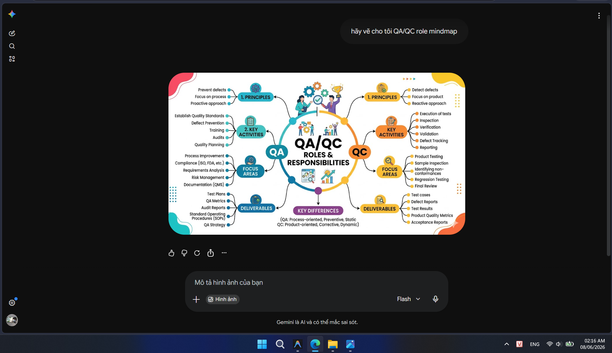
> **Sơ đồ do AI tạo:**  
> 

---

## 2. Phân tích 3 lỗi sai / thiếu sót của AI (MANDATORY)

| STT   | Lỗi sai / Thiếu sót                                            | Giải thích dựa trên ISTQB Syllabus                                                                                                                                                                                                                              | Cách sửa đổi / Bổ sung                                                                                                                                             |
| :---- | :------------------------------------------------------------- | :-------------------------------------------------------------------------------------------------------------------------------------------------------------------------------------------------------------------------------------------------------------- | :----------------------------------------------------------------------------------------------------------------------------------------------------------------- |
| **1** | **QC — Principles: "Reactive approach"**                       | ISTQB không định nghĩa QC là "reactive". Trong các mô hình hiện đại (Agile, Shift-Left), QC hoàn toàn có thể là chủ động (proactive). ISTQB CTFL v4.0 không dùng thuật ngữ này để mô tả QC.                                                                     | Thay bằng **"Corrective approach"** hoặc **"Product-focused approach"** — phù hợp hơn với định nghĩa ISTQB.                                                        |
| **2** | **QC — Key Activities: "Verification"**                        | Theo ISTQB, Verification ("Are we building the product right?") thuộc về **QA/Static Testing**, không phải QC. QC tập trung vào **Validation** ("Are we building the right product?"). Đặt Verification trong QC là nhầm lẫn hai khái niệm cốt lõi.             | Chuyển "Verification" sang QA. Trong QC thay bằng **"Validation"** hoặc **"Test Execution"**, **"Defect Detection"**.                                              |
| **3** | **Key Differences: "QA: Static" vs "QC: Dynamic"**             | Quá đơn giản hóa và dễ gây hiểu sai. Theo ISTQB CTFL v4.0, Static/Dynamic là **kỹ thuật kiểm thử**, không phải đặc trưng riêng của QA hay QC. QA có thể bao gồm cả hai; QC cũng có thể dùng static testing trong một số ngữ cảnh.                               | Thay bằng: **QA: Process-oriented, Preventive, Proactive** / **QC: Product-oriented, Corrective, Reactive**. Ghi chú Static/Dynamic là techniques riêng.           |
| **4** | **QA — Principles: "Prevent defects" (chưa đầy đủ)**           | ISTQB CTFL v4.0 định nghĩa QA là _"part of quality management focused on providing confidence that quality requirements will be fulfilled"_. "Prevent defects" là **kết quả**, không phải nguyên tắc. Nguyên tắc đúng là đảm bảo quy trình được thực hiện đúng. | Sửa thành **"Provide confidence in quality"** hoặc **"Process compliance"**. Có thể giữ "Prevent defects" nhưng thêm chú thích là mục tiêu, không phải nguyên tắc. |
| **5** | **QA — Key Activities: Thiếu Test Planning & Test Monitoring** | ISTQB CTFL v4.0 liệt kê **Test Planning**, **Test Monitoring & Control** là các test activities chính của QA/Test Management. "Defect Prevention" không xuất hiện với tên này trong ISTQB — đây là khái niệm từ TMMi/ISO.                                       | Bổ sung **"Test Planning"** và **"Test Monitoring & Control"** vào QA Key Activities.                                                                              |
| **6** | **QA — Focus Areas: Thiếu "Test Policy" và "Test Strategy"**   | Theo ISTQB CTFL v4.0, **Test Policy** (cấp tổ chức) và **Test Strategy** (cấp dự án) là hai deliverable/hoạt động quan trọng thuộc phạm vi QA. Mindmap chỉ ghi chung "Documentation (QMS)" mà bỏ qua hai khái niệm nền tảng này.                                | Thêm **"Test Strategy"** và **"Test Policy"** vào Focus Areas hoặc Deliverables của QA.                                                                            |
| **7** | **QC — Key Activities: "Inspection" dùng sai nghĩa ISTQB**     | Trong ISTQB, **Inspection** là một dạng **Static Review** (review có cấu trúc cao nhất — có moderator, checklist, formal exit criteria), không phải kiểm tra vật lý sản phẩm. Dùng "Inspection" trong QC Dynamic Activities dễ gây nhầm nghĩa.                  | Làm rõ: **"Inspection" = Static Review technique** theo ISTQB. Hoặc đổi thành **"Static Review / Inspection"** để tránh nhầm với physical inspection.              |
| **8** | **QC — Deliverables: Thiếu "Test Summary Report"**             | ISTQB CTFL v4.0 xác định **Test Completion Report** (Test Summary Report) là testware/deliverable chính thức của giai đoạn Test Completion. Mindmap chỉ ghi "Test Results" — khác với một báo cáo tổng kết chính thức theo ISTQB.                               | Bổ sung **"Test Summary Report"** (hoặc "Test Completion Report") vào QC Deliverables.                                                                             |

---

## 3. Sơ đồ tư duy đã được hiệu chỉnh (Sản phẩm của sinh viên)

### Sơ đồ dạng đã sửa lỗi:

> **Ảnh chụp màn hình cuộc hội thoại với AI (chứng minh sơ đồ đã được chỉnh sửa):**  
> 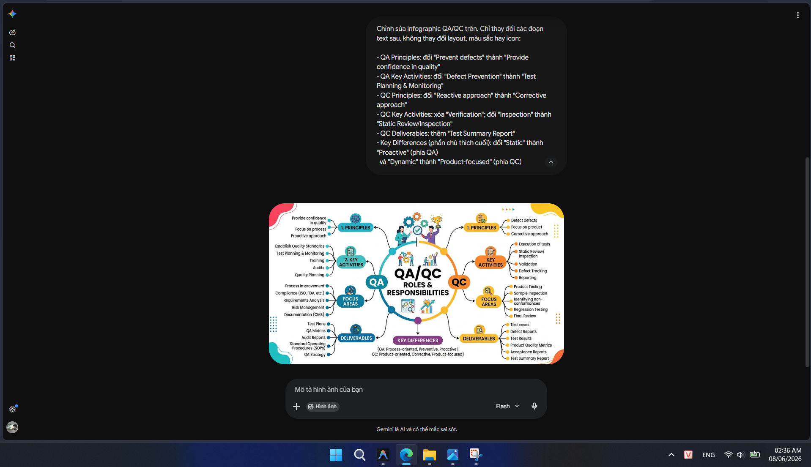
> **Sơ đồ đã được hiệu chỉnh:**  
> 

---

### PHẦN 5: NHẬN XÉT VỀ AI (AI CRITIQUE)

Trong quá trình thực hiện bài tập lần này, việc sử dụng AI hỗ trợ cho em rất nhiều, xây dựng cho em một bộ khung vững chắc để dễ dàng triển khai các nội dung bên trong. Thế nhưng, có một số điểm AI làm chưa tốt, cụ thể là việc cung cấp các đường dẫn tham khảo đến các lỗi được công bố, đa phần các đường dẫn đều không truy cập được, thế mà AI lại bảo đã hoàn tất việc cung cấp, có thể là do các đọc một đường dẫn của AI khác với việc truy cập link trên browser, hoặc AI tự bịa ra các đường link đó (có vài đường link rất khác so với chính thống). Ngoài ra trong việc học thuật như gen ra mindmap cho các vai trò của QA/QC, nếu như không đưa cho AI một khái niệm đủ tốt thì AI sẽ gen ra gặp nhiều lỗi, mất thời gian trong việc sửa và khắc phục. Hiện tại thì việc sử dụng AI đang là xu thế, và qua bài tập này, em cũng đã thấy được rằng để sử dụng AI tốt mình nên cung cấp cho AI một ngữ cảnh tốt, càng cụ thể càng tốt, bằng cách đính kèm các file khi mình prompt, ngoài ra không được tin rằng các thông tin AI cũng cấp là đúng hoàn toàn, luôn phải tự kiểm tra lại trên các trang chính thông để đảm bảo chất lượng sản phẩm cuối cùng. Ngoài ra có thể hướng đến việc trang bị các skill cho AI để AI có thể hoạt động tốt hơn, do chưa có nhiều kinh nghiệm trong việc cài đặt sản môi trường cho AI trong việc soạn thảo văn bản (lúc trước code thì em có làm), nên trong bài tập lần này chưa có dịp sử dụng đến các skill.

---

### PHẦN 6: KHAI BÁO BẮT BUỘC (MANDATORY DISCLOSURE)

_"Phân tích thị trường việc làm / Danh sách 20 lỗi phần mềm / 15 ca kiểm thử quạt điện / Sơ đồ tư duy QA/QC" ban đầu được tạo ra bởi Gemini và Antigravity. Em đã xem xét và chỉnh sửa toàn bộ 4 sản phẩm, bao gồm: xác minh lại 14 link tuyển dụng và sửa kết luận AI/LLM; chắt lọc và hiệu chỉnh 20/30 lỗi phần mềm; bổ sung edge case TC16–TC19 mà AI bỏ sót; phân tích và sửa 8 lỗi trong mindmap QA/QC; phần 'Đính chính' và phần bảng lỗi sai mindmap được em tự viết hoàn toàn. Báo cáo Kiểm tra AI chi tiết được đính kèm như Phụ lục A. Em xác nhận rằng em không sử dụng AI để tạo ra bất kỳ sản phẩm nào thuộc danh mục bị cấm (ảnh thiết bị, video thực thi, ảnh chụp tài khoản đăng nhập, prompt log)._

---

### PHẦN 7: BẢNG TỰ ĐÁNH GIÁ ĐIỂM SỐ (SELF-ASSESSMENT RUBRIC)

_Sinh viên tự đánh giá điểm số của mình cho các phần tương ứng trước khi nộp bài._

| STT      | Nội dung yêu cầu                                          | Điểm tối đa | Điểm tự đánh giá | Minh chứng / Ghi chú                                                                                                          |
| :------- | :-------------------------------------------------------- | :---------: | :--------------: | :---------------------------------------------------------------------------------------------------------------------------- |
| **1**    | Job Market 2026 (10 jobs × 3 pts + AI Impact)             |   **40**    |        40        | File nguồn: `[Req01]QA_QC-Job_Market_2026.md`                                                                                 |
| **2**    | Software Defects 2022-2026 (20 defects)                   |   **20**    |        20        | File nguồn: `[Req02]Software_Defect_22_26.md`                                                                                 |
| **3**    | Physical-product test design (15 TCs + 5 videos)          |   **25**    |        25        | File nguồn: `[Req03]Test_Cases_Physical_Product.md`                                                                           |
| **AI-1** | [AI-02] AI Audit Report (5-section) attached              |    **8**    |        8         | File nguồn: `[AI-02] - FIT@HCMUS - AI Audit Report.md`                                                                        |
| **AI-2** | AI Critique (200-300 words) + [AI-03] Disclosure attached |    **4**    |        4         | File nguồn: `[AI-03] - FIT@HCMUS - AI Disclosure Form.md`                                                                     |
| **AI-3** | [AI-05] Checklist signed + anti-cheat artifacts           |    **3**    |        3         | File: `[AI-05] - FIT@HCMUS - AI Privacy Checklist.md`, `[AI-06] - FIT@HCMUS - AI Student Acknowledgement.md`, `prompt_log.md` |
|          | **TỔNG ĐIỂM (Total)**                                     |   **100**   |       100        |                                                                                                                               |

---

### PHẦN 8: CÁC PHỤ LỤC (APPENDICES)

#### PHỤ LỤC A: BÁO CÁO KIỂM TRA AI (AI AUDIT REPORT) [AI-02]

**Khoa Công nghệ Thông tin (FIT) – Trường Đại học Khoa học Tự nhiên TP.HCM (HCMUS)**

**CS423 / CSC15003 – Kiểm thử Phần mềm (Tích hợp AI · 2026)**

**CHÍNH SÁCH AI · MẪU BIỂU — 2026 v1.0**

# Báo Cáo Kiểm Tra AI – Mẫu 5 Phần cho Mỗi Sản Phẩm

_Phụ lục bắt buộc cho mọi bài tập có sử dụng AI (HW#01–HW#06 và Seminar)._

_Được điều chỉnh từ Med Kharbach, PhD (2026) — AI Use Policy Templates for Higher Education. CC BY-NC-SA 4.0. Bản điều chỉnh này được chuẩn bị cho FIT@HCMUS – CS423 / CSC15003 Kiểm thử Phần mềm._

## 1. Thông Tin Sinh Viên

| Trường                            | Giá trị                               |
| :-------------------------------- | :------------------------------------ |
| **Họ và tên sinh viên (in hoa):** | MẠCH QUỐC TẤN                         |
| **Mã số sinh viên:**              | 23127115                              |
| **Lớp / Khóa:**                   | 23KTPM3                               |
| **Mã bài tập:**                   | HW01-AI                               |
| **Ngày nộp bài:**                 | 08/06/2026                            |
| **Công cụ AI đã sử dụng:**        | Gemini, Antigravity IDE with AI Agent |
| **Bài nộp có sử dụng AI:**        | Có                                    |

## 2. Hướng Dẫn (đọc trước khi điền)

- Thêm một hàng cho mỗi sản phẩm do AI tạo ra (ca kiểm thử, script, checklist, OpenAPI spec, kế hoạch JMeter, v.v.).
- Dán nguyên văn prompt đã dùng – KHÔNG được diễn đạt lại.
- Dán nguyên văn kết quả đầu ra của AI (hoặc đính kèm ảnh chụp màn hình có nhãn trong báo cáo).
- Gán phán quyết: VALID / INVALID / INCOMPLETE.
- Phần lý giải phải trích dẫn slide bài giảng, mục ISTQB, hoặc RFC kỹ thuật.
- Trình bày sản phẩm đã chỉnh sửa với phần thay đổi được làm nổi bật.
- Các hàng mẫu in nghiêng – thay thế trước khi nộp.

## 3. Báo Cáo Kiểm Tra Chi Tiết – Từng Sản Phẩm

### Sản phẩm #1: Phân tích thị trường việc làm QA/QC

- **Công cụ:** Antigravity IDE with AI Agent
- **Thời gian thực hiện:** 17:58 04/06/2026
- **Prompt đã sử dụng:**
  > "Hiện tại, tôi đã tổng hợp được 14 đường dẫn về các công việc liên quan đến QA/QC ở file QA_QC-Job_Market_2026.md và ngoài ứng với mỗi link theo thứ tự thì tôi đã chụp màn hình lại và để trong img/job/xy với xy là thứ tự của mỗi đường dẫn, tôi muốn bạn hãy truy cập vào mỗi đường dẫn và lấy ra cho tôi các thông tin sau: mô tả ngắn về bài tuyển dụng, ngày đăng, yêu cầu kĩ năng AI/LLM, hình ảnh minh họa, phân tích tác động AI 1–2 câu. Cuối cùng rút ra kết luận về thị trường QA/QC..."
- **Kết quả AI & Minh chứng:**
  - AI tổng hợp được thông tin của cả 14 tin tuyển dụng, bao gồm mô tả công việc, ngày đăng, yêu cầu AI/LLM, ảnh minh họa và phân tích tác động AI cho từng vị trí. Kết luận về thị trường gồm: nhu cầu, mức lương, yêu cầu kỹ năng và định hướng cho sinh viên mới ra trường.
  - **Bản AI gen thô (raw):** [`[Req01]QA_QC-Job_Market_2026.md`](./[Req01]QA_QC-Job_Market_2026.md) tại Commit: [`2c61ec7`](https://github.com/mqt4n/hcmus-swtesting--hw/commit/2c61ec7562d35bed18b8e89dd5818e0907b3e08c) (Bản sơ khởi lúc 19:52 04/06/2026)
  - **Bản hiệu chỉnh (final):** [`[Req01]QA_QC-Job_Market_2026.md`](./[Req01]QA_QC-Job_Market_2026.md) tại Commit: [`3bad089`](https://github.com/mqt4n/hcmus-swtesting--hw/commit/3bad0898e849d80278487f0d7b939e89bc015876)
- **Phán quyết:** `INCOMPLETE`
- **Lý giải đánh giá (ISTQB):** Không có
- **Chỉnh sửa của Sinh viên:** Em đã: (1) đọc lại toàn bộ 14 JD và xác minh kết luận AI/LLM; (2) sửa lại 3 tin từ "Có" thành "Không" do AI suy diễn sai; (3) hiệu chỉnh ngày đăng bằng cách đối chiếu với ảnh chụp màn hình; (4) viết lại phần phân tích tác động AI để bám sát nội dung JD thực tế.

---

### Sản phẩm #2: Danh sách 20 lỗi phần mềm 2022–2026

- **Công cụ:** Antigravity IDE with AI Agent
- **Thời gian thực hiện:** 20:06 04/06/2026
- **Prompt đã sử dụng:**
  > "Bạn hãy tìm 30 lỗi phần mềm được công bố từ năm 2022 đến 2026. Với điều kiện có lớn hơn hoặc bằng 10 lỗi liên quan đến AI/LLM (ảo giác - hallucination, tiêm mã độc vào prompt - prompt injection, thiên kiến - bias). Mỗi lỗi cần có: link nguồn, mô tả, mức độ nghiêm trọng, hậu quả, giải pháp. Câu trả lời được ghi vào trong file Software_Defect_22_26.md, văn phong của một bài báo cáo nghiêm túc."
- **Kết quả AI & Minh chứng:**
  - AI tổng hợp danh sách 30 lỗi phần mềm, gồm các mục: link nguồn, mô tả sự kiện, mức độ nghiêm trọng, hậu quả và giải pháp. Trong đó có các lỗi AI/LLM (ảo giác, prompt injection, bias) và lỗi phần mềm truyền thống.
  - **Bản AI gen thô (raw):** [`[Req02]Software_Defect_22_26.md`](./[Req02]Software_Defect_22_26.md) tại Commit: [`fad3078`](https://github.com/mqt4n/hcmus-swtesting--hw/commit/fad30781132fa87591ac7b38f80c1bd78f2bfa52) (Bản thô gồm 30 lỗi lúc 22:04 04/06/2026)
  - **Bản hiệu chỉnh (final):** [`[Req02]Software_Defect_22_26.md`](./[Req02]Software_Defect_22_26.md) tại Commit: [`3bad089`](https://github.com/mqt4n/hcmus-swtesting--hw/commit/3bad0898e849d80278487f0d7b939e89bc015876)
- **Phán quyết:** `INCOMPLETE`
- **Lý giải đánh giá (ISTQB):** Không có
- **Chỉnh sửa của Sinh viên:** Em đã: (1) rà soát và xác minh toàn bộ 30 link, loại bỏ những link không còn hoạt động; (2) chắt lọc từ 30 xuống 20 lỗi đại diện nhất; (3) hiệu chỉnh mức độ nghiêm trọng dựa trên thông tin từ nguồn gốc tin tức; (4) bổ sung mục "AI giải thích về lỗi" và "Đính chính" cho mỗi lỗi để chỉ ra điểm thiên kiến/ảo giác của AI khi giải thích.

---

### Sản phẩm #3: 15 ca kiểm thử thiết bị vật lý (quạt điện Senko BX1282)

- **Công cụ:** Gemini
- **Thời gian thực hiện:** 20:50 06/06/2026
- **Prompt đã sử dụng:**
  > "Thiết kế 15 ca kiểm thử cho thiết bị gia dụng là quạt máy không có tính năng hẹn giờ và tăng chiều cao (Mục tiêu / Đầu vào / Các bước / Kết quả mong đợi / Kết quả thực tế / Phán quyết). Thêm giúp tôi cả checklist và test summary report template dạng bảng."
- **Kết quả AI & Minh chứng:**
  - AI tạo ra 15 ca kiểm thử theo đúng cấu trúc 6 cột (Mục tiêu / Đầu vào / Các bước / Kết quả mong đợi / Kết quả thực tế / Phán quyết). Các ca kiểm thử tập trung vào: bật/tắt quạt, điều chỉnh tốc độ (3 mức), chức năng xoay quạt, độ an toàn và điều kiện biên cơ bản. AI cũng tạo kèm template checklist và test summary report.
  - **Bản AI gen thô (raw):** [Test_Cases_Physica_Product .xlsx](./Test_Cases_Physica_Product%20.xlsx) tại Commit: [`901d736`](https://github.com/mqt4n/hcmus-swtesting--hw/commit/901d736fecd7cb6116ae0daecb12350238e50ca7) (Bản thô 15 ca kiểm thử lúc 21:26 06/06/2026)
  - **Bản hiệu chỉnh (final):** [`[Req03]Test_Cases_Physical_Product.xlsx`](./[Req03]Test_Cases_Physical_Product.xlsx) & [`[Req03]Test_Cases_Physical_Product.md`](./[Req03]Test_Cases_Physical_Product.md) tại Commit: [`baf263b`](https://github.com/mqt4n/hcmus-swtesting--hw/commit/baf263b7f5dcbf4668c0d26e6e067ba5813fa190)
- **Phán quyết:** `INCOMPLETE`
- **Lý giải đánh giá (ISTQB):** Không có
- **Chỉnh sửa của Sinh viên:** Em đã: (1) thực thi toàn bộ 15 ca kiểm thử và ghi lại kết quả thực tế vào file Excel; (2) bổ sung TC16–TC19 là các edge case về lồng quạt mà AI không tạo ra; (3) ghi lại 7 ảnh bằng chứng hội thoại AI chứng minh AI không tìm ra các edge case này; (4) quay video thực thi cho ít nhất 5 ca kiểm thử; (5) ghi nhận và log các lỗi phát hiện lên GitHub Issues.

---

### Sản phẩm #4: Sơ đồ tư duy QA/QC Role Mindmap

- **Công cụ:** Gemini
- **Thời gian thực hiện:** 02:16 08/06/2026
- **Prompt đã sử dụng:**
  > "hãy vẽ cho tôi QA/QC role mindmap"
- **Kết quả AI & Minh chứng:**
  - AI tạo ra một infographic/sơ đồ tư duy dạng text mô tả vai trò QA và QC, bao gồm các mục: Principles, Key Activities, Focus Areas, Deliverables và Key Differences giữa QA và QC.
  - **Sơ đồ AI gen thô (raw):** [raw.png](./img/mindmap/raw.png) tại Commit: [`f28b63f`](https://github.com/mqt4n/hcmus-swtesting--hw/commit/f28b63ffbbce40a95c8f1b4b4dd29ebe885100af) (Bản thô sơ đồ lúc 02:49 08/06/2026)
  - **Sơ đồ hiệu chỉnh (final):** [final.png](./img/mindmap/final.png) & [`[Req01]QA_QC-Role_Mindmap.md`](./[Req01]QA_QC-Role_Mindmap.md) tại Commit: [`f28b63f`](https://github.com/mqt4n/hcmus-swtesting--hw/commit/f28b63ffbbce40a95c8f1b4b4dd29ebe885100af)
- **Phán quyết:** `INCOMPLETE`
- **Lý giải đánh giá (ISTQB):** Không có
- **Chỉnh sửa của Sinh viên:** Em đã: (1) phân tích và lập bảng 8 lỗi sai với dẫn chứng từ ISTQB CTFL v4.0; (2) yêu cầu AI chỉnh sửa lại infographic theo 6 điểm cụ thể (thay đổi thuật ngữ, thêm/xóa các mục sai); (3) lưu sơ đồ gốc (img/mindmap/raw.png) và sơ đồ đã sửa (img/mindmap/final.png) kèm ảnh hội thoại chứng minh.

---

## 4. Tổng Hợp Độ Chính Xác của AI

Tổng hợp các phán quyết từ Phần 3 và hoàn thiện bảng dưới đây.

| Chỉ số                                            | Số lượng | Tỷ lệ |
| :------------------------------------------------ | :------- | :---- |
| **Tổng số sản phẩm do AI tạo ra được kiểm tra**   | 4        | 100%  |
| **VALID (đúng, chấp nhận nguyên bản)**            | 0        | 0%    |
| **INVALID (sai; bị từ chối)**                     | 0        | 0%    |
| **INCOMPLETE (chấp nhận được sau khi chỉnh sửa)** | 4        | 100%  |

## 5. Kết Luận – Khi nào nên (hoặc không nên) sử dụng AI?

Qua kiểm tra 4 sản phẩm do AI tạo ra, ta thấy AI rất mạnh trong việc tạo khung dàn ý, cấu trúc báo cáo hoặc tìm kiếm thông tin ban đầu (soạn thảo thô, lập dàn ý test cases). Tuy nhiên, AI thường xuyên gặp lỗi ảo giác (hallucination), cung cấp liên kết hỏng, đánh giá sai mức độ nghiêm trọng và đặc biệt là thiếu sót hoặc sai lệch các khái niệm học thuật chuẩn (như ISTQB CTFL v4.0 trong sơ đồ tư duy) và các trường hợp biên (edge cases) trong kiểm thử thực tế. Vậy chỉ nên dùng AI như một công cụ hỗ trợ tạo bản thảo ban đầu. Sau đó bắt buộc phải kiểm chứng thủ công, rà soát đối chiếu tài liệu chuẩn và bổ sung kiểm thử thực tế để đảm bảo chất lượng.

## 6. Công Bố Bắt Buộc (dán nguyên văn)

_"Phân tích thị trường việc làm / Danh sách 20 lỗi phần mềm / 15 ca kiểm thử quạt điện / Sơ đồ tư duy QA/QC" ban đầu được tạo ra bởi Gemini và Antigravity. Em đã xem xét và chỉnh sửa toàn bộ 4 sản phẩm, bao gồm: xác minh lại 14 link tuyển dụng và sửa kết luận AI/LLM; chắt lọc và hiệu chỉnh 20/30 lỗi phần mềm; bổ sung edge case TC16–TC19 mà AI bỏ sót; phân tích và sửa 8 lỗi trong mindmap QA/QC; phần 'Đính chính' và phần bảng lỗi sai mindmap được em tự viết hoàn toàn. Báo cáo Kiểm tra AI chi tiết được đính kèm như Phụ lục A. Em xác nhận rằng em không sử dụng AI để tạo ra bất kỳ sản phẩm nào thuộc danh mục bị cấm (ảnh thiết bị, video thực thi, ảnh chụp tài khoản đăng nhập, prompt log)._

## Ký Xác Nhận

| Họ và tên sinh viên (in hoa): | MẠCH QUỐC TẤN                                                                                            |
| :---------------------------- | :------------------------------------------------------------------------------------------------------- |
| **Mã số sinh viên:**          | 23127115                                                                                                 |
| **Lớp / Khóa:**               | 23KTPM3                                                                                                  |
| **Môn học:**                  | CS423 / CSC15003 – Kiểm thử Phần mềm                                                                     |
| **Giảng viên:**               | TS. Lâm Quang Vũ, TS. Trần Duy Hoàng, ThS. Trần Thị Bích Hạnh, ThS. Hồ Tuấn Thanh, ThS. Trương Phước Lộc |
| **Ngày:**                     | 08/06/2026                                                                                               |
| **Chữ ký:**                   | Mạch Quốc Tấn                                                                                            |

## Tài Liệu Tham Khảo

- Kharbach, M. (2026). AI Use Policy Templates for Higher Education. CC BY-NC-SA 4.0.
- ISTQB Foundation Level Syllabus (phiên bản mới nhất).
- Hardman, P. (2025). A Post-AI Learning Taxonomy.
- Fuster Rabella, M. (2025). OECD Education Working Paper No. 338.
- Perkins, M., Roe, J., & Furze, L. (2025). AI Assessment Scale.
- Anthropic (2025). Building reliable AI test agents – engineering blog.
- Tài liệu DeepEval & Promptfoo – framework kiểm thử cho hệ thống LLM.

#### PHỤ LỤC B: MẪU CÔNG BỐ SỬ DỤNG AI (AI DISCLOSURE FORM) [AI-03]

**Khoa Công nghệ Thông tin (FIT) – Trường Đại học Khoa học Tự nhiên TP.HCM (HCMUS)**

**CS423 / CSC15003 – Kiểm thử Phần mềm (Tích hợp AI · 2026)**

**CHÍNH SÁCH AI · MẪU BIỂU — 2026 v1.0**

# Mẫu Công Bố Sử Dụng AI

_Đính kèm vào các bài tập có sử dụng AI theo bất kỳ hình thức nào được phép._

_Được điều chỉnh từ Med Kharbach, PhD (2026) — AI Use Policy Templates for Higher Education. CC BY-NC-SA 4.0. Bản điều chỉnh này được chuẩn bị cho FIT@HCMUS – CS423 / CSC15003 Kiểm thử Phần mềm._

## 1. Thông Tin Môn Học & Sinh Viên

| Trường                         | Giá trị                                           |
| :----------------------------- | :------------------------------------------------ |
| **Môn học:**                   | CS423 / CSC15003 – Kiểm thử Phần mềm              |
| **Mã bài tập:**                | HW01-AI                                           |
| **Tên bài tập:**               | QA/QC Jobs · 20 Defects · Test a Physical Product |
| **Danh mục Sử dụng AI (1–5):** | Danh mục\_\_\_                                    |
| **Công cụ AI đã sử dụng:**     | Gemini, Antigravity IDE with AI Agent             |
| **Ngày:**                      | 08/06/2026                                        |
| **Họ và tên sinh viên:**       | MẠCH QUỐC TẤN                                     |
| **Mã số sinh viên:**           | 23127115                                          |

## 2. Câu Hỏi Công Bố

### 1. Công cụ AI đã sử dụng:

1. **Antigravity IDE with AI Agent** — sử dụng cho Req01 (phân tích 14 tin tuyển dụng QA/QC) và Req02 (tổng hợp 30 lỗi phần mềm, format lại sau khi chắt lọc).
2. **Gemini** — sử dụng cho Req03 (thiết kế 15 ca kiểm thử, checklist, test summary report) và Req01/Mindmap (vẽ và chỉnh sửa sơ đồ tư duy QA/QC) và giải thích từng lỗi phần mềm trong Req02.

### 2. Giai đoạn bài tập có sử dụng AI:

- [x] **brainstorming** (ý tưởng) — Đặt câu hỏi gợi ý về các lỗi phần mềm nổi bật và định hướng nghiên cứu thị trường QA/QC.
- [x] **outlining** (lập dàn ý) — AI hỗ trợ thiết lập cấu trúc bảng cho test cases, checklist và test summary report.
- [x] **drafting** (soạn thảo) — AI viết nháp nội dung phân tích JD tuyển dụng (Req01), 30 sự cố phần mềm (Req02) và 15 ca kiểm thử (Req03).
- [ ] **feedback** (phản hồi)
- [x] **revision** (chỉnh sửa) — Yêu cầu AI chỉnh sửa lại sơ đồ tư duy QA/QC theo 6 yêu cầu chi tiết.
- [ ] **coding** (lập trình)
- [x] **data analysis** (phân tích dữ liệu) — AI hỗ trợ tổng hợp thông tin, trích lọc dữ liệu kỹ năng từ 14 tin tuyển dụng và phân tích mức độ tác động của AI.
- [x] **visual design** (thiết kế trực quan) — AI vẽ và khởi tạo sơ đồ tư duy QA/QC Role Mindmap ban đầu.
- [ ] **other** (khác) (ghi rõ): \***\*\*\*\*\***\_\_\_\_\***\*\*\*\*\***

### 3. Các prompt hoặc yêu cầu chính đã giao cho AI:

**Prompt 1** — **Antigravity IDE with AI Agent** (17:58 04/06/2026 — Req01 – Job Market):

> "Hiện tại, tôi đã tổng hợp được 14 đường dẫn về các công việc liên quan đến QA/QC ở file QA_QC-Job_Market_2026.md và ngoài ứng với mỗi link theo thứ tự thì tôi đã chụp màn hình lại và để trong img/job/xy với xy là thứ tự của mỗi đường dẫn, tôi muốn bạn hãy truy cập vào mỗi đường dẫn và lấy ra cho tôi các thông tin sau: mô tả ngắn về bài tuyển dụng, ngày đăng, yêu cầu kĩ năng AI/LLM, hình ảnh minh họa, phân tích tác động AI 1–2 câu. Cuối cùng rút ra kết luận về thị trường QA/QC..."

**Prompt 2** — **Antigravity IDE with AI Agent** (20:06 04/06/2026 — Req02 – 20 Defects):

> "Bạn hãy tìm 30 lỗi phần mềm được công bố từ năm 2022 đến 2026. Với điều kiện có lớn hơn hoặc bằng 10 lỗi liên quan đến AI/LLM (ảo giác - hallucination, tiêm mã độc vào prompt - prompt injection, thiên kiến - bias). Mỗi lỗi cần có: link nguồn, mô tả, mức độ nghiêm trọng, hậu quả, giải pháp. Câu trả lời được ghi vào trong file Software_Defect_22_26.md, văn phong của một bài báo cáo nghiêm túc."

**Prompt 3** — **Gemini** (20:50 06/06/2026 — Req03 – Test Cases):

> "Thiết kế 15 ca kiểm thử cho thiết bị gia dụng là quạt máy không có tính năng hẹn giờ và tăng chiều cao (Mục tiêu / Đầu vào / Các bước / Kết quả mong đợi / Kết quả thực tế / Phán quyết). Thêm giúp tôi cả checklist và test sumary report template dạng bảng."

**Prompt 4** — **Gemini** (02:16 08/06/2026 — Mindmap QA/QC):

> "hãy vẽ cho tôi QA/QC role mindmap"

_Xem toàn bộ lịch sử prompt tại `prompt_log.md` (Phụ lục A)._

### 4. Các phần cụ thể trong bài mà AI đã đóng góp:

- **Req01** _(Antigravity IDE with AI Agent)_ – AI tạo ra bản nháp phân tích 14 tin tuyển dụng (mô tả, ngày đăng, kết luận AI/LLM, tác động AI); Em đã xác minh lại toàn bộ 14 JD, sửa 3 kết luận AI/LLM sai, hiệu chỉnh ngày đăng theo ảnh chụp màn hình, viết lại phần tác động AI bám sát JD.
- **Req02** _(Antigravity IDE with AI Agent + Gemini)_ – Antigravity IDE with AI Agent tạo ra bản nháp 30 lỗi; Gemini giải thích chi tiết từng lỗi; Em đã xác minh link nguồn, chắt lọc xuống 20 lỗi, sửa mức độ nghiêm trọng, tự viết toàn bộ phần "Đính chính" (20 mục).
- **Req03** _(Gemini)_ – AI tạo ra TC01–TC15 và template checklist/test summary; Em thực thi toàn bộ trên thiết bị thực, ghi lại kết quả thực tế, tự thiết kế TC16–TC19 (edge case về lồng quạt mà AI bỏ sót), quay video, log lỗi lên GitHub Issues.
- **Mindmap** _(Gemini)_ – AI tạo ra infographic QA/QC ban đầu; Em phân tích và chỉ ra 8 lỗi ISTQB, yêu cầu AI sửa lại theo danh sách cụ thể.
- **AI KHÔNG đóng góp vào:** ảnh chụp thiết bị, ảnh chụp tài khoản LinkedIn/ITviec, video thực thi, prompt logs, phần "Đính chính" trong Req02, phần AI Critique và Mandatory Disclosure trong báo cáo chính.

### 5. Cách em xem xét, chỉnh sửa hoặc xác minh kết quả đầu ra của AI:

- Em đã tra cứu trên Internet, xem các trang uy tín để xác thực thông tin và chỉnh sửa khi cần thiết.

### 6. Trích Dẫn

Google. (2026). Gemini (Large language model). https://gemini.google.com

Antigravity. (2026). Antigravity IDE with AI Agent (AI coding assistant). https://antigravity.google/product/antigravity-ide

## 3. Cam Kết Trung Thực

_Bằng cách ký tên dưới đây, em xác nhận rằng thông tin công bố ở trên là chính xác và đầy đủ. Em hiểu rằng việc không công bố hoặc công bố sai về việc sử dụng AI được coi là vi phạm học thuật và có thể dẫn đến điểm 0 cho bài tập và bị chuyển lên xử lý kỷ luật._

## Ký Xác Nhận

| Họ và tên sinh viên (in hoa): | MẠCH QUỐC TẤN                                                                                            |
| :---------------------------- | :------------------------------------------------------------------------------------------------------- |
| **Mã số sinh viên:**          | 23127115                                                                                                 |
| **Lớp / Khóa:**               | 23KTPM3                                                                                                  |
| **Môn học:**                  | CS423 / CSC15003 – Kiểm thử Phần mềm                                                                     |
| **Giảng viên:**               | TS. Lâm Quang Vũ, TS. Trần Duy Hoàng, ThS. Trần Thị Bích Hạnh, ThS. Hồ Tuấn Thanh, ThS. Trương Phước Lộc |
| **Ngày:**                     | 08/06/2026                                                                                               |
| **Chữ ký:**                   | Mạch Quốc Tấn                                                                                            |

## Tài Liệu Tham Khảo

- Kharbach, M. (2026). AI Use Policy Templates for Higher Education. CC BY-NC-SA 4.0.
- ISTQB Foundation Level Syllabus (phiên bản mới nhất).
- Hardman, P. (2025). A Post-AI Learning Taxonomy.
- Fuster Rabella, M. (2025). OECD Education Working Paper No. 338.
- Perkins, M., Roe, J., & Furze, L. (2025). AI Assessment Scale.
- Anthropic (2025). Building reliable AI test agents — engineering blog.
- Tài liệu DeepEval & Promptfoo — framework kiểm thử cho hệ thống LLM.

#### PHỤ LỤC C: CHECKLIST QUYỀN RIÊNG TƯ VÀ SỬ DỤNG AI CÓ TRÁCH NHIỆM [AI-05]

**Khoa Công nghệ Thông tin (FIT) – Trường Đại học Khoa học Tự nhiên TP.HCM (HCMUS)**

**CS423 / CSC15003 – Kiểm thử Phần mềm (Tích hợp AI · 2026)**

**CHÍNH SÁCH AI · MẪU BIỂU — 2026 v1.0**

# Checklist Quyền Riêng Tư & Sử Dụng AI Có Trách Nhiệm

_Thực hiện checklist này trước khi nộp bất kỳ bài tập nào có sử dụng AI._

_Được điều chỉnh từ Med Kharbach, PhD (2026) — AI Use Policy Templates for Higher Education. CC BY-NC-SA 4.0. Bản điều chỉnh này được chuẩn bị cho FIT@HCMUS – CS423 / CSC15003 Kiểm thử Phần mềm._

## 1. Trước Khi Sử Dụng AI

- [x] Em đã xác nhận Danh mục Sử dụng AI được gán cho bài tập này.
- [x] Em đã khai báo (các) công cụ AI mình sẽ sử dụng trong nhật ký prompt.
- [x] Em đã đọc Thỏa thuận Sử dụng AI của môn học này.
- [x] Em hiểu những sản phẩm nào KHÔNG ĐƯỢC tạo ra bằng AI.

## 2. Trong Khi Sử Dụng AI

- [x] Em không nhập dữ liệu cá nhân của bạn học, khách hàng hoặc bệnh nhân.
- [x] Em không dán toàn bộ tài liệu có bản quyền vào AI.
- [x] Em không dán mã nguồn thuộc sở hữu của doanh nghiệp hoặc bị hạn chế bởi giấy phép mã nguồn mở.
- [x] Em đã ghi lại mỗi prompt + phản hồi AI vào prompt_log.md kèm timestamp.

## 3. Trước Khi Nộp Bài

- [x] Tất cả các sản phẩm do AI tạo ra đều được gắn nhãn trong Báo cáo Kiểm tra AI.
- [x] Tất cả các trích dẫn từ AI đã được xác minh.
- [x] Tất cả mã do AI tạo ra đã được chạy thử và kiểm thử.
- [x] Phần AI Critique 200–300 từ của em đã được đưa vào báo cáo.
- [x] Đoạn Công bố Bắt buộc nằm ở cuối báo cáo của em.
- [x] Em đã đính kèm Mẫu Công bố Sử dụng AI.
- [x] Em sẵn sàng cho buổi bảo vệ vấn đáp ngẫu nhiên 5–7 phút vào tuần sau khi nộp bài.

## 4. Tuyên Bố Cuối Cùng

_Trách nhiệm cuối cùng về tính chính xác, tính gốc và tính toàn vẹn của bài nộp này thuộc về em. Bất kỳ việc sử dụng AI không được công bố nào đều được coi là vi phạm học thuật._

## Ký Xác Nhận

| Họ và tên sinh viên (in hoa): | MẠCH QUỐC TẤN                                                                                            |
| :---------------------------- | :------------------------------------------------------------------------------------------------------- |
| **Mã số sinh viên:**          | 23127115                                                                                                 |
| **Lớp / Khóa:**               | 23KTPM3                                                                                                  |
| **Môn học:**                  | CS423 / CSC15003 – Kiểm thử Phần mềm                                                                     |
| **Giảng viên:**               | TS. Lâm Quang Vũ, TS. Trần Duy Hoàng, ThS. Trần Thị Bích Hạnh, ThS. Hồ Tuấn Thanh, ThS. Trương Phước Lộc |
| **Ngày:**                     | 08/06/2026                                                                                               |
| **Chữ ký:**                   | Mạch Quốc Tấn                                                                                            |

## Tài Liệu Tham Khảo

- Kharbach, M. (2026). AI Use Policy Templates for Higher Education. CC BY-NC-SA 4.0.
- ISTQB Foundation Level Syllabus (phiên bản mới nhất).
- Hardman, P. (2025). A Post-AI Learning Taxonomy.
- Fuster Rabella, M. (2025). OECD Education Working Paper No. 338.
- Perkins, M., Roe, J., & Furze, L. (2025). AI Assessment Scale.
- Anthropic (2025). Building reliable AI test agents — engineering blog.
- Tài liệu DeepEval & Promptfoo — framework kiểm thử cho hệ thống LLM.

#### PHỤ LỤC D: CAM KẾT THỎA THUẬN SỬ DỤNG AI CỦA SINH VIÊN [AI-06]

**Khoa Công nghệ Thông tin (FIT) – Trường Đại học Khoa học Tự nhiên TP.HCM (HCMUS)**

**CS423 / CSC15003 – Kiểm thử Phần mềm (Tích hợp AI · 2026)**

**CHÍNH SÁCH AI · MẪU BIỂU — 2026 v1.0**

# Cam Kết Thỏa Thuận Sử Dụng AI của Sinh Viên

_Ký và nộp vào đầu học kỳ._

_Được điều chỉnh từ Med Kharbach, PhD (2026) — AI Use Policy Templates for Higher Education. CC BY-NC-SA 4.0. Bản điều chỉnh này được chuẩn bị cho FIT@HCMUS – CS423 / CSC15003 Kiểm thử Phần mềm._

## 1. Tuyên Bố Cam Kết

Em đã đọc và hiểu Thỏa thuận Sử dụng AI cho môn CS423 / CSC15003 Kiểm thử Phần mềm (FIT@HCMUS, phiên bản 2026). Em hiểu: (1) năm Danh mục Sử dụng AI và danh mục nào áp dụng cho từng bài tập; (2) các nghĩa vụ công bố, kiểm tra và ghi nhật ký prompt; (3) các cơ chế chống gian lận (ảnh chụp thực tế kèm thẻ sinh viên, dấu watermark hostname, buổi bảo vệ vấn đáp); (4) rằng việc sử dụng AI không được công bố hoặc công bố sai được coi là vi phạm học thuật theo Quy chế HCMUS. Em cam kết tuân thủ thỏa thuận này trong suốt học kỳ.

## 2. Cam Kết Về Chế Độ AI

- Em hiểu rằng thi Giữa kỳ và Cuối kỳ là thi SÁCH ĐÓNG, KHÔNG sử dụng AI.
- Em hiểu rằng các prompt của em được ghi lại tập trung và em chịu trách nhiệm về chúng.
- Em hiểu rằng 10–30% sinh viên ngẫu nhiên được mời tham dự buổi bảo vệ vấn đáp cho mỗi bài HW.

## 3. Tài Khoản AI của Khoa

| Trường                                     | Giá trị                                 |
| :----------------------------------------- | :-------------------------------------- |
| **Công cụ AI bạn dự định sử dụng:**        | Antigravity IDE, Gemini, Github Copilot |
| **Ngày kích hoạt:**                        | 07/12/2025                              |
| **Đã xác nhận đăng nhập lần đầu:**         | Có                                      |
| **Đã kích hoạt GitHub Copilot Education:** | Có                                      |

## Ký Xác Nhận

| Họ và tên sinh viên (in hoa): | MẠCH QUỐC TẤN                                                                                            |
| :---------------------------- | :------------------------------------------------------------------------------------------------------- |
| **Mã số sinh viên:**          | 23127115                                                                                                 |
| **Lớp / Khóa:**               | 23KTPM3                                                                                                  |
| **Môn học:**                  | CS423 / CSC15003 – Kiểm thử Phần mềm                                                                     |
| **Giảng viên:**               | TS. Lâm Quang Vũ, TS. Trần Duy Hoàng, ThS. Trần Thị Bích Hạnh, ThS. Hồ Tuấn Thanh, ThS. Trương Phước Lộc |
| **Ngày:**                     | 08/06/2026                                                                                               |
| **Chữ ký:**                   | Mạch Quốc Tấn                                                                                            |

## Tài Liệu Tham Khảo

- Kharbach, M. (2026). AI Use Policy Templates for Higher Education. CC BY-NC-SA 4.0.
- ISTQB Foundation Level Syllabus (phiên bản mới nhất).
- Hardman, P. (2025). A Post-AI Learning Taxonomy.
- Fuster Rabella, M. (2025). OECD Education Working Paper No. 338.
- Perkins, M., Roe, J., & Furze, L. (2025). AI Assessment Scale.
- Anthropic (2025). Building reliable AI test agents — engineering blog.
- Tài liệu DeepEval & Promptfoo — framework kiểm thử cho hệ thống LLM.

#### PHỤ LỤC E: NHẬT KÝ HỘI THOẠI AI (PROMPT LOG)

2026-06-04T17:58:00+07:00 (Antigravity IDE with AI Agent)
Hiện tại, tôi đã tổng hợp được 14 đường dẫn về các công việc liên quan đến QA/QC ở file [QA_QC-Job_Market_2026.md]([Req01]QA_QC-Job_Market_2026.md) và ngoài ứng với mỗi link theo thứ tự thì tôi đã chụp màn hình lại và để trong img/job/xy với xy là thứ tự của mỗi đường dẫn, tôi muốn bạn hãy truy cập vào mỗi đường dẫn và lấy ra cho tôi các thông tin sau:
- Mô tả ngắn về bài tuyển dụng (công ty, vị trí tuyển dụng, ...)
- Ngày đăng tuyển dụng là ngày này (dựa trên đã đăng được bao nhiêu ngày so với ngày hôm nay là 04/06/2026)
- Yêu cầu tuyển dụng có yêu cầu các kĩ năng về AI/LLM/automation-AI (AI tự động hóa) không
- Chèn hình ảnh mà tôi đã chụp màn hình vào theo thứ tự
- Dựa vào nội dung tin tuyển dụng, hãy phân tích tác động của AI trong 1 đến 2 câu
Cuối cùng, rút ra cho tôi một kết luận về thị trương QA/QC hiện tại về nhu cầu, vị trí tuyển dụng, mức lương, yêu cầu tuyển dụng thường gặp, và các sinh viên khi mới ra trường cần chuẩn bị tốt những gì để có thể đáp ứng được nhu cầu của thị trường
Các nội dung trên được cập nhật trực tiếp vào file [QA_QC-Job_Market_2026.md]([Req01]QA_QC-Job_Market_2026.md)

2026-06-04T19:28:00+07:00 (Antigravity IDE with AI Agent)
Dựa trên kết quả hiện tại của file [QA_QC-Job_Market_2026.md]([Req01]QA_QC-Job_Market_2026.md), tôi thấy các vấn đề sau cần được khắc phục:
- Không hiển thị các icon, xây dựng văn phong theo một bài báo cáo nghiêm túc
- Về việc phân tích tác động của AI, tôi cần bạn tập trung vào đọc nội dung công việc trong tin tuyển dụng, Nhận xét ngắn gọn 1 đến 2 câu về việc AI có thể ảnh hưởng như thế nào đến vị trí đó trong tương lai.
- Về việc yêu cầu các kỹ năng về AI/LLM/automation-AI (AI tự động hóa), đọc kĩ nội dung tuyển dụng rồi kết luận, kết quả chỉ là có hoặc không, nếu có thì nêu ra dẫn chứng, hiện tại tôi thấy có những tin tuyển dụng không có mà giả sử có
- Về ngày đăng tin tuyển dụng hiện tại chưa được đúng, cần kiểm tra trên ảnh chụp màn hình và nội dung bài đăng, lấy mốc là 04/06/2025 để ước lượng ngày đăng
Cập nhật kết quả ở file [QA_QC-Job_Market_2026.md]([Req01]QA_QC-Job_Market_2026.md) 

2026-06-04T20:06:00+07:00 (Antigravity IDE with AI Agent)
Bạn hãy tìm 30 lỗi phần mềm được công bố từ năm 2022 đến 2026. Với điều khiện có lớn hơn hoặc bằng 10 lỗi liên quan đến AI/LLM (ảo giác - hallucination, tiêm mã độc vào prompt - prompt injection, thiên kiến - bias). Mỗi lỗi cần có: link nguồn, mô tả, mức độ nghiêm trọng, hậu quả, giải pháp.
Câu trả lời được ghi vào trong file [Software_Defect_22_26.md]([Req02]Software_Defect_22_26.md), văn phong của một bài báo cáo nghiêm túc, có thể tham khảo của [QA_QC-Job_Market_2026.md]([Req01]QA_QC-Job_Market_2026.md)

2026-06-06T18:58:00+07:00 (Antigravity IDE with AI Agent)
Với những nội dung mà tôi đã rà soát, chắt lọc và kiểm tra lại các nguồn tham khảo, bạn hãy format các đường link sao cho dễ nhìn, cập nhật lại phần III bảng tổng hợp với 20 lỗi không còn là 30 lỗi nữa và các nội dung bên dưới sao cho phù hợp

2026-06-06T20:50:00+07:00 (Gemini)
Thiết kế 15 ca kiểm thử cho thiết bị gia dụng là quạt máy không có tính năng hẹn giờ và tăng chiều cao (Mục tiêu / Đầu vào / Các bước / Kết quả mong đợi / Kết quả thực tế / Phán quyết). Thêm giúp tôi cả checklist và test sumary report template dạng bảng.

2026-06-07T22:26:00+07:00 (Gemini)
bạn hãy giải thích về lỗi phần mềm của sự kiện Chatbot Air Canada Tư Vấn Sai Chính Sách Hoàn Vé

2026-06-07T22:45:00+07:00 (Gemini)
bạn hãy giải thích ngắn gọn về lỗi phần mềm của sự kiện Bing Chat "Sydney" Lộ System Prompt

2026-06-07T22:51:00+07:00 (Gemini)
bạn hãy giải thích ngắn gọn về lỗi phần mềm của sự kiện Tiêm Lệnh Thực Thi Mã Cục Bộ trên GitHub Copilot năm 2025

2026-06-07T22:59:00+07:00 (Gemini)
bạn hãy giải thích ngắn gọn về lỗi phần mềm của sự kiện Log4Shell: Lỗ Hổng Thực Thi Mã Từ Xa Trong Log4j

2026-06-07T23:05:00+07:00 (Gemini)
bạn hãy giải thích ngắn gọn về lỗi phần mềm của sự kiện Twitter API: Lỗ Hổng Xác Thực Rò Rỉ 5,4 Triệu Tài Khoản

2026-06-07T23:18:00+07:00 (Gemini)
bạn hãy giải thích ngắn gọn về lỗi phần mềm của sự kiện FAA NOTAM: Hệ Thống Thông Báo Hàng Không Sụp Đổ Do Xóa Nhầm File

2026-06-07T23:21:00+07:00 (Gemini)
bạn hãy giải thích ngắn gọn về lỗi phần mềm của sự kiện CrowdStrike Falcon: Cập Nhật Lỗi Gây Sập 8,5 Triệu Máy Windows

2026-06-07T23:27:00+07:00 (Gemini)
bạn hãy giải thích ngắn gọn về lỗi phần mềm của sự kiện Microsoft Azure Front Door: Sự Cố Toàn Cầu Do Lỗi Cấu Hình

2026-06-07T23:32:00+07:00 (Gemini)
bạn hãy giải thích ngắn gọn về lỗi phần mềm của sự kiện Cloudflare: Lỗi Bot Management Làm Sập ChatGPT, Spotify, X

2026-06-07T23:47:00+07:00 (Gemini)
bạn hãy giải thích ngắn gọn về lỗi phần mềm của sự kiện Apple iOS 16: Lockdown Mode Lộ Dữ Liệu Ngoài VPN Tunnel

2026-06-07T23:51:00+07:00 (Gemini)
bạn hãy giải thích ngắn gọn về lỗi phần mềm của sự kiện OpenAI ChatGPT: Lỗi Redis-py Lộ Lịch Sử Hội Thoại

2026-06-08T00:06:00+07:00 (Gemini)
bạn hãy giải thích ngắn gọn về lỗi phần mềm của sự kiện Meta WhatsApp: Lỗi Tràn Số Trong Xử Lý Cuộc Gọi Và Tệp Video Cho Phép RCE

2026-06-08T00:13:00+07:00 (Gemini)
bạn hãy giải thích ngắn gọn về lỗi phần mềm của sự kiện OpenSSL: Lỗi Bộ Nhớ Đệm Tiềm Năng RCE

2026-06-08T00:24:00+07:00 (Gemini)
bạn hãy giải thích ngắn gọn về lỗi phần mềm của sự kiện Progress MOVEit Transfer: SQL Injection Gây Rò Rỉ Dữ Liệu Toàn Cầu

2026-06-08T00:29:00+07:00 (Gemini)
bạn hãy giải thích ngắn gọn về lỗi phần mềm của sự kiện Atlassian Confluence: Lỗi Hổng RCE Không Cần Xác Thực

2026-06-08T00:35:00+07:00 (Gemini)
bạn hãy giải thích ngắn gọn về lỗi phần mềm của sự kiện Starlink: Mất Kết Nối Toàn Cầu Do Lỗi Phần Mềm

2026-06-08T00:52:00+07:00 (Gemini)
bạn hãy giải thích ngắn gọn về lỗi phần mềm của sự kiện Google AI Overviews Đề Xuất Ăn Đá Và Cho Keo Vào Pizza

2026-06-08T00:55:00+07:00 (Gemini)
bạn hãy giải thích ngắn gọn về lỗi phần mềm của sự kiện Google Gemini Tạo Ảnh Lịch Sử Sai Lệch Về Chủng Tộc

2026-06-08T01:09:00+07:00 (Gemini)
bạn hãy giải thích ngắn gọn về lỗi phần mềm của sự kiện Uber Eats: Lỗi Ứng Dụng Bán Burger Với Giá 0 Đồng Tại Nhật

2026-06-08T01:18:00+07:00 (Gemini)
bạn hãy giải thích ngắn gọn về lỗi phần mềm của sự kiện Okta: Khai Thác Phiên Đăng Nhập Hỗ Trợ Kỹ Thuật

2026-06-08T02:38:00+07:00 (Gemini)
Chỉnh sửa infographic QA/QC trên. Chỉ thay đổi các đoạn text sau, không thay đổi layout, màu sắc hay icon:
- QA Principles: đổi "Prevent defects" thành "Provide confidence in quality"
- QA Key Activities: đổi "Defect Prevention" thành "Test Planning & Monitoring"
- QC Principles: đổi "Reactive approach" thành "Corrective approach"
- QC Key Activities: xóa "Verification"; đổi "Inspection" thành "Static Review/Inspection"
- QC Deliverables: thêm "Test Summary Report"
- Key Differences (phần chú thích cuối): đổi "Static" thành "Proactive" (phía QA)
  và "Dynamic" thành "Product-focused" (phía QC)

